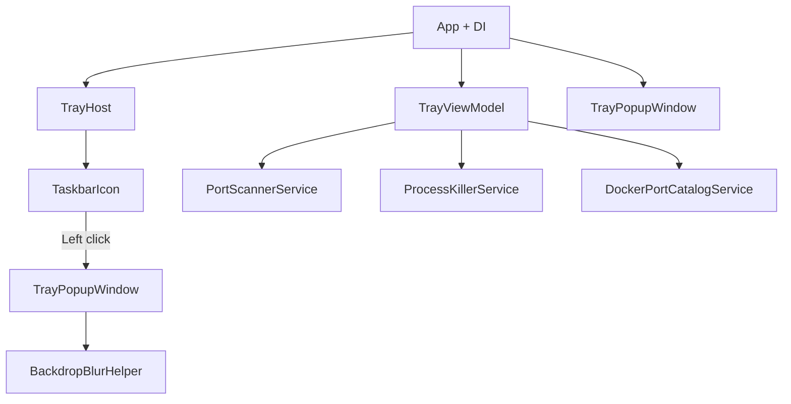

# PortCheck

Windows tray app to **list local TCP listening ports** and **kill processes**. When Docker Engine is already running with published TCP ports, an optional **Docker Port** pane lists container mappings (**Kill** = `docker stop`). PortCheck never starts or installs Docker.

## Requirements

- Windows 10 1809+ or Windows 11
- [.NET 8 SDK](https://dotnet.microsoft.com/download/dotnet/8.0) (build) or .NET 8 Runtime (framework-dependent publish)
- **Administrator** for Release builds (manifest requests elevation to kill processes)
- **Docker Desktop** (optional): only used if Engine is already running; no Docker UI when Engine is off or has no published TCP ports

## Architecture



| Component | Role |
|-----------|------|
| `TrayHost` | Tray icon, popup toggle, tray menu (Refresh / Kill All / Quit) |
| `TrayPopupWindow` | Local Port / Docker Port panes, search, compact lists |
| `TrayViewModel` | Dual collections, filter, refresh, kill / docker stop |
| `PortScannerService` | Win32 `GetExtendedTcpTable` |
| `ProcessKillerService` | Terminate by PID (Local pane) |
| `DockerPortCatalogService` | Engine API via named pipe (no `docker.exe`) |
| `DockerContainerStopService` | Stop container (Docker pane Kill) |

Source: `src/PortCheck/`

## Build & run

```powershell
cd src/PortCheck
dotnet restore
dotnet build
dotnet run
```

Debug uses `asInvoker` (no UAC). Port scan works; killing may need an elevated shell or a Release publish.

## Publish (Windows `.exe`)

```powershell
cd src/PortCheck
dotnet publish -c Release -r win-x64 /p:PublishSingleFile=true
```

**Output folder:** `bin/Release/net8.0-windows/win-x64/publish/`

| File | Required |
|------|----------|
| `PortCheck.exe` | Yes |
| `appsettings.json` | Yes (beside exe; not embedded in single-file) |
| `Assets/AppIcon.ico` | Yes (tray icon; falls back to exe icon if missing) |

Distribute the **whole `publish` folder**, not only `PortCheck.exe`.

## Usage

1. Launch — only the tray icon appears.
2. **Left-click** tray — toggle port list popup.
3. **Search** by port, process name, or PID.
4. **Hover** a row → **✕** → inline kill confirm.
5. Footer **Kill All** — confirmation dialog.
6. Footer **Hide** — closes popup; app stays in tray.
7. **Right-click** tray → **Quit** — exit app.

| Key | Action |
|-----|--------|
| Ctrl+R | Refresh |
| Ctrl+K | Kill All |
| Esc | Hide |

## Configuration

`appsettings.json`:

```json
{
  "appSettings": {
    "refreshIntervalSeconds": 5
  }
}
```
