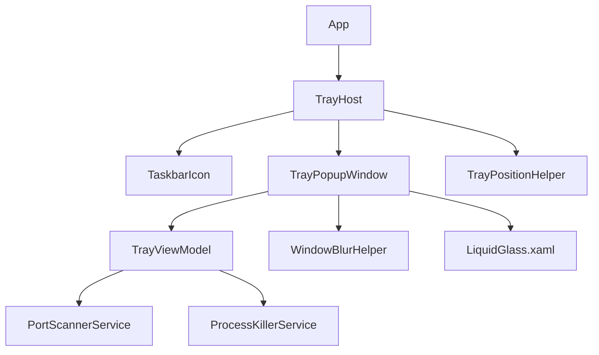
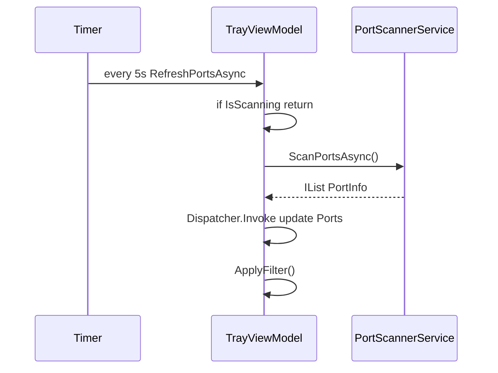

# PortKiller Windows Tray-Only — Per-Phase PRD & TDD

| Field | Value |
|-------|-------|
| Date | 2026-05-26 |
| Status | **Approved** — assumptions locked; proceed phase-by-phase |
| Base fork | `https://github.com/productdevbook/port-killer` → `platforms/windows/` |
| Target repo | `d:\Git2\port\` |
| OS | Windows 11 primary; Windows 10 1809+ supported |

---

## Document map

| Section | Purpose |
|---------|---------|
| [§0 Locked decisions](#0-locked-decisions) | 你已確認的需求與假設 |
| [§G Global context](#g-global-context) | 全專案背景（各 phase 共用） |
| [§LG Liquid Glass UX](#lg-liquid-glass-ux-system) | UI/UX 設計系統（Phase 3+ 強制遵循） |
| [Phase 0](#phase-0--repo-bootstrap) | Repo 初始化 |
| [Phase 1](#phase-1--codebase-pruning) | 刪除非必要模組 |
| [Phase 2](#phase-2--tray-only-runtime) | Tray 啟動與生命週期 |
| [Phase 3](#phase-3--tray-popup-ui--liquid-glass) | Popup UI + Liquid Glass |
| [Phase 4](#phase-4--tray-viewmodel--domain) | ViewModel 與 port/kill 邏輯 |
| [Phase 5](#phase-5--positioning--interaction-polish) | Tray 定位、toggle、快捷鍵 |
| [Phase 6](#phase-6--verification--release) | 驗證與發佈 |

**規則**：每個 Phase 自含 PRD + TDD；實作時只讀該 Phase + §G + §LG，不需回推其他 Phase 的細節。

---

## 0. Locked decisions

以下為已確認、各 Phase **不得偏離** 的決策：

| ID | 決策 |
|----|------|
| D-1 | 功能範圍：**僅 Local Ports kill**（掃描 + 單筆 kill + Kill All + search + refresh） |
| D-2 | **無主視窗**；唯一 UI = tray popup |
| D-3 | Fork 上游 **Windows WPF** 子專案，不保留 macOS |
| D-4 | Popup 顯示 **全部 listening ports + ScrollViewer**（不截斷 50 筆） |
| D-5 | 單筆 kill：**保留 inline 確認**（hover ✕ → Kill? → Kill / Cancel） |
| D-6 | Kill All：**ConfirmDialog** 二次確認 |
| D-7 | manifest：**`requireAdministrator`** 保留 |
| D-8 | Tray 左鍵：**toggle** popup 顯示/隱藏 |
| D-9 | 目錄：`src/PortKiller/` + `src/PortKiller.sln` |
| D-10 | 刪除：`SettingsService`、`NotificationService`、Tunnel、MainWindow、Favorites/Watched |
| D-11 | UI：**Liquid Glass** 風格（見 §LG） |
| D-12 | Refresh interval：**5s**，來源 `appsettings.json`（不可 UI 修改） |

---

## G. Global context

### G.1 Problem（全專案）

Windows 沒有 macOS menu bar。上游 PortKiller Windows 版用 **System Tray + `MiniPortKillerWindow`** 模擬 popup，但：

- `App.xaml` 的 `StartupUri="MainWindow.xaml"` 導致啟動必開大窗
- 含 Cloudflare、Favorites、Watched、Settings 等與你需求無關的程式碼
- `MiniPortKillerWindow` 未套用 `WindowBlurHelper`（主窗才有 Acrylic）
- Popup 固定貼右下角 `WorkArea`，非 tray 旁

### G.2 Target end state

```
使用者啟動 PortKiller.exe
  → UAC（admin）
  → 僅通知區出現圖示
  → 左鍵：Liquid Glass popup（ports + kill）
  → 失焦：popup 關閉，程序常駐
  → 右鍵 tray：Refresh / Kill All / Quit
```

### G.3 Upstream assets to keep

| 路徑（上游） | 用途 |
|-------------|------|
| `Services/PortScannerService.cs` | `GetExtendedTcpTable` 掃描 |
| `Services/ProcessKillerService.cs` | Graceful + force kill |
| `Models/PortInfo.cs` | Port 資料 + `IsConfirmingKill` / `IsKilling` |
| `Models/ProcessType.cs` | 可選保留供 scanner 分類（UI 不用） |
| `MiniPortKillerWindow.*` | Phase 3 改為 `TrayPopupWindow` |
| `ConfirmDialog.*` | Kill All 確認 |
| `Helpers/WindowBlurHelper.cs` | Acrylic 底層 |
| `app.manifest` | Admin + PerMonitorV2 DPI |
| `Hardcodet.NotifyIcon.Wpf` | Tray icon |

### G.4 Upstream assets to remove（Phase 1 執行）

`MainWindow.*`, `CloudflareTunnelsView.*`, `TunnelService.cs`, `TunnelViewModel.cs`, `CloudflareTunnel.cs`, `CloudflaredProtocol.cs`, `WatchedPort.cs`, `SettingsService.cs`, `NotificationService.cs`, `PortFilter.cs`（sidebar 部分）, `ValueConverters.cs`（若僅 MainWindow 用）

### G.5 Final repo layout

```
d:\Git2\port\
├── docs/plan/260526_tray-only-port-killer.md
├── README.md
├── LICENSE
├── .gitignore
└── src/
    ├── PortKiller.sln
    └── PortKiller/
        ├── App.xaml / App.xaml.cs
        ├── TrayHost.cs                    # Phase 2
        ├── TrayPopupWindow.xaml(.cs)      # Phase 3（自 MiniPortKiller 改名）
        ├── ConfirmDialog.xaml(.cs)
        ├── appsettings.json
        ├── app.manifest
        ├── PortKiller.csproj
        ├── Themes/
        │   └── LiquidGlass.xaml           # Phase 3
        ├── Helpers/
        │   ├── WindowBlurHelper.cs
        │   └── TrayPositionHelper.cs      # Phase 5
        ├── Services/
        │   ├── PortScannerService.cs
        │   └── ProcessKillerService.cs
        ├── ViewModels/
        │   └── TrayViewModel.cs           # Phase 4
        └── Models/
            ├── PortInfo.cs
            └── ProcessType.cs
```

### G.6 Dependency graph（完成後）



### G.7 Phase dependency chain

```
Phase 0 ──► Phase 1 ──► Phase 2 ──► Phase 3 ──► Phase 4
                              │           ▲
                              └───────────┘（Phase 4 可與 3 並行，建議先 4 再 3 綁定）
Phase 3 + 4 ──► Phase 5 ──► Phase 6
```

---

## LG. Liquid Glass UX system

**適用 Phase**：3、5、6（驗收）

### LG.1 Design intent

對齊 macOS PortKiller menu bar popup + **Liquid Glass**（iOS 26 / macOS Tahoe 方向）：

- **透過背景看到桌面**（真實 Acrylic blur，非純色假透明）
- **玻璃層次**：外框高光 + 內層霧面 + 內容浮於其上
- **低對比邊框**、**柔和陰影**、**圓角連續**

WPF 無原生 Liquid Glass API；以 **Acrylic (`SetWindowCompositionAttribute`) + 分層 XAML** 達到視覺等價。

### LG.2 Window chrome

| 屬性 | 值 |
|------|-----|
| `WindowStyle` | `None` |
| `AllowsTransparency` | `True` |
| `Background` | `Transparent` |
| 外層 `Border` | `CornerRadius="14"` |
| 外層邊框 | `1px` 線性漸層（上左亮 `#80FFFFFF` → 下右暗 `#20FFFFFF`） |
| 外層陰影 | `DropShadowEffect` BlurRadius=24, Opacity=0.45, ShadowDepth=8 |
| 內層玻璃 | `CornerRadius="12"` Margin=1 |
| 視窗寬度 | `340`（略寬於上游 320，利於 process 名） |
| 最大高度 | `min(560, WorkArea.Height * 0.75)` |
| 列表區 | `ScrollViewer` + `MaxHeight` 動態計算 |

### LG.3 Acrylic 參數（`WindowBlurHelper`）

在 `TrayPopupWindow` `SourceInitialized` / `Loaded` 呼叫：

```csharp
WindowBlurHelper.EnableAcrylicBlur(
    window,
    blurOpacity: 170,      // 0xAA — 霧面濃度
    blurColor: 0x1E1E1E);  // 深灰 tint（非純黑，保留玻璃感）
```

**禁止**：僅用 `#C8282828` 不透明畫刷而不呼叫 Acrylic（會變成假毛玻璃）。

### LG.4 Color tokens（`Themes/LiquidGlass.xaml`）

| Token | Hex / 值 | 用途 |
|-------|----------|------|
| `Glass.Fill` | `#99282828` | 內層疊加（60% 灰，疊在 blur 上） |
| `Glass.Stroke` | `#40FFFFFF` | 分隔線、外框輔助 |
| `Glass.StrokeBright` | `#66FFFFFF` | 頂部高光邊 |
| `Text.Primary` | `#FFFFFF` | 標題、port 數字 |
| `Text.Secondary` | `#B3FFFFFF` | process name |
| `Text.Tertiary` | `#66FFFFFF` | PID |
| `Accent.Blue` | `#5B9DD9` | 焦點、連結色 |
| `Status.Active` | `#2ECC71` | 綠點 |
| `Danger` | `#FF453A` | Kill、Kill All |
| `Hover.Surface` | `#26FFFFFF` | 列 hover |
| `Pressed.Surface` | `#33FFFFFF` | 列 pressed |
| `Search.Fill` | `#1AFFFFFF` | 搜尋框內凹玻璃 |
| `Search.Stroke` | `#33FFFFFF` | 搜尋框邊 |

### LG.5 Typography

| 元素 | 字體 | 大小 | 字重 |
|------|------|------|------|
| Port 數字 | Segoe UI | 13 | SemiBold |
| Process | Segoe UI | 12 | Regular |
| PID | Segoe UI | 11 | Regular |
| Section / Footer | Segoe UI | 12 | Regular |
| Badge | Segoe UI | 11 | Bold |

### LG.6 Component specs

**Search bar（膠囊）**

- Height `32`, CornerRadius `8`
- 左側 icon：Unicode `⌕` 或 Segoe MDL `Search`
- Placeholder：`Search...`
- Badge：獨立膠囊 `CornerRadius=10`，`Glass.Fill` 略亮

**Port row**

- Padding `12,7`；CornerRadius `10`
- 左：6px 綠點
- Hover：顯示紅色 circular kill `20×20`；PID 隱藏
- Confirm overlay：毛玻璃加深 `#40000000` + 白字 Kill/Cancel 按鈕

**Footer actions**

- 與上游一致：Refresh / Kill All / Quit
- Kill All 文字 + icon 使用 `Danger`
- 快捷鍵右對齊、`Text.Tertiary`

**Tray context menu（Phase 2/5）**

- Background `#E6252525`、CornerRadius `8`、1px `Glass.Stroke`
- 與 popup 同色系（略不透明，因原生 ContextMenu 無 Acrylic）

### LG.7 Motion（輕量）

| 動畫 | 規格 |
|------|------|
| Popup 出現 | Opacity 0→1，150ms，`QuadraticEase.Out`（Phase 5） |
| Refresh spinner | 上游圓環旋轉保留 |
| Kill 中 | ⌛ 或 8px 脈動點，300ms loop |

### LG.8 Accessibility

- 對比：Primary 文字 on glass ≥ 4.5:1（深 tint 下驗證）
- Kill 按鈕 `ToolTip="Kill process on this port"`
- 鍵盤：Tab 可聚焦 Footer；Enter 觸發預設按鈕

---

# Phase 0 — Repo bootstrap

## Phase 0 — PRD

### P0.1 Problem

`d:\Git2\port` 目前無可編譯的 Windows 專案；需從上游取得 Windows 子專案並建立獨立 repo 結構，後續 phase 才能安全刪改。

### P0.2 Goals

1. 複製上游 `platforms/windows/` 至 `src/`，可 `dotnet build`。
2. 建立 Windows-only `README.md`、`LICENSE`、`.gitignore`。
3. **不修改** 業務邏輯（本 phase 僅搬運 + 建置驗證）。

### P0.3 Non-goals

- 不刪檔、不改 `StartupUri`、不改 UI。
- 不加入 macOS 目錄。

### P0.4 Deliverables

| 產出 | 路徑 |
|------|------|
| Solution | `src/PortKiller.sln` |
| Project | `src/PortKiller/PortKiller.csproj` |
| README | `README.md` |
| License | `LICENSE`（MIT，複製上游） |
| gitignore | `.gitignore` |

### P0.5 Success criteria

- [ ] `cd src/PortKiller && dotnet build` 成功（Debug）
- [ ] `dotnet run` 可啟動（仍會開 MainWindow — 預期行為）
- [ ] repo 內無 `platforms/macos`
- [ ] README 說明：需 .NET 9、Windows 11、admin

### P0.6 User stories

- **P0-US-1**：開發者 clone repo 後可依 README build。

---

## Phase 0 — TDD

### P0.1 Context

- 上游路徑：`productdevbook/port-killer/platforms/windows/PortKiller.sln`
- 本機暫存可參考：`_upstream/platforms/windows/`（若已 shallow clone）
- .NET SDK：**9.0**（與 `TargetFramework net9.0-windows` 一致）

### P0.2 Actions（逐步）

1. **複製檔案**
   ```text
   上游 platforms/windows/PortKiller.sln  → src/PortKiller.sln
   上游 platforms/windows/PortKiller/**   → src/PortKiller/**
   ```
2. **調整 solution 路徑**（若 sln 內為 `PortKiller\PortKiller.csproj`，保持相對路徑正確）
3. **新增 `.gitignore`**
   - `bin/`, `obj/`, `.vs/`, `*.user`, `PublishProfiles/`
4. **新增 `README.md`**
   - Build: `dotnet build`
   - Run: `dotnet run --project src/PortKiller`
   - 註明：本 fork 目標為 tray-only（建置中狀態）
5. **複製 `LICENSE`**

### P0.3 Build verification

```powershell
cd d:\Git2\port\src\PortKiller
dotnet restore
dotnet build -c Debug
```

預期：0 errors。Warnings 可記錄，不阻擋。

### P0.4 Risks

| 風險 | 緩解 |
|------|------|
| 路徑含空格 | 使用引號 |
| 缺 .NET 9 | README 連結安裝頁 |

### P0.5 Phase exit gate

通過 P0.5 Success criteria 後進入 Phase 1。

---

# Phase 1 — Codebase pruning

## Phase 1 — PRD

### P1.1 Problem

上游 codebase 含 MainWindow、Cloudflare、Settings、Notifications 等，與 D-1/D-2/D-10 衝突；殘留檔案會造成 DI 編譯錯誤或死碼。

### P1.2 Goals

1. 刪除所有 non-goals 模組（見 P1.4 清單）。
2. **暫時** 保留 `MiniPortKillerWindow` + `MainViewModel`（Phase 2–4 再替換），但移除對已刪服務的引用。
3. `dotnet build` 成功。

### P1.3 Non-goals

- 不實作 TrayHost（Phase 2）。
- 不套用 Liquid Glass（Phase 3）。

### P1.4 Delete manifest（必刪）

| 檔案 | 原因 |
|------|------|
| `MainWindow.xaml(.cs)` | D-2 無主視窗 |
| `CloudflareTunnelsView.xaml(.cs)` | D-1 無 tunnel |
| `Services/TunnelService.cs` | 同上 |
| `ViewModels/TunnelViewModel.cs` | 同上 |
| `Models/CloudflareTunnel.cs` | 同上 |
| `Models/CloudflaredProtocol.cs` | 同上 |
| `Models/WatchedPort.cs` | D-10 |
| `Services/SettingsService.cs` | D-10 |
| `Services/NotificationService.cs` | D-10 |
| `Models/PortFilter.cs` | Sidebar/filter 不用 |
| `Helpers/ValueConverters.cs` | 確認無引用後刪 |

### P1.5 Interim compile strategy

刪檔後必然壞編譯；本 phase **允許最小修復**：

| 檔案 |  interim 修復 |
|------|----------------|
| `App.xaml.cs` | 移除 `TunnelViewModel`、`SettingsService`、`NotificationService` 註冊 |
| `MiniPortKillerWindow.xaml.cs` | 移除 `_tunnelViewModel`、tunnel UI 事件、ContextMenu 內 tunnel/favorite/watch |
| `MainViewModel.cs` | 移除 favorites/watched/settings/notifications 成員與方法（或整檔暫留至 Phase 4 刪） |
| `App.xaml` | **暫保留** `StartupUri=MainWindow` → 改為 `MiniPortKillerWindow` **不可**（mini 非 startup 合理）→ **改 Startup 為 Phase 2**；Phase 1 結束時可暫改 `StartupUri` 指向 placeholder 或完成 Phase 2 一部分 |

**Phase 1 結束狀態決策（已選）**：

- Phase 1 結束時必須能 build；若 `MainWindow` 已刪，**同 phase 內** 將 `App.xaml` 改為無 `StartupUri`，並在 `App.xaml.cs` `OnStartup` 僅 `ShutdownMode=OnExplicitShutdown` + 顯示 MessageBox「Phase 2 pending」**或** 直接併入 Phase 2 最小 `TrayHost` stub。
- **建議**：Phase 1 與 Phase 2 **同一 PR/commit 系列**，Phase 1 刪檔後立即接 Phase 2 的 minimal tray，避免無法 run。

### P1.6 Success criteria

- [ ] P1.4 檔案不存在於 `src/PortKiller`
- [ ] `grep -r TunnelViewModel|MainWindow|Cloudflare` 無結果（除註解）
- [ ] `dotnet build` 成功
- [ ] `PortKiller.csproj` 無多餘 PackageReference

### P1.7 User stories

- **P1-US-1**：開發者打開 solution 只見 tray 相關與 port 服務，無 tunnel/main window 檔案。

---

## Phase 1 — TDD

### P1.1 Dependency

- **Requires**：Phase 0 complete

### P1.2 `App.xaml.cs` DI 目標狀態（Phase 1 結束）

```csharp
services.AddSingleton<PortScannerService>();
services.AddSingleton<ProcessKillerService>();
// MainViewModel 暫留至 Phase 4 更名 TrayViewModel
services.AddSingleton<MainViewModel>(...); // 精簡 ctor：僅 scanner + killer + dispatcher
```

移除：

```csharp
// DELETE
services.AddSingleton<SettingsService>();
services.AddSingleton<NotificationService>();
services.AddSingleton<TunnelService>();
services.AddSingleton<TunnelViewModel>(...);
```

### P1.3 `MainViewModel` 精簡範圍（Phase 1 先做減法）

**刪除成員**：

- `Favorites`, `WatchedPorts`, `SelectedSidebarItem`, `FilteredPorts`（sidebar）
- `LoadSettings` / `SaveSettings` / `CheckWatchedPorts`
- `ToggleFavorite`, `AddWatchedPort`, `RemoveWatchedPort`
- `NotificationService` 依賴

**保留**：

- `Ports`, `IsScanning`, `RefreshPortsAsync`, `KillProcessAsync`, `StartAutoRefresh`
- `RefreshInterval` 改從 `IConfiguration` 讀取（見 P1.4）

### P1.4 Configuration

`appsettings.json`：

```json
{
  "appSettings": {
    "refreshIntervalSeconds": 5
  }
}
```

新增讀取（`App.xaml.cs` 或 static helper）：

```csharp
services.AddSingleton<IConfiguration>(sp =>
    new ConfigurationBuilder()
        .SetBasePath(AppContext.BaseDirectory)
        .AddJsonFile("appsettings.json", optional: false)
        .Build());
```

`MainViewModel` / 後續 `TrayViewModel` 建構注入 `IConfiguration`，讀 `refreshIntervalSeconds`。

### P1.5 `MiniPortKillerWindow` XAML 刪除區塊

- 整段 `TunnelsSection`（Grid.Row=2）
- `Open PortKiller` header button（Grid.Row=0）
- `Grid.RowDefinitions` 收斂為：Search / List / Footer
- `PortListBoxItem` 內 `ContextMenu` 整段移除（D-1 精簡；右鍵留 Phase 3）

### P1.6 `MiniPortKillerWindow.xaml.cs` 刪除

- `_tunnelViewModel`, `_tunnelUpdateTimer`
- `UpdateTunnelsList`, tunnel click handlers
- `ContextMenu_*` 方法
- `OpenApp_Click`

### P1.7 `PortKiller.csproj`

確認保留：

```xml
<PackageReference Include="Hardcodet.NotifyIcon.Wpf" Version="1.1.0" />
<PackageReference Include="CommunityToolkit.Mvvm" Version="8.2.2" />
<PackageReference Include="Microsoft.Extensions.DependencyInjection" Version="8.0.0" />
```

新增（若用 Configuration）：

```xml
<PackageReference Include="Microsoft.Extensions.Configuration.Json" Version="8.0.0" />
```

### P1.8 Verification

```powershell
cd d:\Git2\port\src\PortKiller
dotnet build
# 選用： ripgrep 驗證
rg "Tunnel|Cloudflare|MainWindow|SettingsService|NotificationService" --glob "!docs/**"
```

### P1.9 Failure modes

| 情況 | 處理 |
|------|------|
| XAML 仍引用刪除的 converter | 刪除 StaticResource 或改內建 |
| `MainWindow` 仍是 StartupUri | 必須在 Phase 1 末或 Phase 2 初移除 |

### P1.10 Phase exit gate

Build 綠燈 + P1.6 Success criteria。

---

# Phase 2 — Tray-only runtime

## Phase 2 — PRD

### P2.1 Problem

即使刪除 MainWindow，若無集中式 tray 生命週期，無法達成 D-2（純 tray）與 D-8（toggle）。

### P2.2 Goals

1. 啟動 **零主視窗**；僅 `TaskbarIcon` 可見。
2. 左鍵 tray → 顯示/隱藏 popup（D-8 toggle）。
3. 右鍵 tray → `Refresh` / `Kill All...` / `Quit`。
4. 關閉流程僅 `Quit` 觸發 `Application.Shutdown()`。
5. `ShutdownMode = OnExplicitShutdown`。

### P2.3 Non-goals

- Popup Liquid Glass 完整落地（Phase 3）。
- `TrayViewModel` 更名（Phase 4）；本 phase 可仍用精簡後 `MainViewModel`。

### P2.4 User stories

| ID | 故事 |
|----|------|
| P2-US-1 | 啟動後工作列無 PortKiller 視窗按鈕 |
| P2-US-2 | 左鍵 tray 第一次開 popup，再左鍵關閉 |
| P2-US-3 | 右鍵 Refresh 會更新 port 列表（popup 開著時可見） |
| P2-US-4 | Quit 後 tray 圖示消失、進程結束 |

### P2.5 Success criteria

- [ ] `App.xaml` **無** `StartupUri`
- [ ] `TrayHost` 單例註冊並於 `OnStartup` 初始化
- [ ] 啟動 3 秒內不出現任何 Window（除測試外）
- [ ] Toggle 行為符合 D-8
- [ ] `TrayHost.Dispose` 於 exit 釋放 icon handle

---

## Phase 2 — TDD

### P2.1 New file: `TrayHost.cs`

**職責**：

- 持有 `TaskbarIcon _icon`
- 持有 `TrayPopupWindow? _popup`（singleton）
- 訂閱 `TrayLeftMouseDown` → `TogglePopup()`
- 建立右鍵 `ContextMenu`

**介面草圖**：

```csharp
public sealed class TrayHost : IDisposable
{
    private readonly IServiceProvider _services;
    private readonly MainViewModel _viewModel; // Phase 4 改 TrayViewModel
    private TaskbarIcon? _icon;
    private TrayPopupWindow? _popup;

    public void Initialize();
    public void TogglePopup();
    public void ShowPopup();
    public void HidePopup();
    public void Dispose();
}
```

### P2.2 Toggle 邏輯（D-8）

```text
Left click:
  if _popup == null || !IsLoaded:
    create _popup once (new TrayPopupWindow())
    ShowNearTray()
  else if _popup.IsVisible:
    HidePopup()  // 或 Close() + _popup=null 依 Phase 3 生命週期
  else:
    ShowNearTray()
```

**注意**：若用 `Close()` + `Deactivated` 會衝突；toggle hide 建議 `Hide()` 保留 instance。

### P2.3 `App.xaml` / `App.xaml.cs`

**App.xaml**：

```xml
<Application x:Class="PortKiller.App"
             ShutdownMode="OnExplicitShutdown">
  <!-- 無 StartupUri -->
</Application>
```

**OnStartup**：

```csharp
protected override void OnStartup(StartupEventArgs e)
{
    base.OnStartup(e);
    var host = Services.GetRequiredService<TrayHost>();
    host.Initialize();
    var vm = Services.GetRequiredService<MainViewModel>();
    _ = vm.InitializeAsync(); // 背景掃描開始
}
```

**DI**：

```csharp
services.AddSingleton<TrayHost>();
```

`TrayHost` ctor 注入 `IServiceProvider` + `MainViewModel`。

### P2.4 Tray icon

沿用 `MainWindow.xaml.cs` 內 `CreateTrayIcon()` → 移至 `TrayHost` 或 `TrayIconFactory` static class。

| 屬性 | 值 |
|------|-----|
| ToolTipText | `PortKiller` |
| Visibility | Visible |

### P2.5 Context menu spec

| Header | Handler |
|--------|---------|
| Refresh | `await _viewModel.RefreshPortsCommand` |
| Kill All... | 若 popup 未開可先 `ShowPopup()`；觸發 Kill All（與 popup footer 共用 command） |
| — separator — | |
| Quit | `_isShuttingDown=true`; `Shutdown()` |

樣式：背景 `#E6252525`（Phase 5 可統一 theme）。

### P2.6 Rename preparatory

本 phase 可將 `MiniPortKillerWindow` **class 改名** `TrayPopupWindow`（檔名同步），或 Phase 3 再改。建議 **Phase 3 改名**，Phase 2 僅改引用類名 alias。

### P2.7 Interaction with `Deactivated`

上游 `MiniPortKillerWindow` 在 `Deactivated` 時 `Close()`。與 toggle 衝突：

| 行為 | 決策 |
|------|------|
| 點擊外部 | `Hide()` 而非 `Close()`（D-8 toggle 保留 instance） |
| `_isClosing` flag | 改為 `_isHiding`；`OnClosing` 若為 hide 則 `Cancel=false` 允許 hide |

**TDD 實作**：

```csharp
private void Window_Deactivated(...)
{
    if (_isProcessingAction) return;
    Hide(); // 不 Close
}
```

`TrayHost.ShowPopup()` → `Show()` + `Activate()`。

### P2.8 Auto-start scan

`MainViewModel.InitializeAsync()` 在 `OnStartup` fire-and-forget；確保 popup 打開時已有資料。

### P2.9 Verification checklist

| 步驟 | 預期 |
|------|------|
| `dotnet run` | 僅 tray |
| 左鍵×2 | 開 → 關 |
| 右鍵 Quit | 進程結束 |
| 工作管理員 | 無多餘 PortKiller 視窗 |

### P2.10 Phase exit gate

P2.5 全勾。

---

# Phase 3 — Tray popup UI + Liquid Glass

## Phase 3 — PRD

### P3.1 Problem

上游 `MiniPortKillerWindow` 為半透明色塊，未啟用 Acrylic；版面仍含已刪功能殘留佈局；未符合 D-11 Liquid Glass。

### P3.2 Goals

1. 更名 **`TrayPopupWindow`**（xaml + cs + class）。
2. 導入 **`Themes/LiquidGlass.xaml`** 資源字典，全域套用 §LG tokens。
3. 啟用 **真 Acrylic blur**（§LG.3）。
4. 版面：**Search → Scrollable Port List → Footer**（無 tunnel、無 open main）。
5. 列表 **全部 ports**（D-4），`ScrollViewer` + 虛擬化可選。
6. 保留單筆 kill UX（D-5）與 Kill All footer（D-6）。

### P3.3 Non-goals

- Tray 定位（Phase 5）
- 進場動畫（Phase 5）
- ViewModel 邏輯重構（Phase 4；本 phase 綁定現有 VM）

### P3.4 UI wireframe

```text
┌─ Liquid Glass border (14px radius) ─────────────┐
│  [ ⌕  Search...                    ] [badge 9] │
│  ┌─ scroll ─────────────────────────────────┐  │
│  │ ● :3000   node.exe              PID 1234 │  │
│  │ ● :5173   node.exe         [hover ✕]    │  │
│  │ ...                                      │  │
│  └──────────────────────────────────────────┘  │
│  ───────────────────────────────────────────  │
│  ↻  Refresh                          Ctrl+R   │
│  ⚡ Kill All Processes               Ctrl+K   │
│  ───────────────────────────────────────────  │
│  ✕  Quit PortKiller                  Ctrl+Q   │
└────────────────────────────────────────────────┘
```

### P3.5 Success criteria

- [ ] 視覺：背後桌面可模糊透視（非純灰塊）
- [ ] 所有顏色來自 `LiquidGlass.xaml`（無 magic number 散落）
- [ ] 列表可捲動；100+ ports 不撐破螢幕（MaxHeight）
- [ ] Hover kill + inline confirm 可用
- [ ] `OpenApp`、tunnel section 不存在

### P3.6 User stories

- **P3-US-1**：popup 外觀與 macOS PortKiller 截圖同一視覺家族（玻璃、圓角、緊湊列表）。

---

## Phase 3 — TDD

### P3.1 File operations

| 操作 | 路徑 |
|------|------|
| Rename | `MiniPortKillerWindow.xaml` → `TrayPopupWindow.xaml` |
| Rename | `MiniPortKillerWindow.xaml.cs` → `TrayPopupWindow.xaml.cs` |
| Add | `Themes/LiquidGlass.xaml` |
| Update | `TrayHost.cs` 引用 `TrayPopupWindow` |

### P3.2 `App.xaml` merge dictionaries

```xml
<Application.Resources>
    <ResourceDictionary>
        <ResourceDictionary.MergedDictionaries>
            <ResourceDictionary Source="Themes/LiquidGlass.xaml"/>
        </ResourceDictionary.MergedDictionaries>
    </ResourceDictionary>
</Application.Resources>
```

### P3.3 `LiquidGlass.xaml` 結構

```xml
<ResourceDictionary xmlns="...">
  <!-- Brushes: Glass.Fill, Text.Primary, ... -->
  <!-- Styles: GlassMenuButton, GlassPortRow, GlassSearchBox, GlassBadge -->
  <!-- Effect: GlassWindowShadow -->
</ResourceDictionary>
```

**Glass row style** 要點：

- `ControlTemplate` Border `CornerRadius=10`
- Trigger `IsMouseOver` → `Hover.Surface`
- 嵌 kill button visibility 仍用 DataTemplate Triggers（沿用上游）

### P3.4 `TrayPopupWindow.xaml` 結構

```xml
<Window ... Width="340" SizeToContent="Height" MaxHeight="{Binding MaxPopupHeight}">
  <Border Style="{StaticResource GlassShell}"> <!-- 外框+陰影+漸層邊 -->
    <Grid>
      <RowDefinition Height="Auto"/> <!-- Search -->
      <RowDefinition Height="*"/>    <!-- Scroll list -->
      <RowDefinition Height="Auto"/> <!-- Footer -->
      ...
      <ScrollViewer Grid.Row="1" VerticalScrollBarVisibility="Auto"
                    MaxHeight="400"> <!-- 或 code-behind 動態 -->
        <ListBox x:Name="PortsList" .../>
      </ScrollViewer>
    </Grid>
  </Border>
</Window>
```

### P3.5 Code-behind: Acrylic

```csharp
public TrayPopupWindow()
{
    InitializeComponent();
    SourceInitialized += (_, _) =>
        WindowBlurHelper.EnableAcrylicBlur(this, 170, 0x1E1E1E);
    ...
}
```

**雙層玻璃**：Window 透明 + Acrylic；內層 Border 用 `Glass.Fill` 疊加增強霧面。

### P3.6 Search & badge

- `SearchBox.TextChanged` → 呼叫 `UpdatePortList()`（Phase 4 改綁 `TrayViewModel.FilteredPorts`）
- Badge 顯示 **`Ports.Count`（總數）**，非 filter 後數量（與上游一致）

### P3.7 Kill interaction（保留上游邏輯）

| 狀態 | UI |
|------|-----|
| Default | 顯示 PID |
| Hover | 顯示 ✕ |
| Click ✕ | `IsConfirmingKill=true` → overlay |
| Confirm | `KillProcessCommand` |
| Killing | ⌛ |

### P3.8 Footer commands

綁定 `_viewModel.RefreshPortsCommand`、Kill All、Quit：

```csharp
private void Quit_Click(...) {
    Application.Current.Shutdown();
}
```

### P3.9 `TrayHost` integration

```csharp
_popup ??= _services.GetRequiredService<TrayPopupWindow>();
// 或 new TrayPopupWindow() + DI via ctor injection
```

建議：**Register `TrayPopupWindow` as Transient** 但 Host 快取 singleton instance。

### P3.10 MaxHeight 計算

```csharp
public void ShowNearTray()
{
    var work = SystemParameters.WorkArea;
    MaxHeight = Math.Min(560, work.Height * 0.75);
    // Phase 5 改位置；本 phase 仍可用 work.Bottom-right
    ...
}
```

### P3.11 Verification

| 測試 | 方法 |
|------|------|
| Acrylic | 打開 popup 對著彩色桌布，確認模糊 |
| Scroll | 開 20+ node 進程佔 port |
| Kill UI | hover → confirm → kill |

### P3.12 Phase exit gate

P3.5 全勾 + build 成功。

---

# Phase 4 — TrayViewModel & domain

## Phase 4 — PRD

### P4.1 Problem

`MainViewModel` 名稱與 sidebar 遺留語意不符；搜尋/filter 在 code-behind 不利測試與綁定；需穩定支援 auto-refresh、kill、Kill All。

### P4.2 Goals

1. 新增 **`TrayViewModel`** 取代 `MainViewModel`（刪除 `MainViewModel.cs`）。
2. 對外暴露：`Ports`, `FilteredPorts`, `IsScanning`, `SearchQuery`, commands。
3. `FilteredPorts`：依 `SearchQuery` 過濾 port/process/pid（即時）。
4. Auto-refresh：讀 `appsettings.json` interval（D-12）。
5. Kill All：對 **目前 FilteredPorts 中 active** 或 **全部 Ports** — **鎖定：對 snapshot of `Ports` 全部 active**（與 upstream Kill All 一致，非僅 filter 結果）。

### P4.3 Non-goals

- Favorites / Watch / Notifications
- 持久化使用者設定

### P4.4 Success criteria

- [ ] 無 `MainViewModel` 引用
- [ ] `TrayPopupWindow` 僅依賴 `TrayViewModel`
- [ ] 搜尋在 VM 內，XAML 可 `ItemsSource={Binding FilteredPorts}`
- [ ] Auto-refresh 每 5s 不重入（`IsScanning` gate）
- [ ] Kill 後 500ms delay + refresh（沿用上游）

### P4.5 User stories

| ID | 故事 |
|----|------|
| P4-US-1 | 搜尋 "node" 只顯示 process 含 node 的列 |
| P4-US-2 | 背景每 5s 更新，badge 數字同步 |

---

## Phase 4 — TDD

### P4.1 `TrayViewModel` API contract

```csharp
public partial class TrayViewModel : ObservableObject
{
    ObservableCollection<PortInfo> Ports { get; }
    ObservableCollection<PortInfo> FilteredPorts { get; }
    bool IsScanning { get; }
    string SearchQuery { get; set; } // 觸發 ApplyFilter

    IAsyncRelayCommand RefreshPortsCommand { get; }
    IAsyncRelayCommand<PortInfo> KillProcessCommand { get; }
    IAsyncRelayCommand KillAllCommand { get; }

    Task InitializeAsync();
    void StopAutoRefresh();
}
```

### P4.2 Filter logic

```csharp
private void ApplyFilter()
{
    var q = SearchQuery.Trim().ToLowerInvariant();
    var source = Ports.AsEnumerable();
    if (!string.IsNullOrEmpty(q))
        source = source.Where(p =>
            p.Port.ToString().Contains(q) ||
            (p.ProcessName?.ToLowerInvariant().Contains(q) ?? false) ||
            p.Pid.ToString().Contains(q));
    // 寫入 FilteredPorts（clear + add）或 ICollectionView
}
```

**排序**：`OrderBy(p => p.Port)`。

**不設 Take 上限**（D-4）。

### P4.3 Refresh flow



### P4.4 Kill single

```csharp
[RelayCommand]
async Task KillProcessAsync(PortInfo? port)
{
    if (port is not { IsActive: true }) return;
    port.IsKilling = true;
    var ok = await _killer.KillProcessGracefullyAsync(port.Pid);
    await Task.Delay(500);
    await RefreshPortsAsync();
    if (!ok && Ports.Contains(port)) port.IsKilling = false;
}
```

### P4.5 Kill All

```csharp
[RelayCommand]
async Task KillAllAsync()
{
    foreach (var port in Ports.ToList())
        await KillProcessAsync(port);
}
```

UI 層負責先 `ConfirmDialog`；command 假設已確認。

### P4.6 DI 更新

```csharp
services.AddSingleton<TrayViewModel>(sp => new TrayViewModel(
    sp.GetRequiredService<PortScannerService>(),
    sp.GetRequiredService<ProcessKillerService>(),
    sp.GetRequiredService<IConfiguration>(),
    Dispatcher.CurrentDispatcher));
```

移除 `MainViewModel`。

### P4.7 `TrayPopupWindow` 綁定

- ctor：`DataContext = viewModel`（或注入）
- 刪除 `UpdatePortList()` 手動 filter → 改用 `ItemsSource="{Binding FilteredPorts}"` + `INotifyCollectionChanged`
- `SearchBox` → `{Binding SearchQuery, UpdateSourceTrigger=PropertyChanged}`

### P4.8 `PortInfo` model

保留 `IsConfirmingKill`, `IsKilling` INPC。

無需 `ProcessType` 於 UI 時可保留 scanner 內部使用。

### P4.9 Edge cases

| Case | Behavior |
|------|----------|
| Refresh 中再 refresh | 忽略第二次 |
| Kill All 空列表 | Command no-op |
| Process 已死 | kill 回 false；refresh 移除 |

### P4.10 Verification

- 單元：可选手動測試清單（無 test project）
- 綁定：`FilteredPorts` 隨 `SearchQuery` 變化

### P4.11 Phase exit gate

P4.4 全勾；`rg MainViewModel` 無結果。

---

# Phase 5 — Positioning & interaction polish

## Phase 5 — PRD

### P5.1 Problem

Popup 固定右下角，tray 在頂部時體驗差；缺少 Esc、進場動畫；托盤右鍵與 popup 視覺不一致。

### P5.2 Goals

1. **`TrayPositionHelper`**：依 taskbar 邊緣放置 popup（近 tray）。
2. 左鍵 toggle（與 Phase 2 對齊）+ 點外 `Hide()` 一致。
3. **Esc** 關閉 popup（不 quit）。
4. **進場 opacity 動畫** 150ms（§LG.7）。
5. Popup 內 **Ctrl+R/K/Q**；global hotkey 不做。
6. Tray context menu 套用 Liquid Glass 色系。

### P5.3 Non-goals

- 多螢幕 DPI 進階校正（僅 WorkArea per screen）
- Win11 通知中心區域精確錨點（無公開 API，用 cursor / work area 启发式）

### P5.4 Success criteria

- [ ] Taskbar 在 top/bottom/left/right 四種情況 popup 不大幅離屏（手動測）
- [ ] Esc hide popup
- [ ] 動畫流暢無閃爍
- [ ] 快捷鍵在三種 footer 動作可用

---

## Phase 5 — TDD

### P5.1 `TrayPositionHelper.cs`

```csharp
public static class TrayPositionHelper
{
    public static void PositionNearTray(Window popup, double width, double height)
    {
        var work = SystemParameters.WorkArea;
        var cursor = System.Windows.Forms.Cursor.Position; // 需 WindowsForms 引用或 GetCursorPos P/Invoke
        // 判斷 taskbar 邊：比較 work 與 screen bounds
        // 將 popup 放在 work 角落鄰近 cursor 的一側
    }
}
```

**csproj 選項**：

```xml
<UseWindowsForms>true</UseWindowsForms> <!-- 僅 Cursor.Position -->
```

或 P/Invoke `GetCursorPos` 避免 WinForms 依賴。

### P5.2 Taskbar edge detection（启发式）

```text
screen = SystemParameters.FullPrimaryScreenWidth/Height
work = WorkArea
if work.Top > 0 → taskbar top
if work.Left > 0 → taskbar left
if work.Bottom < screenHeight → taskbar bottom
else → taskbar right (default)
```

放置：

| Edge | Popup anchor |
|------|----------------|
| Bottom | `Left = cursor.X - width/2 clamp; Top = work.Bottom - height - margin` |
| Top | `Top = work.Top + margin` |
| Right | `Left = work.Right - width - margin` |
| Left | `Left = work.Left + margin` |

Clamp 確保視窗 ⊆ work area。

### P5.3 `ShowNearTray()` 更新

```csharp
public void ShowNearTray()
{
    Width = 340;
    Measure(new Size(Width, double.PositiveInfinity));
  // 或固定 MaxHeight
    TrayPositionHelper.PositionNearTray(this, ActualWidth, ActualHeight);
    if (Visibility != Visible) { Opacity=0; Show(); BeginAnimation... }
    else { Show(); Activate(); }
}
```

### P5.4 Esc handler

```xml
<Window InputBindings>
  <KeyBinding Key="Escape" Command="{Binding HideCommand}"/> <!-- 或 code-behind -->
</Window>
```

Code-behind：`Hide()` + `TrayHost` 同步狀態。

### P5.5 Opacity animation

```csharp
var anim = new DoubleAnimation(0, 1, TimeSpan.FromMilliseconds(150))
    { EasingFunction = new QuadraticEase { EasingMode = EasingMode.EaseOut } };
BeginAnimation(UIElement.OpacityProperty, anim);
```

### P5.6 Keyboard bindings（Window `InputBindings`）

| Gesture | Command |
|---------|---------|
| Ctrl+R | `RefreshPortsCommand` |
| Ctrl+K | 開 ConfirmDialog → `KillAllCommand` |
| Ctrl+Q | `Application.Shutdown` |

### P5.7 TrayHost toggle 與 Hide 同步

```csharp
public void HidePopup()
{
    _popup?.Hide();
}
// TrayPopupWindow Deactivated → Hide → 不 dispose
```

### P5.8 Verification matrix

| Taskbar | 檢查 |
|---------|------|
| Bottom | popup 在 cursor 上方 |
| Top | popup 在 cursor 下方 |
| Left/Right | 不出界 |

### P5.9 Phase exit gate

P5.4 全勾。

---

# Phase 6 — Verification & release

## Phase 6 — PRD

### P6.1 Problem

需確認 D-1～D-12 與 Liquid Glass 驗收，並產出可分發 build。

### P6.2 Goals

1. 執行完整 **manual test plan**（下述）。
2. `dotnet publish` 產物可於乾淨 Win11 執行。
3. 更新 README：使用方式、admin、快捷鍵、限制。
4. 確認無上游 dead code 殘留。

### P6.3 Success criteria（全專案 release gate）

- [ ] 全部 P0–P5 phase success criteria 回歸通過
- [ ] Liquid Glass 視覺驗收（§LG checklist）
- [ ] `publish` 單檔或 folder 可選
- [ ] README 完整

### P6.4 Non-goals

- Microsoft Store / MSIX
- 自動更新

---

## Phase 6 — TDD

### P6.1 Manual test plan

| ID | 步驟 | 預期 |
|----|------|------|
| T-01 | 以 admin 啟動 | 僅 tray |
| T-02 | 左鍵×3 | 開→關→開 |
| T-03 | `node -e "require('http').createServer().listen(3999)"` | 列表見 :3999 |
| T-04 | 搜尋 "3999" | 篩出該列 |
| T-05 | Hover kill + confirm | node 終止；列消失 |
| T-06 | 再開 listener + Kill All | 確認框；全清 |
| T-07 | Ctrl+R | 刷新 |
| T-08 | Esc | popup 關；app 在 |
| T-09 | Ctrl+Q | 退出 |
| T-10 | 桌布彩色背景 | Acrylic 可見 |
| T-11 | 100+ ports（可模擬） | 捲動順暢 |

### P6.2 Liquid Glass checklist（§LG）

- [ ] Acrylic API 已呼叫
- [ ] 外框漸層邊 + 陰影
- [ ] 無不透明大色塊取代 blur
- [ ] Hover/危險色符合 token
- [ ] 圓角 14/10 一致

### P6.3 Publish command

```powershell
cd d:\Git2\port\src\PortKiller
dotnet publish -c Release -r win-x64 `
  /p:PublishSingleFile=true `
  /p:IncludeNativeLibrariesForSelfExtract=true
```

輸出：`bin\Release\net9.0-windows\win-x64\publish\PortKiller.exe`

### P6.4 README 必寫章節

1. 功能（tray only、local port kill）
2. 需求：Win11、.NET 9 runtime、admin
3. Build / Run / Publish
4. 快捷鍵表
5. 限制：IPv6、system process
6. Fork attribution + MIT

### P6.5 Static analysis

```powershell
rg "MainWindow|Tunnel|Cloudflare|SettingsService|NotificationService|MiniPortKiller" src/
# 預期：無匹配（除 plan/docs）
```

### P6.6 Phase exit gate = **Project shipped**

---

## Appendix A — Service contracts (reference)

### `PortScannerService.ScanPortsAsync()`

- **Returns**: `Task<List<PortInfo>>`（listening TCP, IPv4 為主，沿用上游）
- **Errors**: thrown → VM catch, `IsScanning=false`

### `ProcessKillerService.KillProcessGracefullyAsync(int pid)`

- **Returns**: `Task<bool>`
- **Strategy**: `CloseMainWindow` → wait 500ms → `Kill(entireProcessTree:true)`

---

## Appendix B — `appsettings.json` schema

| Field | Type | Default | Description |
|-------|------|---------|-------------|
| `appSettings.refreshIntervalSeconds` | int | 5 | 自動刷新週期 |

---

## Appendix C — Open questions

| # | 狀態 |
|---|------|
| OQ-1 產品命名 | **Closed** — 維持 PortKiller |
| OQ-2 列表上限 | **Closed** — 全部 + scroll |
| OQ-3 單筆確認 | **Closed** — 保留 |
| OQ-4 Admin | **Closed** — 保留 manifest |
| OQ-5 Toggle | **Closed** — Hide/Show |
| OQ-6 安裝包 | **Closed** — zip publish only |
| OQ-7 舊 settings | **Closed** — 忽略 |

**無阻擋實作的 open questions。**

---

## Appendix D — Phase summary table

| Phase | 天數估計 | PRD 焦點 | TDD 焦點 |
|-------|----------|----------|----------|
| 0 | 0.5d | 可 build 的 fork | 複製 + sln |
| 1 | 1d | 刪 dead features | 刪檔 + DI 精簡 |
| 2 | 1d | 純 tray 運行 | TrayHost + toggle |
| 3 | 1.5d | Liquid Glass UI | Theme + Acrylic + layout |
| 4 | 1d | Port/kill 邏輯 | TrayViewModel |
| 5 | 1d | 定位/動畫/快捷鍵 | TrayPositionHelper |
| 6 | 0.5d | Release | 測試 + publish |

**Total: 5.5–6.5 工作天**

---

## Gate

本文已取代舊版「單一 PRD/TDD 包 6 phase」結構。實作順序：**Phase 0 → 1 → 2 → 3 → 4 → 5 → 6**；Phase 1 末須與 Phase 2 銜接以保證可 run。
