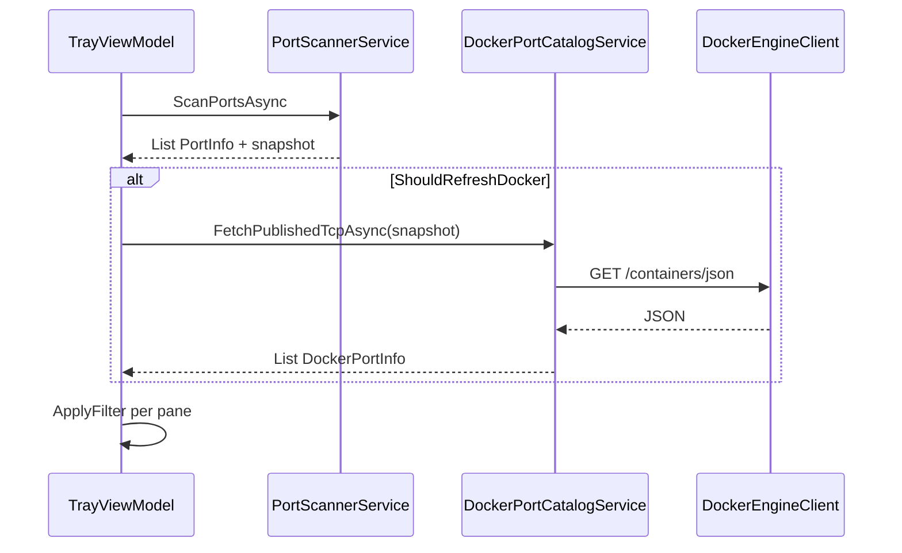

# Phase 2: Services & ViewModel — Docker Dual Pane

| Field | Value |
| --- | --- |
| Initiative | [260527_docker-dual-pane-ports.md](260527_docker-dual-pane-ports.md) |
| Phase | 2 of 3 |
| Status | `complete` |
| Depends on | [Phase 1](260527_docker-dual-pane-phase1-contract-spec.md) complete |
| Governing authority | Updated `docs/spec/portcheck.md` |

---

## 1. Phase PRD

### Problem

需要高效、可取消的 Docker catalog 與宿主 listen 對照，並在 ViewModel 編排雙集合刷新，尚未改 UI。

### Goals

- 實作 `DockerEngineClient`、`DockerPortCatalogService`、`DockerContainerStopService`（供 UI **Kill** = docker stop）。
- 實作 `TryProbeAsync`（被動 pipe 探測，**絕不**啟動 Docker）。
- 實作 `DockerPortInfo` model。
- 擴充 `TrayViewModel`：雙集合、filter、refresh orchestrator、segment 狀態。
- 擴充 `PortScannerService`：listen snapshot export、docker proxy WMI skip。
- DI 註冊於 `App.xaml.cs`。
- `appsettings.json` 新鍵。

### Non-Goals

- XAML segment / 雙 ListBox（Phase 3）。
- Kill All 行為變更 UI。

### User Stories

1. VM 暴露 `LocalPorts`, `DockerPorts`, `Filtered*`, `ActivePane`, `IsDockerSurfaceVisible`, counts。
2. Refresh 可取消且不重疊。
3. `TryProbeAsync` 更新 `IsDockerSurfaceVisible`；失敗時無任何 Docker UI 文案。
4. 完整 catalog **僅當** `IsDockerSurfaceVisible && ActivePane==Docker`。
5. `KillContainerAsync`（內部 docker stop）供 Phase 3 Kill 按鈕。

### Success Criteria

- [ ] `dotnet build` Debug 成功。
- [ ] 手動：daemon on 時 `IsDockerSurfaceVisible=true` 且 catalog 有列；daemon off 時 `IsDockerSurfaceVisible=false`（不拋錯、無「unavailable」屬性給 UI）。
- [ ] 手動：Local 刷新間隔內僅一次 Win32 掃描供 docker listen 標記使用。

---

## 2. Phase TDD

### File Plan

| Path | Action |
| --- | --- |
| `Models/DockerPortInfo.cs` | **New** |
| `Models/HostListenSnapshot.cs` | **New** readonly struct |
| `Services/DockerEngineClient.cs` | **New** |
| `Services/DockerPortCatalogService.cs` | **New** |
| `Services/DockerContainerStopService.cs` | **New** |
| `Services/DockerEngineException.cs` | **New** optional typed errors |
| `Services/PortScannerService.cs` | Add `ScanListenSnapshotAsync()` or return tuple; proxy skip |
| `ViewModels/TrayViewModel.cs` | Dual collections, orchestrator, `StopContainerAsync` |
| `ViewModels/PortPane.cs` | **New** enum `Local`, `Docker` |
| `App.xaml.cs` | Register services |
| `appsettings.json` | New keys |

### `DockerEngineClient` Design

```csharp
// Pseudocode — named pipe, no NuGet
internal sealed class DockerEngineClient
{
    private readonly HttpClient _http;
    public async Task<string> GetAsync(string path, CancellationToken ct);
    public async Task PostAsync(string path, CancellationToken ct);
}
```

- Connect: `NamedPipeClientStream(".", pipeName, PipeDirection.InOut, PipeOptions.Asynchronous)`.
- Request: `GET /containers/json?all=false HTTP/1.1\r\nHost: localhost\r\n\r\n`.
- Parse status + Content-Length body.

### `DockerPortCatalogService` Design

```csharp
public async Task<IReadOnlyList<DockerPortInfo>> FetchPublishedTcpAsync(
    HostListenSnapshot listen,
    CancellationToken ct)

public async Task<bool> TryProbeAsync(CancellationToken ct)  // pipe connect only, never start Docker
```

1. `TryProbeAsync`: open named pipe or minimal `GET /version` with `dockerEngineProbeTimeoutMs`; success → gate true.
2. `FetchPublishedTcpAsync`: `GET /containers/json?all=false` (**running only**).
3. Flatten `Ports` → rows (tcp, PublicPort > 0); populate all port detail fields for §10.3.
4. Set `IsHostListening = listen.Contains(hostPort)` (v1 port-only match).
5. Return **new list** (no mutation of prior instances).

### `TrayViewModel` Refresh Orchestrator

```csharp
private int _refreshGeneration;
private async Task RefreshAsync()
{
    if (Interlocked.CompareExchange(ref _scanInFlight, 1, 0) != 0) return;
    try
    {
        _refreshCts?.Cancel();
        _refreshCts = new CancellationTokenSource();
        var ct = _refreshCts.Token;

        var localTask = _scanner.ScanPortsAsync();
        var probeTask = _engine.TryProbeAsync(ct);

        await Task.WhenAll(localTask, probeTask);
        var listen = /* from local scan */;
        var gate = probeTask.Result && _config.DockerCatalogEnabled;

        IReadOnlyList<DockerPortInfo> dockerPorts = Array.Empty<DockerPortInfo>();
        if (gate && ActivePane == PortPane.Docker)
            dockerPorts = await _catalog.FetchPublishedTcpAsync(listen, ct);

        _dispatcher.Invoke(() => ApplySnapshot(localPorts, dockerPorts, listen, gate));
    }
    finally { Interlocked.Exchange(ref _scanInFlight, 0); }
}
```

- On `ActivePane` changed to Docker while `gate==true`: fire immediate catalog fetch.
- Mark `IsDockerPublished` on local `PortInfo` when host port exists in last successful catalog snapshot (for badge).

### `HostListenSnapshot`

```csharp
public readonly struct HostListenSnapshot
{
    private readonly HashSet<int> _ports;
    public bool IsTcpListening(int port) => _ports.Contains(port);
    public static HostListenSnapshot FromPorts(IEnumerable<PortInfo> ports);
}
```

### PortScannerService Changes

- Extract `BuildListenSnapshot(List<PortInfo>)` after scan.
- If `skipHeavyProcessInfoForDockerProxy` and name in allowlist → `command = processName` only (skip WMI).

### Failure Modes

| Mode | Behavior |
| --- | --- |
| Pipe not found | `IsDockerSurfaceVisible=false`; clear docker collections; **no user-facing message** |
| Timeout | Same |
| JSON parse error | Log debug; empty docker list |
| Cancelled refresh | Discard result; no dispatcher update |

### Test Strategy (Phase 2)

| Test | Type |
| --- | --- |
| `HostListenSnapshot` contains port | Unit if test project added; else manual |
| Build | `dotnet build` |
| Engine parse | Manual with running `docker run -p` |

---

## 3. Data Flow



---

## 4. API / DB / UI Contract (Phase Scope)

- **API:** Implement global §7.1–7.2 in Services only.
- **DB:** N/A.
- **UI:** VM properties only; no XAML in Phase 2.

### VM Public Contract (for Phase 3 binding)

| Property | Type |
| --- | --- |
| `ActivePane` | `PortPane` |
| `LocalPorts` | `ObservableCollection<PortInfo>` |
| `FilteredLocalPorts` | `ObservableCollection<PortInfo>` |
| `DockerPorts` | `ObservableCollection<DockerPortInfo>` |
| `FilteredDockerPorts` | `ObservableCollection<DockerPortInfo>` |
| `LocalPortCount` | `int` |
| `DockerPortCount` | `int` |
| `IsDockerSurfaceVisible` | `bool` |
| `SearchQuery` | `string` (pane-aware filter) |
| `SelectPaneCommand` | `PortPane` parameter |
| `KillContainerCommand` | `DockerPortInfo`（執行 docker stop） |

---

## 5. Operational Concerns (Phase 2)

- Singleton `HttpClient` / `DockerEngineClient`.
- `JsonSerializerOptions` + source generator context for `ContainerJsonDto[]`.
- No `async void` except existing app startup.
- All service methods accept `CancellationToken`.

---

## 6. Edge Cases (Phase 2)

| Case | Expected |
| --- | --- |
| Docker disabled in config | `ShouldRefreshDocker` false; `DockerPorts` cleared |
| Empty Engine `Ports` | Empty collection |
| Container with null Labels | Compose fields null |
| Refresh cancelled mid-flight | No partial UI update |

---

## 7. Validation Plan

| # | Step | Pass |
| --- | --- | --- |
| 1 | `dotnet build -c Debug` in `src/PortCheck` | Exit 0 |
| 2 | Temporary debug log or unit-less assert: publish port appears in VM collection | Manual |
| 3 | Stop Docker Desktop → `IsDockerSurfaceVisible == false` | Manual |

---

## 8. Test and Verify Contract

| Lane | Classification |
| --- | --- |
| Sanity | **Required** — `dotnet build` |
| API QA | no |
| Browser UI QA | no |
| Desktop UI | Deferred to Phase 3 |
| Code review | Deferred to Phase 3 (or lightweight spec compliance review) |

---

## 9. Open Questions (Phase 2)

| # | Question | Default |
| --- | --- | --- |
| P2-Q1 | Source generator vs hand DTO | **Source generator** if csproj allows; else minimal DTO classes |
| P2-Q2 | `ScanPortsAsync` return type change | Add overload `ScanAsync()` returning `(List<PortInfo>, HostListenSnapshot)` to avoid double scan |

---

## 10. Phase Changelog

| Date | Change |
| --- | --- |
| 2026-05-27 | Phase 2 document created |

---

## 11. Completion Criteria

- [ ] All Phase 2 files implemented.
- [ ] `dotnet build` pass.
- [ ] Manual daemon on/off check documented in global aggregate changelog.
- [ ] Phase 3 may begin.
