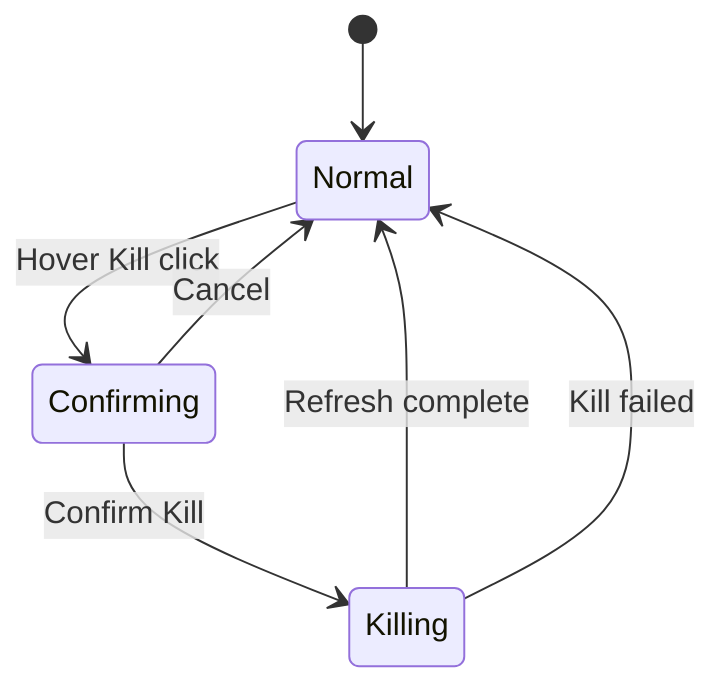

# Phase 3: UI, Stop, Verify — Docker Dual Pane

| Field | Value |
| --- | --- |
| Initiative | [260527_docker-dual-pane-ports.md](260527_docker-dual-pane-ports.md) |
| Phase | 3 of 3 |
| Status | `complete` |
| Depends on | [Phase 2](260527_docker-dual-pane-phase2-services-vm.md) complete |
| Governing authority | `docs/spec/portcheck.md` |

---

## 1. Phase PRD

### Problem

ViewModel 已具雙集合，需 compact 雙 pane UI、Docker stop 互動、完整 QA 與 code review。

### Goals

- Segment control **Local Port** / **Docker Port**。
- 雙 `ListBox`（或單 ListBox + `DataTemplateSelector`）綁定 `FilteredLocalPorts` / `FilteredDockerPorts`。
- Compact row styles（global §10.2–10.3）。
- Docker row：hover **Kill**（✕ 同 Local）→ confirm `Kill {ContainerName}?` → `KillContainerCommand`（docker stop）。
- Docker row：必須顯示 §10.3 全部 port detail 欄位。
- Local row：保留 kill UX；**Docker** badge when `IsDockerPublished`。
- **Kill All** 按鈕置於 **Local Port 區塊內**（非全域 footer）；Docker 無 Kill All。
- `IsDockerSurfaceVisible==false` 時不渲染 Docker segment（單列表外觀）。
- Search placeholder 隨 pane 切換。
- 完成 desktop QA 證據與 dual code review。

### Non-Goals

- 新視窗、設定頁。

### User Stories

1. 使用者切換 segment 看到不同列表與計數。
2. 使用者於 Docker pane **Kill**（docker stop）後列表更新。
3. 緊湊 UI 在 520px 高度內較改版前多顯示約 15–20% 列。

### Success Criteria

- [ ] 所有 global initiative success criteria（§14）通過。
- [ ] Sanity pass。
- [ ] Desktop UI QA 證據存檔。
- [ ] `code-review` + `receiving-code-review` pass。

---

## 2. Phase TDD

### File Plan

| Path | Action |
| --- | --- |
| `TrayPopupWindow.xaml` | Segment, dual list visibility, compact templates, empty states |
| `TrayPopupWindow.xaml.cs` | `StopContainer` handlers mirroring kill pattern |
| `Themes/LiquidGlass.xaml` | `GlassPortListItemCompact`, `GlassDockerPortListItem` styles |
| `ConfirmDialog.xaml` | Optional: reuse for stop copy or inline confirm row |
| `README.md` | One line Docker requirement |

### UI Structure (XAML)

```text
[ Search box ] [ count for active pane ]

[ Local Port (n) | Docker Port (m) ]  <- Segmented toggle; Docker half Visibility=IsDockerSurfaceVisible

[ ListBox - Local ]
  [ Kill All ]  <- inside Local section only
[ ListBox - Docker ]  Visibility: gate AND ActivePane

[ Footer: Refresh | Hide ]   <- NO Kill All here
```

### Segment Implementation Options

| Option | Pros | Cons | **Pick** |
| --- | --- | --- | --- |
| Two `RadioButton` in `UniformGrid` | Simple, MVVM-friendly | — | **Yes** |
| `TabControl` | Built-in | Heavier style override | No |
| Single ListBox + template selector | One control | Complex confirm states | No |

### Local Row Template (compact)

- Bind existing kill/confirm pattern.
- Add optional `TextBlock` `Docker` visibility `{Binding IsDockerPublished}`.

### Docker Row Template (compact)

| Column | Content |
| --- | --- |
| 0 | Listen dot (green/gray) |
| 1 | Line1 `:HostPort` + `HostAddress`; Line2 full `DisplayPortDetail` |
| 2 | **Kill** button on hover (same ✕ as Local) |
| Confirm row | `Kill {ContainerName}?` |

### Code-Behind

- Reuse kill pattern: `KillSingleContainer_Click` → `IsConfirmingKill`; `ConfirmKill_Click` → `KillContainerCommand`.

### Kill All Placement

- Control lives under Local Port `ListBox` host panel (or Local section `StackPanel`).
- **Removed** from footer `StackPanel` entirely.

---

## 3. UI Contract (Phase 3 Complete)

Refer to global [§10 UI Contract](260527_docker-dual-pane-ports.md#10-ui-contract).

### Visible States Summary

| Pane | Loading | Empty | Error/Unavailable | Ready |
| --- | --- | --- | --- | --- |
| Local | Refresh indicator | `No local ports listening` | — | Port rows |
| Docker | Refresh indicator | `No published Docker TCP ports`（segment visible only） | **N/A — segment hidden** | Docker rows + full port detail |

---

## 4. Docker Kill Flow (= docker stop)



- Command: `KillContainerAsync(DockerPortInfo)` → `DockerContainerStopService` → refresh.
- Failure MessageBox: same tone as local kill elevation warning.

---

## 5. Compact Metrics Verification

| Metric | Before | After | Verify |
| --- | --- | --- | --- |
| `GlassPortListItem` Padding | 10,5 | 8,3 | Measure in VS designer |
| Row MinHeight | 32 | 26 (local), 28 (docker) | Screenshot |
| Popup height | 520 | 520 unchanged | No layout clip on footer |

---

## 6. Edge Cases (UI)

| Case | UI behavior |
| --- | --- |
| Switch pane during confirm | Cancel confirm state on pane change |
| Docker empty + Local has rows | Segment switch works |
| Long container name | Ellipsis on line 2 |
| Kill All on Docker tab | Hidden — cannot trigger Ctrl+K effect |

---

## 7. Validation Plan (QA)

### Sanity

```powershell
dotnet build -c Debug
dotnet publish -c Release -r win-x64 /p:PublishSingleFile=true
```

### Desktop Manual Matrix

| ID | Steps | Expected |
| --- | --- | --- |
| D-1 | Docker off / not installed, open popup | **No** Docker segment; looks like today |
| D-2 | Docker on, `docker run -d -p 18080:80 nginx` | Docker tab shows `:18080`, address, `18080→80/tcp`, container name |
| D-3 | Kill from Docker pane | Container stops; row gone after refresh |
| D-4 | Local pane kill non-docker | Works as before |
| D-5 | Local docker-proxy row | Visible with **Docker** badge when mapped |
| D-6 | Kill All | Only in Local section; footer has no Kill All |
| D-7 | Search docker by service name | Filters correctly |
| D-8 | Stay on Local tab 30s | No full catalog fetch; probe only; no `docker.exe` spawn |
| D-9 | Ctrl+K | Kill All when Local active only |
| D-10 | Compact visual | ≥1 more row visible vs baseline screenshot |

Record: elevation state for Release stop test if needed.

### QA Lane Classification

| Lane | Required |
| --- | --- |
| API QA | no |
| Browser UI QA | no |
| Desktop tray UI | **yes** — qa-tester subagent or manual with evidence paths |
| QA report | yes |
| code-review | yes |
| receiving-code-review | yes |

---

## 8. Test and Verify Contract

Phase 3 complete when:

- [ ] Sanity pass.
- [ ] Desktop matrix D-1–D-8 pass or blocked with documented reason.
- [ ] QA report filed under `docs/implementation-records/` or workflow-defined path.
- [ ] Both review lanes pass.
- [ ] Global initiative status → `complete`.

---

## 9. Phase Changelog

| Date | Change |
| --- | --- |
| 2026-05-27 | Phase 3 document created |

---

## 10. Completion Criteria

- [ ] UI matches spec segment labels **Local Port** / **Docker Port**.
- [ ] Compact styles applied.
- [ ] Stop + kill paths verified.
- [ ] Initiative deliverable ready for `Deliver` phase.
