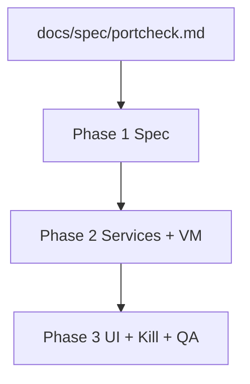
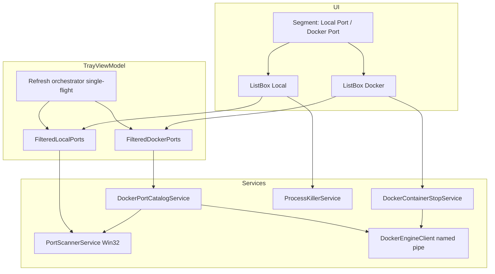
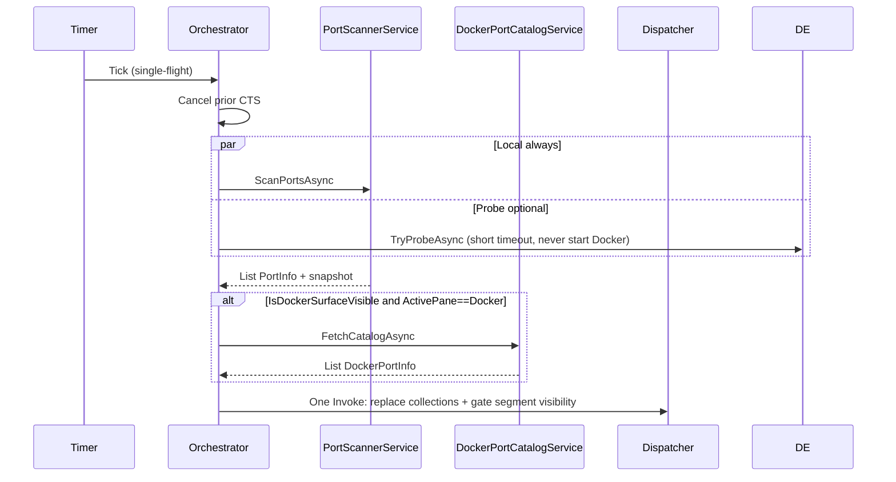

# Initiative: Docker Port + Local Port Dual Pane

| Field | Value |
| --- | --- |
| Initiative | Docker dual-pane port surfaces |
| Status | `complete` |
| Scale | **Large** |
| Governing spec (to update) | `docs/spec/portcheck.md` |
| Governing workflow | `docs/workflow/phases/*.md` |
| Created | 2026-05-27 |
| Phase documents | [Phase 1](260527_docker-dual-pane-phase1-contract-spec.md) · [Phase 2](260527_docker-dual-pane-phase2-services-vm.md) · [Phase 3](260527_docker-dual-pane-phase3-ui-kill-verify.md) |

---

## 1. Initiative Overview

### Problem Statement

PortCheck 目前以 **宿主 TCP listener** 為唯一列表來源。Docker published port 在畫面上常顯示為 `com.docker.backend` 等 proxy 行程，使用者無法直接看到 **container / compose service / 容器內埠**，也無法以「Docker 轉發」心智模型操作。

### Goals

1. 採 **方案 C 框架**（Docker 為中心的獨立列表），資料來源實作採 **方案 B enrichment**（以 Engine catalog 為主，宿主 listen 狀態為輔助欄位）。
2. 將現有單一列表更名為 **Local Port**（宿主 listener 列表，行為與現況一致）。
3. 新增 **Docker Port** 列表（Docker published port 為主鍵）。
4. UI 兩個 pane 的列高 **略為 compact**，在固定 popup 高度內提高可見列數。
5. 以 **最大化資源效率** 為設計約束：低 CPU、低配置、低 UI 分配、可取消的重入掃描；僅在 Docker surface 可見且使用者選中 Docker pane 時才拉完整 catalog。

### Non-Goals

- **啟動、安裝或喚醒 Docker**（不執行 Docker Desktop、不 spawn `docker.exe`、不嘗試啟動 Engine 服務）
- 在 Docker 不可用時於 UI 顯示任何 Docker 相關提示（無 segment、無 empty state、無「請啟動 Docker」文案）
- 遠端 Docker host / SSH context / Docker Context 切換
- Podman、Rancher Desktop 非 `docker_engine` pipe 的適配（v1）
- UDP、未 publish 的容器內部埠
- Swarm / Kubernetes ingress
- HTTP API 或 web UI
- Persistent port history / favorites / watched ports（`PortInfo.Inactive` 不在本 initiative）
- `docker compose` 靜態檔案解析（僅使用 container labels + Engine API）

### Actors / Permissions

| Actor | Capability |
| --- | --- |
| User | 切換 Local / Docker pane（僅 Engine 已可用時）、搜尋、refresh、kill（Local=終止 PID；Docker=**docker stop**，按鈕文案仍為 Kill）、Local 內 Kill All、hide popup、quit |
| OS | Local kill 與 Release elevation 規則不變 |
| Docker Engine | 僅在被動偵測到本機 pipe 可連線時使用；**不可用時 UI 不出現 Docker surface** |

### Success Criteria (Initiative)

- 預設且永遠可見：**Local Port**（宿主 listener）；**Kill All 僅位於 Local Port 區塊內**，不在全域 footer。
- 僅當 Engine **已被使用者事先啟動** 且 pipe 探測成功時，才顯示 **Docker Port** segment；未安裝 / Engine 未開 / 無法連線時，UI 與現今單列表一致，**零 Docker 字樣**。
- Docker Port：僅 **running containers**；每列必須顯示完整 **port detail**（見 §10.3）。
- Docker 列 **Kill** 按鈕語意 = `POST /containers/{id}/stop`（與 Local 的 kill PID 不同，確認框文案可共用 Kill 模式）。
- Local：不隱藏 docker-proxy 列；對應 publish 的列顯示 **Docker** badge。
- 刷新不重疊；Engine catalog 僅在 `IsDockerSurfaceVisible && ActivePane==Docker` 時拉取（見 §12）。
- `dotnet build` 通過；桌面 UI 手動驗證證據記錄於 Phase 3。
- `docs/spec/portcheck.md` 已更新且與實作一致。

### Scope Boundaries

| In scope | Out of scope |
| --- | --- |
| Tray popup 雙 pane UI | Main window |
| `DockerPortCatalogService` + named-pipe Engine client | NuGet `Docker.DotNet` |
| Spec 更新 | `prd.json` 故事拆分（可選同步） |

---

## 2. Scale Assessment

**Classification: Large**

| Signal | Manifestation |
| --- | --- |
| 多 surface | Spec、Models、2 Services、Helpers、ViewModel、XAML、Themes、appsettings |
| 多 ownership | Service（Engine + Win32）、ViewModel（雙集合 + 刷新編排）、View（雙 template + segment） |
| 行為契約擴張 | Kill vs `docker stop` 分離 |
| 需分階段驗證 | Phase 1 spec → Phase 2 services/VM → Phase 3 UI/kill/QA |

---

## 3. Phase Map

| Phase | Title | Objective | Depends on | Exit criteria |
| --- | --- | --- | --- | --- |
| **1** | Contract & Spec | 更新 `portcheck.md`；凍結模型與設定鍵 | — | Spec merged；Phase 1 doc complete |
| **2** | Services & ViewModel | Engine client、catalog service、雙集合刷新編排 | Phase 1 | Build pass；VM 單元可手動驗證 refresh |
| **3** | UI, Kill, Verify | Compact 雙 pane、docker stop、QA 證據 | Phase 2 | UI + kill 手動證據；review pass |

詳細 PRD/TDD/契約見各 phase 文件；本文件為 **cross-phase 權威摘要**。

---

## 4. Cross-Phase Contract

### Dependency Matrix



### Shared Data Contracts

| Type | Owner | Consumers |
| --- | --- | --- |
| `PortInfo` | Models | Local list, filter, kill |
| `DockerPortInfo` | Models | Docker list, filter, stop |
| `HostListenSnapshot` | Services → VM | Docker enrichment only |
| `DockerCatalogSnapshot` | Services → VM | Docker list |

### Sequencing Risks

| Risk | Mitigation |
| --- | --- |
| Spec 與 UI 文案不一致 | Phase 1 gate：禁止 Phase 2 寫碼直到 spec 合併 |
| Docker API 解析與 UI 綁定 | Phase 2 先完成 service + VM 無 UI |
| Kill 語意混淆 | UI 皆標 Kill；Local→`ProcessKillerService`；Docker→`DockerContainerStopService`（Engine stop） |
| 誤啟動 Docker | 禁止 spawn / 禁止啟動 Desktop；僅 pipe 探測 |

### Rollback Boundaries

- Phase 3 可回退 UI 至單列表（feature flag `dockerCatalogEnabled: false`）。
- Phase 2 可獨立關閉 Docker 刷新，不影響 Local scan。

---

## 5. Global Verification Model

| Lane | Classification | Evidence owner |
| --- | --- | --- |
| Sanity (`dotnet build`) | Required every phase | Phase 2+ |
| API QA | **no** | — |
| Browser UI QA | **no** | — |
| Desktop tray UI QA | **yes** (Phase 3) | QA subagent + manual |
| Dual code review | Required (Phase 3) | Subagents |
| Docker daemon on/off | Manual (Phase 3) | Implementation record |

Initiative complete when Phase 3 exit criteria met and global success criteria satisfied.

---

## 6. System Architecture (Initiative)

### Text Description

- **Local Port pane**：`PortScannerService` → `List<PortInfo>` → `TrayViewModel.LocalPorts` / `FilteredLocalPorts`。
- **Docker Port pane**：`DockerPortCatalogService` 透過 `DockerEngineClient` 呼叫 Engine API → `List<DockerPortInfo>`；並以 **單次** `PortScannerService` 產生的 `HostListenSnapshot`（`HashSet<(port, address)>`）標記 `IsHostListening`，不將兩列表 merge 為一。
- **RefreshOrchestrator**（VM 內私有邏輯或 `PortRefreshCoordinator` helper）：single-flight、`CancellationToken` 取消前次、tab-aware docker 刷新間隔。
- **Kill**：Local → `ProcessKillerService`；Docker → `DockerContainerStopService` → `POST /containers/{id}/stop`（UI 按鈕仍為 Kill）。
- **Docker surface 閘門**：`DockerEngineClient.TryProbeAsync()`；失敗則 `IsDockerSurfaceVisible=false`，不渲染 segment、不顯示任何 Docker 提示。

### Architecture Diagram



### Read/Write Ownership

| Data | Read | Write |
| --- | --- | --- |
| Local port rows | VM | `PortScannerService` only |
| Docker port rows | VM | `DockerPortCatalogService` only |
| Listen snapshot | `DockerPortCatalogService` / orchestrator | `PortScannerService` per refresh tick |
| UI selection/hover/kill confirm | View ↔ VM row state | ViewModel / `PortInfo` INotify |

---

## 7. API Contract (Docker Engine — Local Named Pipe)

Base: `http://localhost` over `\\.\pipe\docker_engine` (configurable). No auth on local pipe. All bodies JSON.

### 7.1 `GET /containers/json`

| Field | Value |
| --- | --- |
| Purpose | List running containers and published ports |
| Query | `all=false` (v1: **running only**) |
| Success | `200`, body: array of container objects |
| Errors | Pipe missing → `DockerUnavailable`; timeout → `DockerTimeout`; non-JSON → `DockerParseError` |

**Relevant response fields used:**

| JSON path | Maps to |
| --- | --- |
| `Id` | `DockerPortInfo.ContainerId` (short 12) |
| `Names[0]` | `DockerPortInfo.ContainerName` (trim `/`) |
| `Labels["com.docker.compose.service"]` | `DockerPortInfo.ComposeService` |
| `Labels["com.docker.compose.project"]` | `DockerPortInfo.ComposeProject` |
| `Ports[].IP` | `HostAddress` |
| `Ports[].PublicPort` | `HostPort` |
| `Ports[].PrivatePort` | `ContainerPort` |
| `Ports[].Type` | `Protocol` (`tcp` only in v1 UI) |

**Success example (truncated):**

```json
[
  {
    "Id": "abc123def456",
    "Names": ["/my-web"],
    "Labels": {
      "com.docker.compose.project": "demo",
      "com.docker.compose.service": "web"
    },
    "Ports": [
      {
        "IP": "0.0.0.0",
        "PrivatePort": 80,
        "PublicPort": 8080,
        "Type": "tcp"
      }
    ]
  }
]
```

**Validation rules:**

- Ignore `Ports[]` entries where `Type != "tcp"` or `PublicPort == 0`.
- One UI row per `(ContainerId, HostPort, HostAddress, ContainerPort, Protocol)` tuple.
- Duplicate `PublicPort` on host across containers → show **multiple rows** (do not collapse).

### 7.2 `POST /containers/{id}/stop`

| Field | Value |
| --- | --- |
| Purpose | **Kill** action on Docker pane (= stop container) |
| Path | `id` = full container ID |
| Query | `t=10` (seconds) |
| Body | none |
| Success | `204 No Content` or `304` already stopped |
| Errors | `404` not found; pipe error → surface failure to user |
| Idempotency | Stopping already-stopped container treated as success |
| Side effects | Container stops; host published port may disappear on next refresh |

---

## 8. Database Contract

**Not applicable.** Desktop app holds in-memory snapshots only; no database.

| Concept | In-memory structure | Lifetime |
| --- | --- | --- |
| Local ports | `ObservableCollection<PortInfo>` | Until next refresh replace |
| Docker ports | `ObservableCollection<DockerPortInfo>` | Until next refresh replace |
| Listen snapshot | `HostListenSnapshot` struct wrapping `HashSet<int>` or `(int port, string address)` | Per refresh tick, not persisted |

---

## 9. Model Contract

### 9.1 `PortInfo` (existing — Local pane)

保留現有欄位與 `INotifyPropertyChanged`（僅 UI kill 狀態）。新增 **optional**：

| Field | Type | Required | Notes |
| --- | --- | --- | --- |
| `IsDockerPublished` | `bool` | no | Local 列上小標記；由 VM 在 refresh 後 O(1) set lookup，不寫入 scanner |

### 9.2 `DockerPortInfo` (new)

| Field | Type | Required | Default | Notes |
| --- | --- | --- | --- | --- |
| `Id` | `Guid` | yes | new | UI 穩定鍵 |
| `ContainerId` | `string` | yes | — | Full id for API stop |
| `ContainerIdShort` | `string` | computed | first 12 | Display |
| `ContainerName` | `string` | yes | — | Without leading `/` |
| `ComposeProject` | `string?` | no | null | From label |
| `ComposeService` | `string?` | no | null | From label |
| `HostPort` | `int` | yes | — | PublicPort |
| `ContainerPort` | `int` | yes | — | PrivatePort |
| `Protocol` | `string` | yes | `"tcp"` | |
| `HostAddress` | `string` | yes | — | e.g. `0.0.0.0` |
| `IsHostListening` | `bool` | yes | — | From listen snapshot |
| `IsConfirmingKill` | `bool` | UI | false | INotify；與 Local 相同確認模式 |
| `IsKilling` | `bool` | UI | false | INotify |
| `DisplayHostPort` | `string` | computed | `:{HostPort}` | |
| `DisplayMapping` | `string` | computed | `{HostPort} → {ContainerPort}/{Protocol}` | |
| `DisplayPortDetail` | `string` | computed | 完整一行 port detail（見 §10.3） | |
| `DisplaySubtitle` | `string` | computed | compose service or container name | |

**Immutability rule:** 掃描產生的識別欄位使用 `init`；僅 `IsConfirmingKill` / `IsKilling` 可變。

---

## 10. UI Contract

### Surface: `TrayPopupWindow` (no route — tray popup)

| Item | Value |
| --- | --- |
| Purpose | Dual-pane port management |
| Window size | Keep `340×520`; list area uses saved vertical space from compact rows |

### 10.1 Segment Control & Docker Surface Gate

| State | Behavior |
| --- | --- |
| `IsDockerSurfaceVisible` | `true` **only** after passive pipe probe succeeds（Engine 已由使用者啟動）；`false` 時 **不渲染** Docker segment，popup 呈現單一 Local 模式 |
| Default | **Local Port** selected |
| Labels | `Local Port` \| `Docker Port`（後者僅在 gate 為 true 時存在） |
| Count | Local 永遠顯示；Docker count 僅在 segment 可見時顯示 |
| Switch | Swaps visible `ListBox`；search 僅作用於 active pane |
| Engine 由可用→不可用 | 隱藏 Docker segment；若當前在 Docker pane，**自動切回 Local**；不顯示錯誤橫幅 |

### 10.2 Local Port List

| State | Visible content |
| --- | --- |
| Loading | Footer refresh shows scanning (existing) |
| Empty | `No local ports listening` |
| Ready | Row: status dot, `:port`, `ProcessName`, **`Docker` badge** if `IsDockerPublished`, PID / kill |
| Kill All | **位於 Local Port 區塊內**（segment 標題列下方或列表底部），不在全域 footer；行為同現今 Kill All（終止 Local 列表內所有 active PID） |
| Error | N/A (scan failure → empty list + debug log; no modal) |

**Local 列規則：** 不隱藏 `com.docker.backend` / `docker-proxy` 等 proxy 列；僅加 badge，不移除。

**Compact row spec (Local):**

| Property | Current | Target |
| --- | --- | --- |
| Row `MinHeight` | 32 | **26** |
| Confirm row `MinHeight` | 32 | **26** |
| `GlassPortListItem` Padding | `10,5` | **`8,3`** |
| `GlassPortListItem` Margin | `3,2` | **`2,1`** |
| Status ellipse | 6×6 | **5×5** |
| Primary font | 13 | **12** |
| PID font | 11 | **10** |

### 10.3 Docker Port List

**前置條件：** 僅當 `IsDockerSurfaceVisible==true` 時本節 UI 存在。Engine 未安裝/未啟動時 **整段不出現**（無 empty、無提示）。

| State | Visible content |
| --- | --- |
| Loading | 與 Local 共用 footer Refresh 狀態 |
| Empty (Engine up, zero published TCP) | `No published Docker TCP ports`（僅在 segment 可見時） |
| Ready | 每列 **必須** 顯示下列 port detail（不可只顯示宿主埠數字） |

**每列必填 Port detail（Running container + published TCP）：**

| 顯示項 | 來源欄位 | 範例 |
| --- | --- | --- |
| 宿主埠 | `HostPort` | `:8080` |
| 宿主位址 | `HostAddress` | `0.0.0.0` |
| 對照 | `HostPort`→`ContainerPort`/`Protocol` | `8080 → 80/tcp` |
| 容器 | `ContainerName` | `my-web` |
| Compose（若有 label） | `ComposeProject` / `ComposeService` | `demo / web` |
| 宿主是否在 listen | `IsHostListening` | badge `Listening` / `Idle` |

**Compact row spec (Docker):**

| Element | Spec |
| --- | --- |
| Row `MinHeight` | **28–30**（兩行以容納 port detail） |
| Line 1 | `DisplayHostPort` + `HostAddress` SemiBold 12px |
| Line 2 | `DisplayPortDetail`（mapping + container + compose）11px ellipsis |
| Listen badge | 10px；`IsHostListening` |
| Hover action | **Kill**（✕ 同 Local）；確認 `Kill {ContainerName}?`；執行 **docker stop** |

### 10.4 Search

| Pane | Filters |
| --- | --- |
| Local | port, process name, PID (unchanged) |
| Docker | host port, container port, container name, compose project/service, container id short |

Placeholder: `Search local ports…` / `Search Docker ports…` (switches with segment).

### 10.5 Footer Actions（全域）

| Action | Scope |
| --- | --- |
| Refresh | 永遠可用；觸發 Local scan +（若 Docker surface 可見且為 Docker pane）catalog |
| Hide / Quit | 不變（tray 右鍵 Quit 不變） |
| **Kill All** | **不在全域 footer**；僅 §10.2 Local Port 區塊內 |

### 10.6 Keyboard

| Key | Behavior |
| --- | --- |
| Ctrl+R | Refresh |
| Ctrl+K | Kill All（僅當 Local pane active；等同 Local 區塊內按鈕） |
| Esc | Hide popup |

### 10.7 Docker 不可用（未安裝 / Engine 未開 / pipe 失敗）

| Rule | Behavior |
| --- | --- |
| Segment | **不顯示** Docker Port |
| Copy | **不得**出現「Docker unavailable」「請啟動 Docker」等任何字樣 |
| PortCheck 行為 | **絕不**嘗試啟動或安裝 Docker |
| Local pane | 不受影響，含 docker-proxy 列 + badge |
| Probe | 被動、短超時；失敗僅設 `IsDockerSurfaceVisible=false` |

---

## 11. Configuration Contract (`appsettings.json`)

```json
{
  "appSettings": {
    "refreshIntervalSeconds": 5,
    "dockerRefreshIntervalSeconds": 10,
    "dockerEnginePipeName": "docker_engine",
    "dockerCatalogEnabled": true,
    "dockerEngineTimeoutMs": 2000,
    "dockerEngineProbeTimeoutMs": 400,
    "skipHeavyProcessInfoForDockerProxy": true
  }
}
```

| Key | Type | Default | Validation |
| --- | --- | --- | --- |
| `refreshIntervalSeconds` | int | 5 | ≥ 1 |
| `dockerRefreshIntervalSeconds` | int | 10 | ≥ `refreshIntervalSeconds` when tab inactive |
| `dockerEnginePipeName` | string | `docker_engine` | non-empty |
| `dockerCatalogEnabled` | bool | true | false → never show Docker segment |
| `dockerEngineTimeoutMs` | int | 2000 | full catalog fetch |
| `dockerEngineProbeTimeoutMs` | int | 400 | passive pipe probe only |
| `skipHeavyProcessInfoForDockerProxy` | bool | true | skips WMI command line for known proxy names |

---

## 12. Operational Concerns (Performance-First Design)

### 12.1 Refresh Orchestration



| Rule | Rationale |
| --- | --- |
| **Single-flight** | 新 tick 取消進行中 `CancellationToken`；避免堆疊 Win32 + HTTP |
| **Never start Docker** | 僅連既有 pipe；失敗 → `IsDockerSurfaceVisible=false` |
| **Passive probe** | 每次 Local refresh 可選輕量 `TryProbeAsync`（`dockerEngineProbeTimeoutMs`）以更新 segment 可見性；**不**拉完整 catalog |
| **Catalog only on Docker pane** | `IsDockerSurfaceVisible && ActivePane==Docker` 才 `GET /containers/json` |
| **Switch to Docker pane** | 立即觸發一次 catalog fetch（若 gate true） |
| **Listen snapshot once** | 每次 tick 最多 **一次** Win32 scan；docker catalog 重用 snapshot |
| **Batch UI update** | 單次 `Dispatcher.Invoke` 清空並 `Add` 全部；gate false 時移除 Docker segment 元素 |

### 12.2 Docker Engine Client

| Rule | Rationale |
| --- | --- |
| **Named pipe HTTP** | 無 `docker.exe` process spawn |
| **Reuse `HttpClient`** | Singleton `DockerEngineClient` with handler bound to pipe |
| **`System.Text.Json` source generator** | `DockerContainersJsonContext` 降低反射與分配 |
| **Timeout** | `dockerEngineTimeoutMs` 防止 UI 卡住 |
| **Response buffer cap** | Reject > 4 MB body (DoS guard) |

### 12.3 Local Scan Optimizations

| Rule | Rationale |
| --- | --- |
| **Process cache by PID** | 已有；保留 |
| **Skip WMI `CommandLine`** when `skipHeavyProcessInfoForDockerProxy` and process name in allowlist: `com.docker.backend`, `docker-proxy`, `wslrelay`, `vpnkit` | WMI 為熱路徑大頭 |
| **Dedup** | 保留 `(Port, Pid)` group |

### 12.4 Filter / Search

| Rule | Rationale |
| --- | --- |
| Filter on snapshot **enumerable**, then replace `Filtered*` collection once | 避免 per-keystroke 逐項 Observable 操作 |
| `SearchQuery` drives active pane only | 減少一半 LINQ |

### 12.5 UI Virtualization

- 保持 `VirtualizingPanel.IsVirtualizing=True`。
- Compact rows 減少 layout cost。

---

## 13. Edge Cases

| Case | Expected behavior |
| --- | --- |
| Docker 未安裝 / Engine 未開 / pipe 失敗 | **不顯示** Docker segment；UI 同單列表；Local 正常 |
| Engine 可用後使用者手動啟動 | 下次 probe 成功 → segment 出現 |
| Container running, publish mapped, host not listening | Docker row `IsHostListening=false`, badge `Idle` |
| Host listening, not in docker catalog | Local row only; no docker badge |
| Same host port, two containers | Two docker rows |
| `dockerCatalogEnabled=false` | Hide Docker segment; app behaves as today |
| Refresh overlap | Prior scan cancelled; no duplicate dispatcher updates |
| Docker Kill（stop）失敗 | Row `IsKilling=false`; MessageBox with reason |
| Kill during confirm | Confirm row collapsed after success refresh |
| IPv6-only publish | v1: show if Engine returns; listen match on port number only if ambiguous document in spec |
| User not in `docker-users` group | Probe 失敗 → segment 隱藏（與未安裝相同，無提示） |
| Large container count (>200) | Still virtualized list; JSON parse once |

---

## 14. Initiative PRD (Consolidated)

### User Stories

1. As a user, I open the tray popup and see **Local Port** by default with the same host listener list as today.
2. I switch to **Docker Port** and see each published TCP mapping with container and compose context.
3. I search within the active pane without affecting the other list.
4. I kill a local process from Local pane with existing confirmation UX.
5. I **Kill** a container from Docker pane（實際為 docker stop）with confirmation UX matching Local.
6. When Docker is not installed or Engine is not running, I see **only Local Port**—no Docker tab, no warnings.
7. PortCheck never starts Docker for me.
8. Refresh does not spike CPU from overlapping scans.

### Success Criteria (Measurable)

- [ ] Segment `Local Port` always visible; `Docker Port` only when Engine probe succeeds.
- [ ] Kill All control lives **inside** Local Port section only.
- [ ] Docker row shows full port detail table (§10.3); Kill triggers docker stop.
- [ ] With Docker off, UI has **zero** Docker labels/messages.
- [ ] With Docker running and `docker run -p 8080:80`, Docker pane shows mapping within one refresh cycle.
- [ ] Task Manager: no `docker.exe` child process per refresh (pipe only).
- [ ] Spec `docs/spec/portcheck.md` updated.

---

## 15. Aggregate Changelog (Planned)

| Phase | Planned changes |
| --- | --- |
| 1 | `docs/spec/portcheck.md` dual pane, kill/stop split, config keys |
| 2 | `DockerPortInfo`, `DockerEngineClient`, `DockerPortCatalogService`, `DockerContainerStopService`, VM orchestrator, DI |
| 3 | `TrayPopupWindow.xaml` segment + dual templates, compact theme, stop handlers, QA evidence |

---

## 16. Resolved Decisions（2026-05-27 使用者確認）

| # | Decision |
| --- | --- |
| D-1 | Docker 列表：**僅 running** containers（`all=false`）；每列 **必須** 顯示完整 port detail（§10.3） |
| D-2 | Docker 列按鈕：**Kill**；行為 = **docker stop**（`POST /containers/{id}/stop`） |
| D-3 | Local：**不隱藏** docker-proxy；對 publish 列加 **Docker** badge |
| D-4 | Docker 未安裝 / Engine 未開 / 無法連線：**不顯示任何 Docker UI**（無 segment、無提示）；PortCheck **絕不**主動啟動 Docker |
| D-5 | Tab 語意澄清：與「背景拉 catalog」無關；不可用時整個 Docker surface 不存在；可用時僅在 **Docker pane 選中** 時拉 catalog |
| D-6 | **Kill All** 移入 **Local Port 區塊內**；Docker 無 Kill All；全域 footer 僅 Refresh / Hide |

### Remaining Open Questions

| # | Question | Blocks? |
| --- | --- | --- |
| OQ-4 | IPv6 publish 與 listen 比對 | No — v1 **host port number** only |
| OQ-6 | Engine 已開但零 published TCP | **Resolved:** segment **hidden**（與 Engine 不可用相同，零 Docker UI） |

---

## 17. OMX Execution Surface

| Phase | Develop owner | Test focus |
| --- | --- | --- |
| 1 | Spec editor / leader | Spec review |
| 2 | `executor` subagent | `dotnet build`, service smoke |
| 3 | `executor` + `qa-tester` | Desktop UI + docker daemon on/off |

---

*End of global initiative document.*
