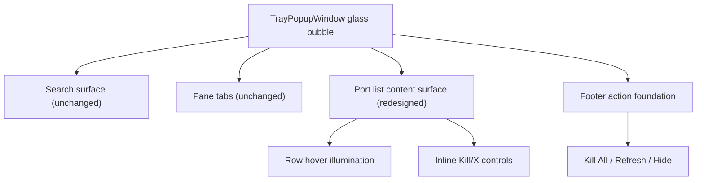

# PortCheck Liquid Glass Action Foundation

## Phase Metadata

| Field | Value |
| --- | --- |
| Change type | Medium |
| Primary surface | `TrayPopupWindow` UI styling |
| Owner boundary | View + Theme + governing UI/spec docs |
| Governing spec | `docs/spec/portcheck.md`, `UIUX_Design.md` |
| Governing workflow | `docs/workflow/phases/plan.md`, `docs/workflow/phases/develop.md`, `docs/workflow/phases/test.md` |
| Execution owner | `ralph` |

## PRD

### Problem statement

The current tray popup mixes two different visual roles under one shared glass language. The footer action surface (`Kill All`, `Refresh`, `Hide`) already behaves like the intended liquid glass foundation, but the port list and inline kill controls still inherit row/button treatments that make them look like generic bordered controls instead of Apple-style liquid glass content on top of an action foundation.

### Goals

- Make the footer action surface the explicit liquid glass foundation in repo contracts.
- Redesign only the `port list` material treatment so it derives from the footer foundation without copying footer chips literally.
- Fix row `Kill` and dismiss `X` controls so glyphs are crisp, centered, borderless in appearance, and visually consistent with liquid glass.
- Keep `tab` and `search bar` unchanged.

### Non-goals

- No layout changes to pane tabs.
- No visual changes to the search bar.
- No behavior changes to scan, filter, refresh, kill, or pane selection logic.
- No new dependencies.

### Actors / permissions

| Actor | Capability |
| --- | --- |
| User | View redesigned list rows and row actions |
| UI theme | Owns texture, reflection, radius, padding, and hover states |
| View model / services | Unchanged behavior only |

### User stories

- As a user, I can distinguish action foundation controls from content rows without losing alignment consistency.
- As a user, port rows feel like illuminated glass content, not menu buttons.
- As a user, the row `Kill` and `X` controls look sharp and centered rather than low-resolution or hand-drawn.

### Success criteria

- Footer action surface is documented as the liquid glass foundation.
- Port list rows use lighter content-surface treatment with refined padding, reflection, border, and hover illumination.
- Inline `Kill` and `X` controls no longer present a visible border ring and their glyphs are optically centered.
- `tab` and `search bar` XAML remain unchanged.
- `dotnet build` passes.

### Scope boundaries

In scope:

- `UIUX_Design.md`
- `docs/spec/portcheck.md`
- `src/PortCheck/TrayPopupWindow.xaml`
- `src/PortCheck/Themes/LiquidGlass.xaml`

Out of scope:

- ViewModel, services, helper classes
- Tab/search visuals
- Tray right-click menu

## TDD

### Technical approach

- Promote the footer action surface to explicit contract language in UI docs/spec.
- Introduce dedicated list-row material metrics and brushes instead of relying on the generic shared row appearance.
- Separate icon glyph rendering from text glyph rendering for row `Kill` and dismiss actions:
  - dismiss `X` uses vector line geometry, not a text glyph
  - `Kill` label button uses text only, with glass fill and no hard border look
- Keep command bindings and event handlers unchanged.

### Component breakdown

| Component | Responsibility |
| --- | --- |
| `UIUX_Design.md` | Canonical liquid glass design prompt/description |
| `docs/spec/portcheck.md` | Product-level UI contract |
| `TrayPopupWindow.xaml` | Row template structure and action content |
| `LiquidGlass.xaml` | Material tokens and control templates |

### Ownership boundaries

| Boundary | Owned by this change |
| --- | --- |
| View | Yes |
| Theme resources | Yes |
| ViewModel | No |
| Services | No |

### Data flow

User hover -> existing XAML trigger -> row/action visual state changes only.

No data contract or command flow changes.

### Failure modes

| Failure mode | Prevention |
| --- | --- |
| Port rows become too similar to footer actions | Use dedicated list-surface brushes, radius, and padding |
| Kill/X glyph remains visually off-center | Use vector `Path` for dismiss icon and explicit centered presenters |
| Hard border reappears around actions | Use transparent border or borderless templates with highlight carried by fill/overlay instead |
| Search/tab accidentally changed | Keep edits away from those sections and verify diff |

### Validation strategy

- Inspect diff to confirm tab/search row unchanged.
- Build WPF project.
- Check updated styles and templates reference only row/footer action controls.

### Test strategy

| Check | Expected result |
| --- | --- |
| `dotnet build` | Pass |
| Search row diff audit | No functional or visual edits |
| Pane tab diff audit | No functional or visual edits |
| Row action template audit | `Kill` and `X` use centered content and no visible border ring |
| List item style audit | Dedicated content-surface texture tokens present |

## System Architecture

### Text description

The popup remains a single glass bubble. Inside that bubble, the footer action group is the primary action foundation. The port list is a subordinate content surface with lighter glass texture, softer illumination, and separate row-action affordances. View and theme own all changed behavior; runtime services remain unchanged.

### Browser -> API -> service -> DB flow

Not applicable. Desktop WPF app. No browser, API, or DB surface involved.

### Permission flow

UI hover/click -> existing command/event path -> existing ViewModel/service path. No permission change.

### Read/write ownership

| Asset | Read/Write owner |
| --- | --- |
| XAML structure | View |
| style tokens/templates | Theme |
| command behavior | Existing code, unchanged |

## API Contract

No API surface affected.

## Database Contract

No database surface affected.

## UI Contract

| Surface | Contract |
| --- | --- |
| Search row | Unchanged |
| Pane tabs | Unchanged |
| Local/Docker list rows | Content-surface glass, lighter than footer action foundation, no hard bordered chip look |
| Inline `Kill` | Crisp glass action with centered label and no visible border ring |
| Inline dismiss `X` | Crisp centered vector cross, no text-glyph wobble, no visible border ring |
| Footer actions | Canonical liquid glass foundation, unchanged role |

Visible states:

- loading: unchanged
- empty: unchanged
- ready: new row material and action rendering only
- error: unchanged

## Operational Concerns

- Audit logging: none
- Observability: none
- Concurrency: unchanged
- Retry/idempotency: unchanged
- Data retention/deletion: unchanged
- Performance constraints: theme-only changes; no runtime work added
- Security/authz boundaries: unchanged

## Edge Cases

- Long process/container names must still trim cleanly beside action controls.
- Hover state must not clip glow or misalign action controls.
- Confirm row must preserve same refined action styling.
- Local and Docker row templates must remain visually related but not collapse into footer menu styling.

## Open Questions

None blocking. User explicitly constrained scope to document prompt descriptions, port list material redesign, and row `Kill/X` control fixes while keeping tab and search unchanged.

## Completion Criteria

- Governing docs describe the footer action surface as the liquid glass foundation.
- Port list styling tokens/templates are redesigned without touching tab/search visuals.
- Row action controls are visually corrected in XAML/theme structure.
- Project builds successfully.
