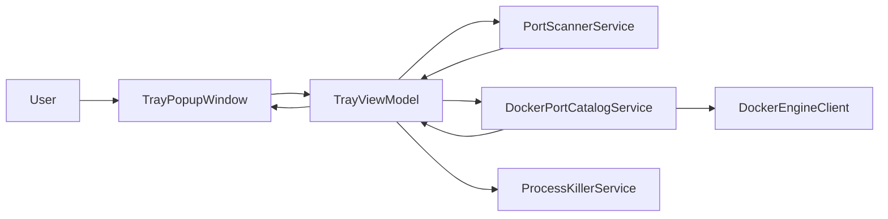
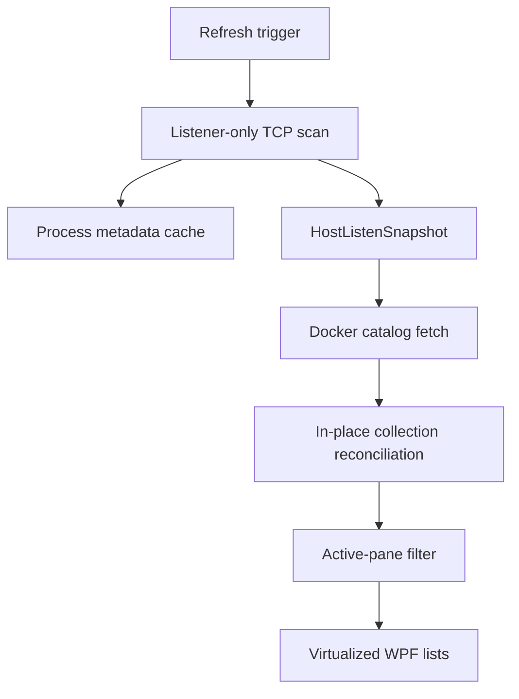
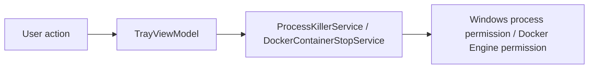

## PRD

### Problem statement

PortCheck refreshes local port data and optional Docker port data on a short polling interval. The current implementation performs avoidable heavy work on every refresh and popup open, causing unnecessary CPU, allocation, and UI-thread latency.

### Goals

- Reduce refresh-time CPU and allocation cost for local port scanning.
- Remove avoidable UI-thread blocking during kill flows.
- Remove redundant refresh and Docker probe work.
- Preserve current product behavior defined in `docs/spec/portcheck.md`.
- Keep ownership boundaries intact: services own scan/kill/catalog work, view model owns orchestration, view owns presentation.

### Non-goals

- No product-surface expansion.
- No new dependencies.
- No fallback or defensive duplicate paths.
- No workflow or spec redesign beyond performance-safe corrections.

### Actors / permissions

| Actor | Capability |
| --- | --- |
| User | Refresh, filter, kill local PID, stop Docker container, hide popup, quit |
| OS | Enforces process-kill permissions and elevation behavior |
| Docker Engine | Responds on named pipe when already running |

### User stories

- As a user, opening the tray popup should avoid redundant refresh work and feel immediate.
- As a user, periodic refresh should avoid unnecessary background cost.
- As a user, killing one or many rows should not freeze the popup.
- As a user, filtering large result sets should avoid unnecessary visual tree rebuild work.

### Success criteria

- One startup/open flow triggers only the minimum required refresh work.
- Port scanning avoids fetching non-listener rows.
- Kill-all avoids per-item full refresh loops.
- WPF lists keep virtualization enabled.
- Backdrop blur work is reduced from every show to one capture per visible session.
- Build passes after changes.

### Scope boundaries

- In scope: `Services`, `ViewModels`, `Helpers`, `TrayPopupWindow.xaml`, `TrayPopupWindow.xaml.cs`, `App.xaml.cs`, model support needed for keyed diff updates.
- Out of scope: tray icon asset pipeline, release packaging strategy, API/browser workflow docs, external infrastructure.

## TDD

### Technical approach

- Change `PortScannerService` to request listener-only TCP tables and eliminate redundant LINQ materialization/sorting.
- Add process metadata caching inside `PortScannerService` so expensive WMI/token lookups are reused across refreshes by PID and process start time.
- Change `TrayViewModel` refresh pipeline to:
  - avoid duplicate Docker probe + catalog round-trips
  - diff-update observable collections instead of clear/repopulate
  - avoid duplicate sorting already performed by services
  - run kill-all as one batch followed by one refresh
- Change `ProcessKillerService` to perform blocking process operations off the UI thread.
- Change popup lifecycle to avoid duplicate initial refresh and to reuse backdrop capture while visible.
- Re-enable WPF item virtualization in both lists.

### Component breakdown

| Component | Change |
| --- | --- |
| `PortScannerService` | listener-only query, metadata cache, lower-allocation loops |
| `ProcessKillerService` | move blocking work off UI thread |
| `DockerPortCatalogService` | provide probe+fetch path from one request boundary |
| `TrayViewModel` | keyed collection reconciliation, batched kill-all, reduced resorting |
| `TrayPopupWindow.xaml` | enable virtualization |
| `TrayPopupWindow.xaml.cs` | remove duplicate load refresh, cache backdrop per visible session |
| `App.xaml.cs` | keep one initialization refresh path only |
| `PortInfo` / `DockerPortInfo` | stable identity support for reconciliation |

### Ownership boundaries

- View model orchestrates refresh, filter, and command batching only.
- Services remain the only owners of Win32, process, and Docker named-pipe work.
- View handles rendering and popup lifecycle only.
- Helpers remain stateless utilities.

### Data flow

### Failure modes

- Local scan fails: return empty list as current service contract already does.
- Docker request fails: Docker surface stays hidden.
- Process/container kill fails: row state resets and current warning behavior remains.
- Reconciliation bug risk: counts/filter output may desync unless property notifications remain explicit.

### Validation strategy

- Build the solution after edits.
- Verify no compile-time break on XAML bindings and command usage.
- Review refresh, kill-all, and popup-open code paths for duplicate calls removed.

### Test strategy

- `dotnet build src/PortCheck.sln`
- Optional runtime sanity by inspecting startup/open code path and command flow from source after build.

## System Architecture

### Text description

The optimized architecture keeps the same runtime contract, but changes the refresh pipeline from “recreate everything each cycle” to “scan once, fetch Docker once, reconcile UI collections in place.” Expensive process metadata is cached inside the scan service, and blocking termination work is moved fully off the UI thread.

### Mermaid diagram

### Browser -> API -> service -> DB flow

Not applicable. This desktop app has no browser, API, or database surface in this scope.

### Permission flow

### Read/write ownership

- Read: `PortScannerService`, `DockerPortCatalogService`
- Write/action: `ProcessKillerService`, `DockerContainerStopService`
- UI state write: `TrayViewModel`
- Presentation only: `TrayPopupWindow`

## API Contract

No HTTP/API surface is owned by this desktop app scope. Internal Docker named-pipe calls keep their existing request paths and semantics.

## Database Contract

No database or persistent storage contract is affected.

## UI Contract

### `TrayPopupWindow`

- Purpose: show current local ports and optional Docker ports.
- Visible states: loading, ready, empty, hidden.
- Behavior changes in scope:
  - popup open does not force a second initial refresh when startup already populated data
  - list rendering stays virtualized
  - backdrop capture happens once per visible session, not on every show within that session
- Validation feedback and disabled states: unchanged from current contract.

## Operational Concerns

- Audit logging: none added.
- Observability: existing debug output retained.
- Concurrency: refresh remains single-flight; batch kill avoids nested refresh storms.
- Retry/idempotency: unchanged.
- Data retention/deletion: none.
- Performance constraints:
  - avoid non-listener TCP enumeration
  - avoid repeated WMI lookup for same living process
  - avoid full observable collection replacement when keys are unchanged
  - avoid UI-thread blocking waits in kill flow
- Security/authz boundaries: unchanged.

## Edge Cases

- PID reused by a different process: metadata cache must invalidate by start time, not PID alone.
- Docker unavailable between cycles: Docker surface hides cleanly.
- Rows removed while kill batch is running: batch logic must tolerate missing processes.
- Search query active during refresh: filtered collection must remain consistent.
- Popup hidden then shown again: backdrop cache must refresh once per newly visible session.

## Open Questions

- None. Current repo evidence and existing contract are sufficient for this optimization scope.

## Completion Criteria

- Planning artifact exists before code edits.
- Changed code keeps the current product contract.
- Refresh path removes duplicate work and reduces avoidable blocking/allocation.
- Solution builds successfully.
