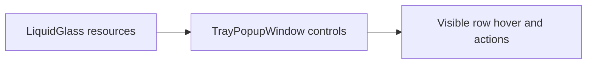
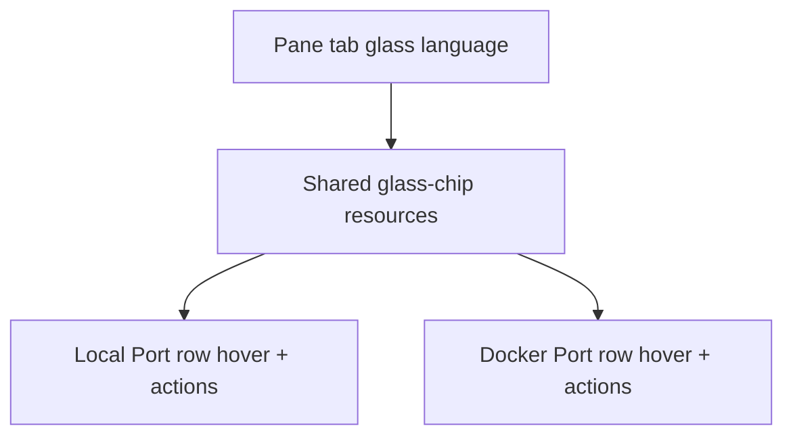

## PRD

### Problem statement

The current popup already has a strong visual language in the pane tabs, but the list rows and row action controls still use simpler hover and action treatments. The result is a UI that feels visually split between the top navigation and the operational controls.

### Goals

- Extract the existing tab glass-chip language into reusable list-row and action-control styles.
- Apply that language to local and Docker row hover states.
- Apply the same visual system to the inline kill button, confirm kill button, and dismiss/cross button.
- Preserve current behavior and control layout.

### Non-goals

- No product behavior changes.
- No command or view-model changes.
- No new icons, dependencies, or animation systems.

### Actors / permissions

| Actor | Capability |
| --- | --- |
| User | Hover rows, reveal actions, confirm kill, dismiss confirm state |

### User stories

- As a user, row hover should feel visually consistent with the tab chips.
- As a user, Local Port and Docker Port rows should inherit the same glass system with pane-appropriate emphasis.
- As a user, kill and dismiss controls should look like part of the same UI family as the pane tabs.

### Success criteria

- Local row hover visually matches the Local Port tab language.
- Docker row hover visually matches the Docker Port tab language.
- Inline kill, confirm kill, and dismiss/cross buttons share the tab-derived glass treatment.
- Build passes with no XAML errors.

### Scope boundaries

- In scope: `src/PortCheck/Themes/LiquidGlass.xaml`, `src/PortCheck/TrayPopupWindow.xaml`
- Out of scope: services, view model, popup behavior logic

## TDD

### Technical approach

- Add reusable tab-derived brushes and button shells to `LiquidGlass.xaml`.
- Split row item container styling into Local and Docker variants.
- Replace ad hoc row action button templates in `TrayPopupWindow.xaml` with extracted styles.

### Component breakdown

| Component | Change |
| --- | --- |
| `LiquidGlass.xaml` | shared row hover shells, local/docker list item styles, extracted row action button styles |
| `TrayPopupWindow.xaml` | apply new local/docker row item styles and action button styles |

### Ownership boundaries

- Theme resources own visual appearance.
- Tray popup XAML owns control composition and style application.
- No code-behind or view-model ownership change.

### Data flow

### Failure modes

- Over-styled rows could reduce readability.
- Replacing inline templates could break action sizing if style metrics drift.

### Validation strategy

- Build after edits.
- Verify both local and Docker row templates still bind and compile.

### Test strategy

- `dotnet build src/PortCheck.sln`

## System Architecture

### Text description

The change keeps the same UI structure and extracts a shared presentation layer from the existing pane-tab visual contract. Row hover, kill, and dismiss controls become consumers of the same glass-chip primitives rather than isolated one-off templates.

### Mermaid diagram

## API Contract

Not applicable.

## Database Contract

Not applicable.

## UI Contract

### `TrayPopupWindow`

- Local list item hover uses neutral active glass shell derived from the Local tab.
- Docker list item hover uses Docker-accented glass shell derived from the Docker tab.
- Inline row kill button uses extracted chip styling instead of inline local template markup.
- Confirm-row Kill and dismiss/cross buttons use the same extracted glass system.

## Operational Concerns

- No runtime/service impact.
- No security/authz impact.
- No concurrency impact.

## Edge Cases

- Long process/container names must remain readable under the new hover shell.
- Action button hit targets must remain unchanged.

## Open Questions

- None.

## Completion Criteria

- Planning artifact exists before edits.
- Row and action visuals use extracted shared resources.
- Build succeeds.
