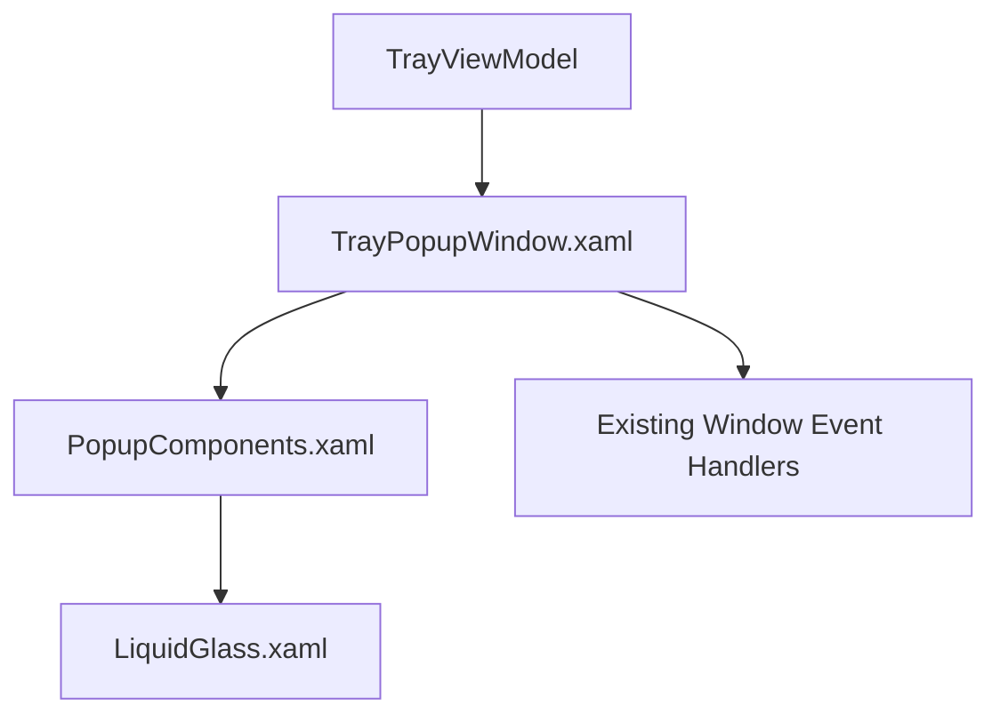

# Popup UI Component Refactor

## Phase Metadata

- Change scale: `Medium`
- Selected execution owner: `ralph`
- Primary changed surface: `TrayPopupWindow` popup UI composition
- Governing spec: `docs/spec/portcheck.md`
- Governing workflow: `docs/workflow/phases/plan.md`, `docs/workflow/phases/develop.md`, `docs/workflow/phases/test.md`

## PRD

### Problem Statement

`TrayPopupWindow.xaml` currently contains tightly coupled inline row composition for:

- local port list rows
- Docker port list rows
- footer action rows (`Kill All`, `Refresh`, `Hide`)

This coupling makes visual behavior hard to reason about and causes repeated regressions such as row hover border behavior leaking across surfaces.

### Goals

- reduce dependency between port-list row composition and footer action composition
- extract reusable popup UI components/resources so row behavior is explicit and locally maintainable
- keep the existing product behavior contract intact
- make hover/confirm/action behavior easier to validate by component boundary

### Non-Goals

- no redesign of tab or search bar systems
- no service-layer contract change
- no tray behavior change
- no Docker data-source change beyond preserving current contract

### Actors / Permissions

| Actor | Permission / role |
| --- | --- |
| User | view ports, hover rows, confirm kill, use footer actions |
| TrayViewModel | provides state, commands, active pane, filtered collections |
| WPF resource/component layer | renders popup rows and actions only |

### User Stories

1. As a user, I can see local port rows rendered by one reusable component structure.
2. As a user, I can see Docker port rows rendered by one reusable component structure.
3. As a user, I can use footer actions rendered by one reusable component structure independent from port rows.
4. As a maintainer, I can adjust popup row behavior without editing duplicated inline structures across the whole window.

### Success Criteria

- `TrayPopupWindow.xaml` no longer duplicates the full local/docker/footer row composition inline when a reusable component/resource can own it.
- Port-list row hover/focus shell behavior is owned by one dedicated row-shell component boundary.
- Footer action rows are owned by one dedicated action-row component boundary.
- Existing popup behavior still works: pane switching, hover kill reveal, confirm state, footer actions.
- Validation evidence still shows at least one real local listening port in the rendered popup.

### Scope Boundaries

- In scope:
  - popup row composition
  - popup row shell styles/templates
  - popup footer action composition
  - popup-specific resource extraction
- Out of scope:
  - search bar
  - pane tab redesign
  - process scanning
  - Docker stop semantics

## TDD

### Technical Approach

- extract popup row/action resources into a dedicated resource dictionary
- move duplicated local/docker/footer inline layout into reusable templates/styles
- keep `TrayPopupWindow.xaml` focused on high-level surface assembly and bindings
- keep view-model ownership unchanged

### Component Breakdown

| Component | Responsibility |
| --- | --- |
| `PopupComponents.xaml` | popup-only reusable data templates and row/action styles |
| `TrayPopupWindow.xaml` | surface assembly, pane layout, list binding, footer placement |
| `LiquidGlass.xaml` | material tokens and low-level control styles |

### Ownership Boundaries

| Boundary | Owner |
| --- | --- |
| popup assembly | `TrayPopupWindow.xaml` |
| popup reusable row/action components | popup component resource dictionary |
| low-level visual tokens | `LiquidGlass.xaml` |

### Data Flow

- `TrayViewModel.FilteredLocalPorts` -> local row template
- `TrayViewModel.FilteredDockerPorts` -> Docker row template
- footer buttons -> existing window event handlers / commands
- row action buttons -> existing window event handlers / commands

### Failure Modes

- resource extraction breaks existing bindings
- row template extraction loses `RelativeSource AncestorType=ListBoxItem` hover behavior
- footer extraction breaks `Kill All` visibility gating by pane
- component reuse accidentally re-couples footer and port-row shell behavior

### Validation Strategy

- build the refactor in an isolated sandbox copy if the live elevated app locks WPF intermediates
- validate reusable component output with popup render evidence
- confirm row hover shell has no border contract in extracted component boundary
- confirm popup still shows real local listening ports

### Test Strategy

- build check
- popup validation harness with real local ports
- component preview for action controls
- code inspection against planning artifact boundaries

## System Architecture

### Text Description

The popup should be composed from three layers:

1. `TrayPopupWindow.xaml` owns only surface layout and list/footer placement.
2. popup component resources own reusable row/action composition.
3. `LiquidGlass.xaml` owns low-level tokens and atomic control styles.

### Mermaid Diagram

### Browser -> API -> service -> DB Flow

- Not applicable for this desktop UI refactor.

### Permission Flow

- user input -> WPF popup component -> existing view-model command/event path

### Read/Write Ownership

| Asset | Read | Write |
| --- | --- | --- |
| popup row state | view / template | `TrayViewModel` / bound models |
| visual material tokens | templates | `LiquidGlass.xaml` |
| popup composition | `TrayPopupWindow.xaml` | `TrayPopupWindow.xaml` / popup component resources |

## API Contract

- No API surface affected.

## Database Contract

- No database surface affected.

## UI Contract

| Screen | Purpose | States |
| --- | --- | --- |
| `TrayPopupWindow` | popup list and action surface | loading, local ready, Docker ready, empty local, empty Docker, confirm kill, killing |

### Create / Edit / Delete Behavior

- none

### Save Flow

- none

### Validation Feedback

- row action visibility and confirm state must remain correct per existing bindings

### Disabled States

- Docker kill button remains hidden when row is not kill-supported
- `Kill All` remains hidden on Docker pane

### Dependency Behavior if Related API Is Unavailable

- existing inferred/catalog Docker visibility behavior remains unchanged for this refactor

## Operational Concerns

- maintainability: duplicated popup row markup must be reduced
- performance: virtualization and list scrolling must remain intact
- security/authz: unchanged
- observability: validation evidence files remain required

## Edge Cases

- pane switch while a row is confirming
- inferred Docker row with no kill support
- local row flagged as Docker-published
- empty Docker pane with visible tab segment

## Open Questions

- None blocking. The user explicitly requested simpler, reusable, maintainable popup components and has already fixed the desired visual direction: footer action material is the authoritative reference for interaction response, while port rows remain a separate architecture.
