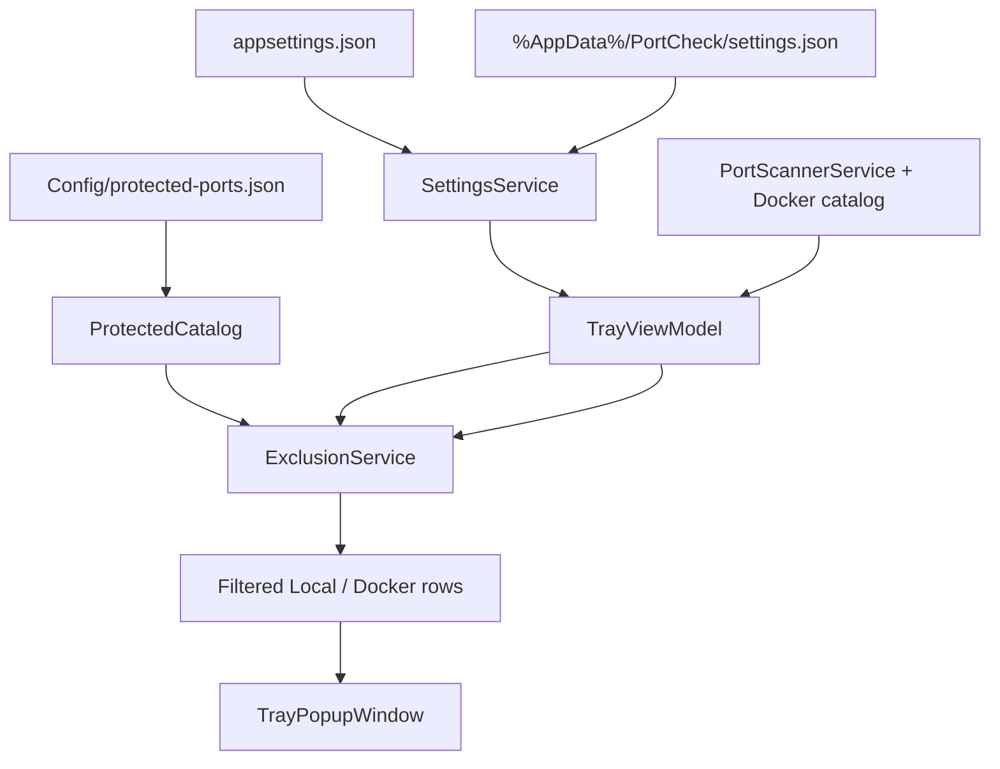
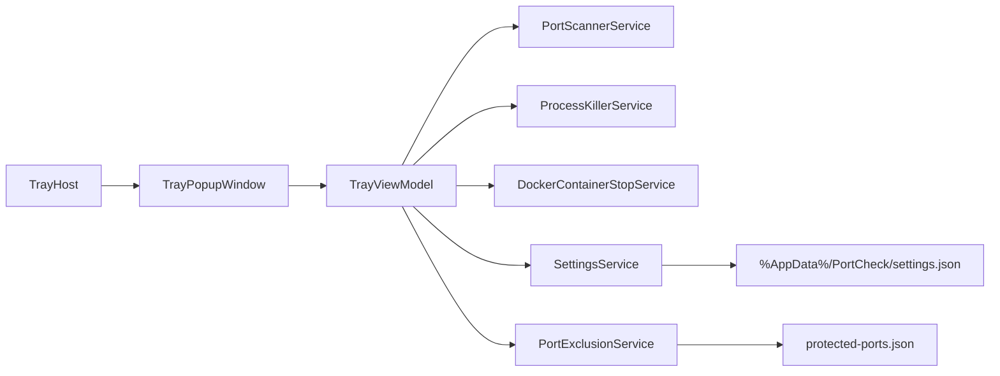

# 260528 Settings Subpage (Port Exclusion Filter + Refresh Interval)

**Type:** Medium (combined PRD + TDD per `docs/workflow/phases/plan.md`)  
**Governing authority:** `docs/spec/portcheck.md`, `UIUX_Design.md`, `docs/workflow/phases/plan.md`  
**Status:** Planning complete; approved for Develop  
**Created:** 2026-05-28  
**Selected execution owner:** `ralph`

---

## Change scale

**Medium**

- One primary changed surface: `TrayPopupWindow`
- Two ownership boundaries: View + ViewModel/Services
- No HTTP API
- Local JSON persistence only
- One verification cycle is sufficient after spec update

---

## 1. PRD

### Problem statement

PortCheck currently lists every listening TCP port and allows termination from the visible rows. Windows protected ports must never appear or be actionable. Users also need to hide additional host ports without editing deployment config. Refresh interval is deployment-only today and not adjustable from the tray UI.

### Goals

1. Add a `Settings` subpage inside the tray popup as a full surface swap.
2. Place the footer entry order as `Refresh`, `Settings`, `Hide`.
3. Apply one global host-port exclusion gate to Local and Docker surfaces.
4. Keep built-in Windows protected ports hidden, non-editable, and absent from Settings UI.
5. Allow users to add and remove their own excluded ports from Settings.
6. Allow refresh interval editing in seconds with immediate persistence and immediate timer restart.

### Non-goals

- Animation toggle
- Process-name-based filtering
- UDP / non-TCP filtering
- Showing excluded ports in a disabled or grey state
- Separate settings window
- Right-click tray settings entry
- Import/export or sync

### Actors / permissions

| Actor | Capability |
| --- | --- |
| User | Open Settings, add/remove excluded ports, adjust refresh interval, return to ports surface |
| PortCheck | Hide protected and excluded host ports before any rendered list or kill path |
| OS | No elevation change; exclusion does not change kill permissions |

### User stories

1. User opens popup and sees footer actions `Refresh`, `Settings`, `Hide`.
2. User opens `Settings` and returns with Back or `Esc`.
3. User adds port `5432` to excluded ports and it disappears from Local and Docker host-port rows.
4. User removes port `5432` and it reappears on the next refresh if still listening.
5. User changes refresh interval to `10` seconds and auto-refresh starts using `10`.
6. Built-in Windows protected ports never appear in the port list and are not shown in Settings.

### Success criteria

- Built-in protected ports are loaded from a project-shipped global JSON source and mirrored in spec.
- User exclusions persist under `%AppData%/PortCheck/settings.json`.
- Excluded host ports never appear in Local or Docker surfaces.
- No kill path can terminate a local process or Docker container through an excluded host port.
- Settings surface matches the existing popup visual system and footer chrome.
- `docs/spec/portcheck.md` documents `Settings`, protected-port source, exclusion semantics, refresh interval bounds, and keyboard behavior.
- `dotnet build` succeeds.
- Manual validation confirms exclusion behavior, refresh interval persistence, and Settings UI rendering with screenshot evidence.

### Scope boundaries

| In | Out |
| --- | --- |
| `TrayPopupWindow` ports/settings surface swap | New top-level window |
| Global built-in protected-port JSON source | User-editable built-in protected-port file |
| User settings persistence | Cloud sync |
| Shared exclusion rule for Local and Docker host ports | Different exclusion logic per pane |

---

## 2. TDD

### Technical approach

Add `PopupSurface` state to `TrayViewModel` so the popup can swap between `Ports` and `Settings` while reusing the existing shell and footer. Introduce a built-in protected-port catalog from `src/PortCheck/Config/protected-ports.json` and merge it with user-excluded ports from `%AppData%/PortCheck/settings.json`. Every scan result passes through one `IsExcluded(hostPort)` gate before search, sort, and kill commands. Refresh interval is loaded from user settings when present, otherwise from `appsettings.json`, clamped to `3..20`, stored in seconds, and applied immediately.

### Component breakdown

| Component | Owner | Responsibility |
| --- | --- | --- |
| `docs/spec/portcheck.md` | Spec | Governing contract update |
| `Config/protected-ports.json` | Config | Built-in Windows protected host-port source |
| `Models/UserSettings.cs` | Models | User settings DTO |
| `Models/PopupSurface.cs` | Models | Popup surface state |
| `Services/ProtectedPortCatalogService.cs` | Services | Load built-in protected ports |
| `Services/SettingsService.cs` | Services | Load/save `%AppData%/PortCheck/settings.json` atomically |
| `Services/PortExclusionService.cs` | Services | Compose protected + user port sets and filter rows |
| `ViewModels/TrayViewModel.cs` | ViewModel | Surface state, settings state, filter gate, timer restart, kill guards |
| `TrayPopupWindow.xaml` and `.xaml.cs` | View | Settings surface, footer entry, Esc behavior, screen capture path |

### Ownership boundaries

- View: popup chrome, ports/settings surface visibility, settings controls
- ViewModel/Services: persistence, exclusion policy, refresh timer, kill guards

### Data flow

### Failure modes

| Failure | Mitigation |
| --- | --- |
| Missing or corrupt `settings.json` | Use app default refresh interval and empty user exclusions |
| Invalid user port input | Reject add/update and show inline validation |
| Duplicate user port | Reject add and show duplicate validation |
| Built-in protected-port file contains invalid values | Blocking contract issue; fail load explicitly |
| Port becomes excluded while stale row remains bound | Kill command guards with `IsExcluded` before acting |
| User excludes all visible ports | Empty state is valid |

### Validation strategy

- `dotnet build` for `src/PortCheck`
- Manual desktop validation on popup UI
- Screenshot capture of the Settings surface
- Persistence check by restarting the app after changing exclusions and refresh interval

### Test strategy

| Lane | Classification |
| --- | --- |
| API QA | no |
| Browser UI QA | no |
| Desktop tray QA | yes |
| Sanity | `dotnet build` |
| Dual code review | yes per workflow authority |

---

## 3. System architecture

Desktop-only WPF tray app. Popup remains the only interaction shell. `TrayViewModel` becomes the coordinator for two popup surfaces, one protected-port catalog, one user settings store, and one exclusion gate shared by Local and Docker host-port rows.

Permission flow: unchanged. Exclusion only removes rows from visibility and command eligibility. Elevation requirements for process termination remain unchanged.

Read/write ownership:

- `SettingsService` is the exclusive reader/writer for `%AppData%/PortCheck/settings.json`
- `ProtectedPortCatalogService` is the exclusive reader for `Config/protected-ports.json`
- `TrayViewModel` is the only coordinator that applies exclusion and timer changes to rendered state

---

## 4. API contract

Not applicable. No HTTP or RPC surface is added or changed.

---

## 5. Database contract

Not applicable. No database is used.

### File contracts

| File | Field | Type | Required | Default | Notes |
| --- | --- | --- | --- | --- | --- |
| `Config/protected-ports.json` | `ports` | `int[]` | yes | none | Built-in Windows protected host ports; project-shipped contract source |
| `%AppData%/PortCheck/settings.json` | `refreshIntervalSeconds` | `int` | no | from `appsettings.json` | Clamped to `3..20` |
| `%AppData%/PortCheck/settings.json` | `userExcludedPorts` | `int[]` | no | `[]` | Unique ports in `1..65535` |

Rollback impact: deleting `%AppData%/PortCheck/settings.json` reverts user-specific values to defaults.

Compatibility impact: built-in protected-port changes require both JSON and spec update in the same change.

---

## 6. UI contract

### Surfaces

| Surface | Purpose |
| --- | --- |
| `Ports` | Existing search, tabs, lists, footer actions |
| `Settings` | Additional excluded ports and refresh interval |

### Visible states

| State | Behavior |
| --- | --- |
| Ready | All settings controls enabled |
| Empty user exclusions | Show placeholder text |
| Invalid port input | Inline validation; Add disabled |
| Save/load failure | Inline error on Settings surface |

### Create / edit / delete behavior

| Action | Behavior |
| --- | --- |
| Add excluded port | Parse, validate, dedupe, persist, re-filter immediately |
| Remove excluded port | Persist and re-filter immediately |
| Change refresh interval | Parse, clamp, persist immediately, restart timer |
| Enter Settings | Footer `Settings` button switches popup surface |
| Leave Settings | Back button or `Esc` returns to `Ports` |

### Save flow

Immediate persistence per successful user change. No explicit Save button.

### Validation feedback

- Port must be between `1` and `65535`
- Duplicate user port shows explicit validation
- Refresh interval must be between `3` and `20` seconds

### Disabled states

- Add button disabled when excluded-port input is invalid
- Settings footer entry visually active while Settings surface is shown

### Dependency behavior

If a scan is in flight, new exclusion state applies on the next reconcile and immediately re-filters existing bound collections.

---

## 7. Operational concerns

| Topic | Approach |
| --- | --- |
| Audit logging | None |
| Observability | None |
| Concurrency | ViewModel serializes refresh; settings changes restart timer and reapply filter on dispatcher |
| Retry/idempotency | Settings save rewrites the full file atomically |
| Data retention | User settings remain until app uninstall or manual delete |
| Performance | Exclusion lookups use `HashSet<int>` |
| Security | Exclusion is a visibility/eligibility rule, not an authorization boundary |

---

## 8. Edge cases

| Case | Expected behavior |
| --- | --- |
| Excluded local host port | Never rendered |
| Excluded Docker host port | Never rendered |
| Kill command receives stale excluded row | Command returns without action |
| Duplicate port in user file | Deduped on load/save |
| Invalid port value in user file | Discard invalid value |
| Refresh interval outside range in user file | Clamp to `3..20` |
| Protected port also present in user exclusions | Protected by built-in set; not shown in user list |

---

## 9. Open questions

| # | Question | Blocks implement? |
| --- | --- | --- |
| OQ-1 | Should invalid `Config/protected-ports.json` stop the app or fail open? Recommended: stop because this file is a shipped contract source. | Yes |

---

## 10. Spec amendment checklist

- [ ] Add `Settings` surface and footer order
- [ ] Add keyboard contract: `Esc` in Settings returns to `Ports`
- [ ] Add `Config/protected-ports.json` as built-in protected-port source
- [ ] Add `%AppData%/PortCheck/settings.json` contract
- [ ] Add exclusion semantics for Local and Docker host ports
- [ ] Add refresh interval bounds and immediate apply behavior

---

## 11. Completion criteria

- [x] User-confirmed UX and persistence decisions
- [ ] Governing spec updated before code
- [ ] Blocking open question resolved
- [ ] Development complete
- [ ] Required verification passes with fresh evidence

---

This plan is the execution artifact for the settings subpage change and is the verification target for this Medium change.
