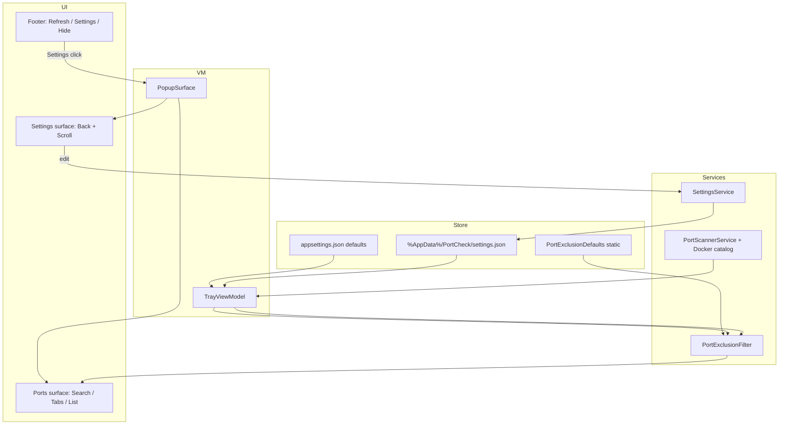
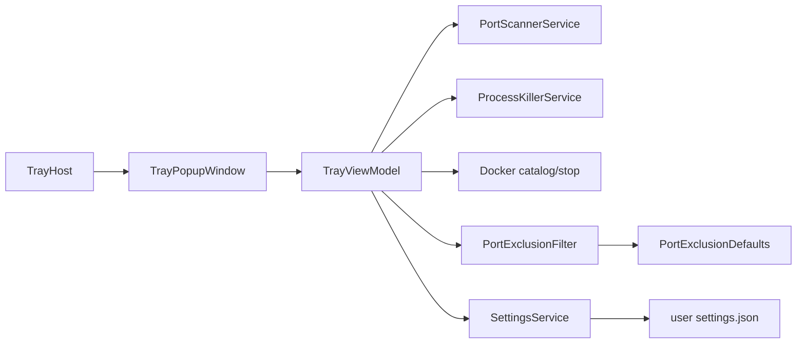

# 260528 — Settings Subpage (Port Exclusion Filter + Refresh Interval)

**Type:** Medium (combined PRD + TDD per `docs/workflow/phases/plan.md`)  
**Governing authority:** `docs/spec/portcheck.md` (must be updated before Develop), `UIUX_Design.md`, `docs/workflow/phases/plan.md`  
**Status:** Planning — ready for Develop after spec amendment approval  
**Created:** 2026-05-28  

---

## Change scale

**Medium** — one primary surface (`TrayPopupWindow`), two ownership boundaries (View + ViewModel/Services), no HTTP API, local JSON persistence, one verification cycle sufficient after spec update.

---

## 1. PRD

### Problem statement

PortCheck currently lists every listening TCP port and allows kill/stop on any visible row. Windows system ports (RPC, SMB, NetBIOS, etc.) must never appear or be actionable, or users can accidentally disrupt the OS. Developers also need to hide application-specific ports (e.g. fixed dev-server ports) without editing `appsettings.json`. Refresh interval is deployment-only today (`appsettings.json`), not adjustable from the UI.

### Goals

1. Add a **Settings subpage** inside the tray popup (full surface swap, not a menu).
2. Place entry **between Refresh and Hide** in the footer action chrome.
3. Implement a **global port exclusion filter**:
   - **Built-in:** curated Windows default / system-critical ports (always excluded).
   - **User-added:** user-defined port numbers (persisted).
   - Excluded ports are **invisible everywhere** in PortCheck (no list row, no kill, no Kill All, no search hit, no Docker row for that host port).
4. Expose **Refresh interval** (seconds) in Settings, persisted for the user.
5. Settings UI follows **Liquid Glass** principles (see §6) and matches existing `LiquidGlass.xaml` metrics.

### Non-goals

- Animation on/off toggle (out of scope per user direction).
- Default sort, confirm-kill toggle, Docker catalog toggles, timeout tuning in Settings UI.
- Separate main window, web settings, cloud sync, import/export profiles.
- Filtering by process name regex (v1 is **port number only**).
- UDP / non-TCP exclusion.
- Showing excluded ports as greyed-out rows (excluded = **not present**).

### Actors / permissions

| Actor | Capability |
| --- | --- |
| User | Open Settings from footer; view built-in exclusions (read-only); add/remove user port exclusions; change refresh interval; navigate back to port list |
| PortCheck | Apply exclusion before any UI binding or kill/stop path |
| OS | No elevation change; exclusion does not grant kill rights |

### User stories

1. User opens popup → footer shows **Refresh → Settings → Hide** → taps Settings → full settings subpage with Back.
2. User sees **Protected Windows ports** (built-in list, read-only) and understands those ports never appear.
3. User adds port `5432` to **Additional excluded ports** → list no longer shows `:5432`; Kill All cannot target it; search for `5432` shows no row.
4. User removes `5432` from exclusions → port reappears on next refresh if still listening.
5. User sets refresh interval to `10` seconds → local port scan auto-refresh uses 10s (within sane bounds).
6. User taps Back (or agreed Esc behavior) → returns to port list; footer unchanged.
7. User on Docker pane opens Settings → same subpage; exclusions apply to **host port** on Docker rows as well.

### Success criteria

- Built-in Windows port list is applied on every scan reconcile before `Filtered*` collections.
- User exclusion list persists under `%AppData%/PortCheck/settings.json` and survives restart.
- No code path can kill/stop a PID or container for an excluded host port (defense in depth in VM + services).
- Settings subpage matches Liquid Glass visual contract (§6) and reuses footer chrome metrics.
- `docs/spec/portcheck.md` documents exclusion semantics, built-in list source, Settings navigation, and refresh interval UI bounds.
- `dotnet build` succeeds; manual QA: add exclusion → port vanishes; built-in port never listed on clean Windows.

### Scope boundaries

| In | Out |
| --- | --- |
| `TrayPopupWindow` navigation Ports ↔ Settings | Tray right-click menu settings |
| `TrayViewModel` / `SettingsViewModel` (optional split) | New NuGet dependencies |
| `PortExclusionService` or filter module | Process-name-based exclusion |
| `UserSettings` + `SettingsService` | Animation toggle |
| Spec amendment `docs/spec/portcheck.md` | Changing `appsettings` deploy keys except as defaults seed |

---

## 2. TDD

### Technical approach

**Navigation:** Introduce `PopupSurface` enum (`Ports`, `Settings`) on `TrayViewModel`. Row 0–2 of `InnerContentRoot` bind visibility to surface; Settings replaces search/tabs/list with a dedicated settings tree while **footer stays visible** (Refresh / Settings / Hide).

**Exclusion pipeline (single gate):**

```text
Scan (local + docker catalog)
  → raw collections (LocalPorts, DockerPorts)
  → ApplyPortExclusions(builtIn ∪ userPorts)   // NEW
  → ApplySearchQuery()                          // existing
  → ApplySort()                                 // existing
  → Filtered* → UI
```

`IsPortExcluded(int port)` is the only authority. Kill commands resolve `PortInfo`/`DockerPortInfo` only from non-excluded snapshots.

**Built-in list:** Static read-only set in `PortExclusionDefaults` (or embedded resource JSON), versioned with app. Documented in spec appendix. Not user-editable.

**User list:** `List<int> UserExcludedPorts` in `UserSettings`, edited in Settings UI (add with validation 1–65535, dedupe, remove).

**Refresh interval:** `UserSettings.RefreshIntervalSeconds` overrides `appsettings` default when present; clamp e.g. **3–120** seconds; restarting timer on change via existing `StopAutoRefresh` / `StartAutoRefresh`.

**Persistence:**

```json
// %AppData%/PortCheck/settings.json
{
  "refreshIntervalSeconds": 10,
  "userExcludedPorts": [ 3000, 5432 ]
}
```

Do **not** write built-in ports to user file. Seed `refreshIntervalSeconds` from `appsettings` on first run if missing.

### Component breakdown

| Component | Owner | Responsibility |
| --- | --- | --- |
| `Models/UserSettings.cs` | Models | DTO for user file |
| `Models/PortExclusionDefaults.cs` | Models | Built-in Windows port set + metadata |
| `Services/SettingsService.cs` | Services | Load/save user JSON |
| `Services/PortExclusionFilter.cs` | Services | `IsExcluded(port)`, filter enumerables |
| `ViewModels/TrayViewModel.cs` | VM | Surface state, settings props, pipeline integration |
| `ViewModels/SettingsViewModel.cs` (optional) | VM | Add/remove port commands, validation |
| `TrayPopupWindow.xaml` | View | `PortsRoot` / `SettingsRoot` panels, footer Settings row |
| `Controls/Settings*.xaml` (optional) | View | Reusable setting row (label + control) |
| `docs/spec/portcheck.md` | Spec | Contract amendment |

### Data flow



### Failure modes

| Failure | Mitigation |
| --- | --- |
| Corrupt `settings.json` | Fall back to appsettings defaults; log or silent reset user file |
| User excludes all ports | Empty list UI; Kill All disabled (already when no active) |
| Duplicate user port | Ignore on add; show inline validation |
| Invalid port text | Reject non-numeric / out of range |
| Kill race on port becoming excluded | Reconcile removes row; kill command validates port not excluded before Win32/docker stop |
| Built-in list stale vs Windows update | Document version; update in app releases only |

### Validation strategy

- Unit-test `PortExclusionFilter` and port list merge logic (if test project added) OR thin integration via manual matrix.
- `dotnet build` in `src/PortCheck`.
- Manual Windows QA: verify `:135`, `:445`, `:139` never listed; add `:3000` exclusion; change refresh interval; restart app.

### Test strategy

| Lane | Classification |
| --- | --- |
| API QA | **no** |
| Browser UI QA | **no** |
| Desktop tray QA | **yes** — Settings navigation, exclusion, refresh interval, footer layout |
| Sanity | `dotnet build` |

---

## 3. System architecture

Desktop-only. No browser, API, or database.



**Permission flow:** Unchanged — kill still requires elevation in Release. Exclusion is deny-by-default for listed ports before any kill UI appears.

**Read/write ownership:** `SettingsService` exclusive writer to `settings.json`; `TrayViewModel` reads on startup and after Settings save.

---

## 4. API contract

**Not applicable.** PortCheck has no HTTP API surface for this change.

---

## 5. Database contract

**Not applicable** (no SQL/document DB).

### User settings file contract

| Field | Type | Required | Default | Notes |
| --- | --- | --- | --- | --- |
| `refreshIntervalSeconds` | `int` | no | from `appsettings` | Clamped 3–120 |
| `userExcludedPorts` | `int[]` | no | `[]` | Unique ports 1–65535 |

**Path:** `%AppData%/PortCheck/settings.json`  
**Read source:** `SettingsService` at app start and after Settings save  
**Write source:** Settings subpage Save/apply on change (immediate persist per field change acceptable)  
**Migration:** Missing file → create with defaults; unknown JSON fields ignored  
**Rollback:** Delete file → revert to appsettings + empty user exclusions  
**Compatibility:** Built-in list changes only with app version (spec version field optional)

### Built-in exclusion set (contract — implement exactly in `PortExclusionDefaults`)

Curated **Windows system / default listener ports** (TCP). Rationale: standard services documented by Microsoft & common Windows hardening guides; ports not safe for arbitrary kill.

| Port | Typical service |
| --- | --- |
| 7 | Echo |
| 9 | Discard |
| 13 | Daytime |
| 17 | Quote |
| 19 | Chargen |
| 20 | FTP-Data |
| 21 | FTP |
| 53 | DNS (system resolver) |
| 67 | DHCP Server |
| 68 | DHCP Client |
| 88 | Kerberos |
| 135 | RPC Endpoint Mapper |
| 137 | NetBIOS Name |
| 138 | NetBIOS Datagram |
| 139 | NetBIOS Session |
| 445 | SMB |
| 464 | Kerberos password change |
| 1900 | SSDP |
| 2869 | UPNP / ICS |
| 3389 | RDP |
| 5353 | mDNS |
| 5355 | LLMNR |
| 5357 | WSDAPI |
| 7680 | Windows Update Delivery Optimization |

**Open question (non-blocking for draft):** Final list should be reviewed once against a clean Windows 11 VM listener snapshot; ports only used by third-party apps must not be in built-in set.

**Union rule:** `ExcludedPorts = BuiltIn ∪ UserExcludedPorts`.

---

## 6. UI contract — Settings subpage

### Route / surface

| Surface | Entry | Exit |
| --- | --- | --- |
| `PortsHome` | Default popup | Settings footer button |
| `SettingsPage` | Settings footer button | Back button in settings header |

**Footer (both surfaces):** `Refresh` | `Settings` | `Hide` — Settings uses `GlassFooterButton` + gear icon `Segoe Fluent Icons` `E713`. On Settings surface, Settings row shows selected/active state (reuse sort-menu selected fill: `PaneTab.Active.Fill` + stroke).

### Liquid Glass design principles (research synthesis)

Sources: [Apple Liquid Glass overview](https://developer.apple.com/documentation/technologyoverviews/liquid-glass), [Adopting Liquid Glass](https://developer.apple.com/documentation/TechnologyOverviews/adopting-liquid-glass), Apple Newsroom June 2025 design announcement, aligned with repo `UIUX_Design.md`.

| Principle | Industry meaning | PortCheck Settings application |
| --- | --- | --- |
| **Content-first / hierarchy** | Glass is a functional layer *above* content; controls recede, content leads | Popup bubble remains the **only** heavy glass shell (existing backdrop blur + rim). Settings body is a **matte content plane** inside the bubble — no second frosted panel card. |
| **Avoid nested glass** | Stacking translucent panels reduces clarity | No inner “glass card” around each setting group. Use **spacing + 1px dividers** (`Glass.Stroke` @ 40% opacity), not nested `Border` with fill. |
| **Concentric rounded geometry** | Controls align to hardware/window corner language | Settings header back button + title align to `Glass.Align.ContentInset` (12px). Rows use `Glass.Metrics.FooterHoverRadius` (8) or `ListHoverRadius` (10), **not** window radius (18–20). |
| **Translucency 20–80%** | Variable opacity by depth | Settings list area: transparent; active controls use `#22FFFFFF` idle → `#72FFFFFF` active (existing pane tab tokens). |
| **Specular rim** | Thin highlight defines glass edge | Reuse existing popup rim; settings header bottom divider only. |
| **Controls as functional layer** | Toolbars/settings float above content | Settings header row (Back + title) sits above scroll content like search row sits above list. |
| **Thoughtful grouping** | Related controls grouped | Two sections only (v1): **Port protection** and **Refresh**. |
| **Legibility** | Color judicious on glass | Primary labels `Text.Primary`; hints `Text.Tertiary`; destructive actions N/A in settings v1. |
| **Motion** | Morph on navigation | Optional 220ms cross-fade Ports ↔ Settings (reuse `FluidAnimation` pane fade); not a separate toggle. |
| **Accessibility** | Reduce Transparency / Reduce Motion | v1: respect system high contrast where WPF exposes; document “Reduce motion” as follow-up if animations added. |

### Layout wireframe (logical)

```text
┌─ Popup chrome (existing 340×H, r=20) ─────────────────────┐
│ [←]  Settings                          (header, h=32–36)   │
│ ─────────────────────────────────────────────────────────  │
│ ▼ ScrollViewer (row 2 * when Settings visible)              │
│                                                            │
│  PORT PROTECTION                                           │
│  Windows ports are always hidden and cannot be killed.     │
│                                                            │
│  Protected (read-only chips/list)                          │
│  :135  :139  :445  :53  …  (wrap panel, muted chips)       │
│                                                            │
│  Additional excluded ports                                   │
│  [ 3000 ] [Add]                                            │
│  · :3000  [×]                                              │
│  · :5432  [×]                                              │
│                                                            │
│  ─────────────── divider ───────────────                   │
│                                                            │
│  REFRESH                                                   │
│  Scan interval   [  5  ] seconds   (NumericUpDown/slider)  │
│  Hint: 3–120 seconds                                      │
│                                                            │
├────────────────────────────────────────────────────────────┤
│  Refresh                                                    │
│  Settings  ← active highlight on this surface              │
│  Hide                                                       │
└────────────────────────────────────────────────────────────┘
```

### Visible states

| State | Behavior |
| --- | --- |
| Loading | N/A (settings local) |
| Ready | All controls enabled |
| Empty user exclusions | Show placeholder “No additional ports excluded” |
| Invalid port input | Inline red hint; Add disabled |
| Error (save failed) | Rare; toast or footer label (v1: silent retry) |

### Create / edit / delete

| Action | Behavior |
| --- | --- |
| Add port | Parse int → dedupe → append → persist → `ApplyFilter()` |
| Remove port | Tap × on chip → persist → re-filter |
| Change refresh | On lost focus or stepper change → clamp → persist → restart timer |

### Validation feedback

- Port must be 1–65535.
- Duplicate user port: “Already excluded”.
- Built-in port add attempt: “Protected by Windows defaults” (optional message if user types 135).

### Disabled states

- Add disabled when input invalid.
- Back always enabled on Settings surface.

### Dependency behavior

- Settings works offline (no network).
- If scan in flight, exclusion changes apply on next reconcile.

---

## 7. Operational concerns

| Topic | Approach |
| --- | --- |
| Audit logging | None v1 |
| Observability | None v1 |
| Concurrency | Settings save on UI thread; VM reload under lock if scan concurrent |
| Retry/idempotency | Save is overwrite whole file (atomic write: temp + replace) |
| Data retention | User file until uninstall / manual delete |
| Performance | Exclusion is `HashSet<int>` lookup O(1) per row |
| Security | Exclusion list is user-local; not a privilege boundary (kill still needs admin) |

---

## 8. Edge cases

| Case | Expected behavior |
| --- | --- |
| Port listening on excluded port | Never shown |
| Kill All with mix | Only non-excluded active PIDs killed |
| Inline kill on row | Impossible if row not shown; command guard if stale reference |
| Docker row host port excluded | Row omitted from Docker list |
| User excludes ephemeral port then removes | Reappears after refresh |
| Built-in port also in user list | Dedupe; show only in protected section |
| `settings.json` missing | Defaults |
| Malformed port in JSON | Skip invalid entries or reset array |
| Refresh interval 0 or 999 | Clamp to 3–120 |
| Settings open during Kill confirm | `_isProcessingAction` prevents accidental hide (existing pattern) |
| Esc key | **Open question** — recommend: Settings → Back; PortsHome → Hide (current) |

---

## 9. Open questions

| # | Question | Blocks implement? |
| --- | --- | --- |
| OQ-1 | Final built-in port list: confirm against Win11 clean VM netstat snapshot? | No (draft list in §5 usable) |
| OQ-2 | Esc on Settings surface: Back only, or Hide? | No (recommend Back-first) |
| OQ-3 | Settings shortcut (e.g. none vs `Ctrl+,`)? | No (default: none) |
| OQ-4 | Show full built-in list in UI vs collapsed “42 ports protected” summary? | No (recommend scrollable chip wrap for transparency) |
| OQ-5 | Persist refresh immediately on each change vs explicit Save button? | No (recommend immediate, matches tray app patterns) |
| OQ-6 | Should inferred Docker rows use same host-port exclusion? | **Yes** (specified in user stories) — confirm user agrees | No |

---

## 10. Spec amendment checklist (pre-Develop)

Update `docs/spec/portcheck.md`:

- [ ] New surface: Settings subpage + footer button order
- [ ] User story: exclusion + refresh interval
- [ ] Keyboard: Back interaction; Esc behavior
- [ ] Configuration: `settings.json` + built-in port appendix
- [ ] Non-goal: excluded ports never visible
- [ ] Success criteria: kill paths respect exclusion

---

## 11. Implementation phases (single cycle)

| Step | Deliverable |
| --- | --- |
| 1 | Spec amendment |
| 2 | `PortExclusionDefaults` + `PortExclusionFilter` + unit tests (optional) |
| 3 | `SettingsService` + `UserSettings` |
| 4 | VM pipeline + kill guards |
| 5 | XAML: Settings surface + footer row |
| 6 | Manual QA + screenshot evidence |

---

## 12. Completion criteria (plan gate)

- [ ] User-confirmed built-in port list or VM snapshot sign-off
- [ ] Spec PR merged/amended before code
- [ ] All §9 blocking items resolved (currently none blocking)
- [ ] Develop + Test per `docs/workflow/phases/develop.md` / `test.md` when execution starts

---

*Plan authored per `docs/workflow/phases/plan.md`. No code changes in this artifact.*
