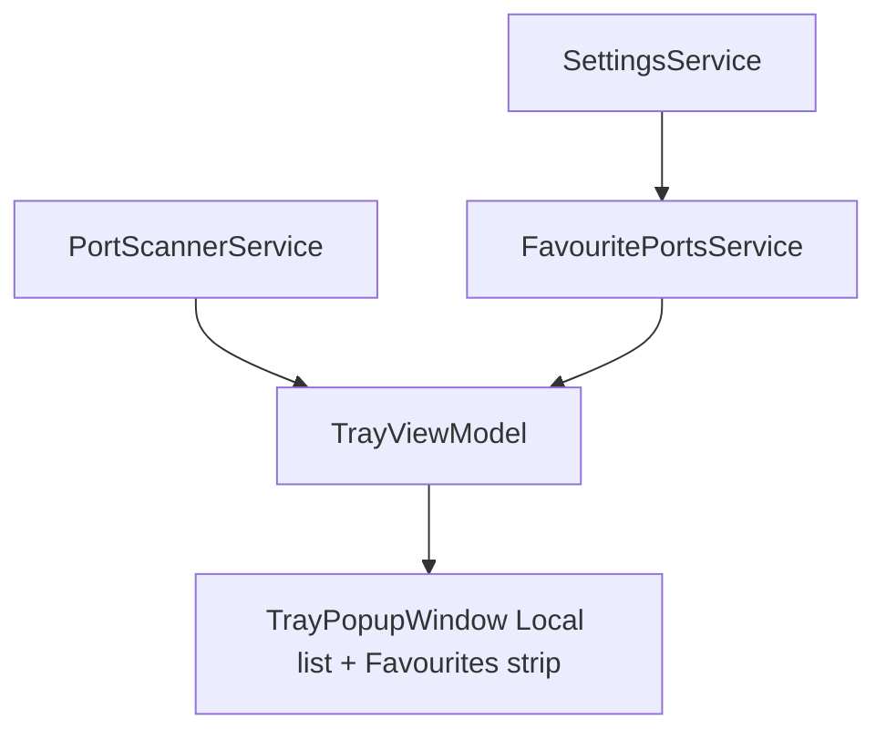

# Phase 1: Favourite Ports

| Field | Value |
| --- | --- |
| Initiative | [260601_portcheck-expansion-milestone.md](260601_portcheck-expansion-milestone.md) |
| Phase | 1 of 3 |
| Status | `planned` |
| Depends on | Liquid-glass UI foundation on `main` |
| Governing authority | `docs/spec/portcheck.md`, `docs/spec/liquid-glass-uiux.md` |

---

## 1. Phase PRD

### Problem

Users repeatedly hunt for the same dev ports (3000, 5432, 6379, etc.). Exclusion hides ports; there is no **positive pin list**. `PortInfo.Inactive(int)` exists from an earlier design but favourites are not wired.

### Goals

- Persist a user-defined list of **favourite host ports** in `%AppData%/PortCheck/settings.json`.
- Show favourites in the popup (dedicated section or filter — see TDD) with **active** scan rows or **inactive** placeholders when nothing is listening.
- Toggle favourite from Local row UI (star) and manage in Settings.
- Favourites respect **exclusion**: cannot favourite protected ports; excluded ports removed from favourites on save.

### Non-Goals

- Docker- or K8s-only favourites (host port number only in v1)
- Favourite ordering sync across machines
- Notifications when a favourite becomes active
- Favourite groups / labels

### User Stories

1. User stars port `:3000` on a Local row; it appears in Favourites after restart.
2. User removes favourite from Settings; star clears on next refresh.
3. Favourite port not listening shows “Not running” inactive row (reuse `PortInfo.Inactive`).
4. User cannot favourite port 135 (protected); UI shows no-op or disabled star.

### Success Criteria

- [ ] `docs/spec/portcheck.md` defines Favourite Ports contract (persistence, visibility, kill rules).
- [ ] `settings.json` schema versioned with `favouritePorts: number[]`.
- [ ] Tray popup shows favourite section; desktop QA evidence recorded.
- [ ] Unit or harness test for merge logic (active scan + inactive placeholders).
- [ ] No regression to exclusion or Docker gate.

---

## 2. Phase TDD

### Technical Approach

1. Extend `UserSettings` / `SettingsService` with `FavouritePorts: IReadOnlyList<int>`.
2. Add `FavouritePortsService` (or methods on `SettingsService`) for add/remove/normalize.
3. `TrayViewModel` builds `FavouritePorts` collection each refresh:
   - For each favourite port: match `FilteredLocalPorts` by port → active row; else `PortInfo.Inactive(port)`.
4. UI: compact list above Local ports **or** “Favourites only” toggle — **recommend**: horizontal chip strip under search (max 8 visible + overflow) **plus** star on each Local row.

### Component Breakdown

| Layer | Artifact | Action |
| --- | --- | --- |
| Spec | `docs/spec/portcheck.md` | Favourites section |
| Model | `UserSettings`, settings document | `favouritePorts` array |
| Service | `SettingsService` | Load/save favourites |
| Service | `FavouritePortsService` | Validate, cap count, intersection with exclusion |
| ViewModel | `TrayViewModel` | `FavouritePortRows`, `ToggleFavouriteCommand` |
| View | `TrayPopupWindow.xaml` | Star button on `GlassPortListItem` template; favourites strip |
| View | Settings subpage | List favourites with remove |

### Ownership Boundaries

| Owner | Responsibility |
| --- | --- |
| Service | Persistence, validation, exclusion intersection |
| ViewModel | Merge scan + inactive; commands |
| View | Star glyph, favourites strip layout (liquid-glass tokens) |

### Data Flow

1. Refresh → scan local listeners → update `LocalPorts`.
2. `RebuildFavourites()` → ordered favourite ports → row per port (active clone or inactive factory).
3. Toggle star → update settings → save → rebuild → UI update.

### Failure Modes

| Failure | Handling |
| --- | --- |
| Corrupt `settings.json` | Ignore favourites array; log nothing (match existing settings tolerance) |
| Favourite port later excluded | Drop on load or hide with spec-defined behavior |
| Kill on inactive row | Kill hidden/disabled |

### Validation Strategy

| Lane | Classification |
| --- | --- |
| Sanity | `dotnet build` |
| API QA | `no` |
| Browser UI QA | `no` |
| Desktop UI QA | `yes` — star, inactive row, Settings remove, restart persistence |
| Harness | Optional `FavouritePortsHarness` — merge 3 favourites, 1 active |

### Test and Verify Contract

- Elevated Release build for kill on active favourite row.
- Evidence: screenshot or short steps in QA report.

### Completion Criteria

Phase 1 is **complete** when spec is merged, code shipped, desktop QA passed, dual code review done per workflow.

---

## 3. Spec Delta Checklist (`portcheck.md`)

- [ ] Actors: favourite add/remove
- [ ] Surfaces: Favourites strip / Settings list
- [ ] User stories (4+)
- [ ] Exclusion interaction
- [ ] `settings.json` schema table
- [ ] Non-goals

---

## 4. Open Questions

| ID | Question | Blocking? |
| --- | --- | --- |
| P1-OQ-1 | Favourites UI: top strip vs separate pane tab | No — default top strip |
| P1-OQ-2 | Kill allowed on inactive favourite | No — disabled in v1 |
