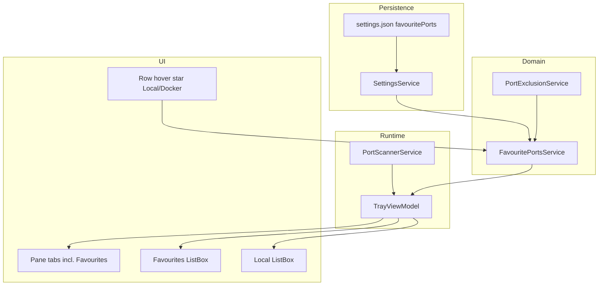
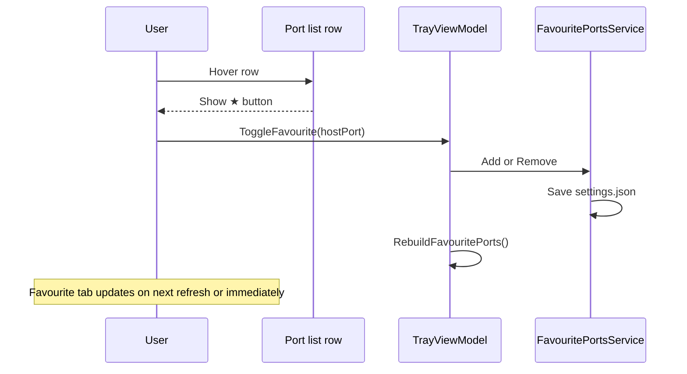
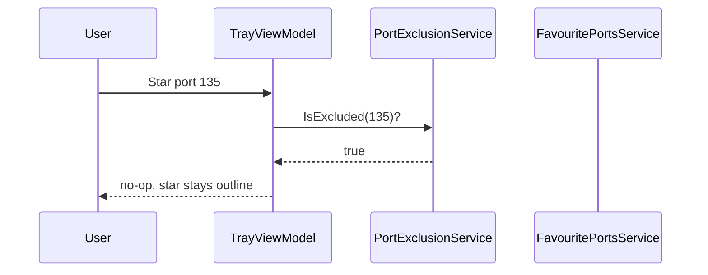

# Phase 1: Favourite Ports

| Field | Value |
| --- | --- |
| Initiative | [260601_portcheck-expansion-milestone.md](260601_portcheck-expansion-milestone.md) |
| Phase | 1 of 3 |
| Status | `in_progress` |
| Depends on | Liquid-glass UI foundation on `main` |
| Governing authority | `docs/spec/portcheck.md`, `docs/spec/liquid-glass-uiux.md` |
| Estimated scale | **Medium** (new pane tab + row star + persistence) |

---

## 1. Phase PRD

### 1.1 Problem Statement

PortCheck optimizes for **discovery and termination** of whatever is listening *right now*. Daily development work also depends on a **fixed set of expected ports** (frontend dev server, DB, Redis, debug adapters). Today the user must:

1. Open the popup and search or scroll every time.
2. Rely on memory when a service is down — non-excluded idle ports vanish from the list.

`PortInfo.Inactive(int)` exists but nothing wires it up. Phase 1 adds a **dedicated Favourite Ports pane** and a **star control on port rows** — no Settings form to type port numbers.

### 1.2 UX Decision (confirmed)

| Flow | v1 behavior |
| --- | --- |
| **Add / remove favourite** | Hover a row in **Local Port** or **Docker Port** list → tap **★** (filled = favourited). Toggle off = remove. |
| **View favourites** | Pane tab **`★ Favourite Ports`** in the same tab bar as Local / Docker (liquid-glass tab chrome). |
| **Settings** | **No** favourites add/remove UI. Settings only keeps refresh interval + excluded ports (existing). Excluding a port still **prunes** it from `favouritePorts` in JSON. |

**Rejected for v1:** horizontal chip strip under tabs; Settings text box “add port 3000”.

**Why this is easier**

- One gesture where the user already sees the port (hover → star).
- One place to read favourites (dedicated tab), same mental model as Local / Docker.
- No context switch to Settings subpage.

### 1.3 Goals

| ID | Goal | Measurable outcome |
| --- | --- | --- |
| G1 | Persist favourite **host port numbers** | `settings.json` → `favouritePorts[]`; survives restart |
| G2 | **Favourite Ports** pane tab | User switches tab; sees only pinned ports |
| G3 | Active vs inactive rows | Listening → full row; not listening → `PortInfo.Inactive` |
| G4 | Star on port list rows (Local + Docker) | Hover reveals star; filled when favourited |
| G5 | Exclusion honoured | Cannot star excluded/protected ports; prune on exclude |

### 1.4 Non-Goals

| Item | Rationale |
| --- | --- |
| Settings page to add favourites | User rejected; star-only entrypoint |
| Favourite chip strip | Replaced by pane tab |
| Favourite by process name / container name | Host port only |
| Cloud sync | Local `%AppData%` only |
| Notifications when favourite goes active | Refresh is enough |
| Drag-reorder favourites | v1: add order = sort order |
| Star on Kubernetes pane | Phase 2; Phase 1 stars on Local + Docker lists only |
| Agent API | Phase 3 |

### 1.5 Actors and Permissions

| Actor | Capability |
| --- | --- |
| User | Star/unstar on Local/Docker rows; open **Favourite Ports** tab; kill active favourite row |
| `PortExclusionService` | Block star; prune favourites when port excluded |
| `TrayViewModel` | `PortPane.Favourites`, merge collection each refresh |
| OS | Elevation unchanged for kill |

### 1.6 User Stories

| # | Story | Acceptance |
| --- | --- | --- |
| US-1 | I hover a Local row for `:3000` and tap ★ | Star fills; port appears on **Favourite Ports** tab |
| US-2 | I tap ★ again on the same row | Unstarred; removed from Favourite tab list |
| US-3 | My favourited `:5432` is not listening | Favourite tab shows **Not running**; kill disabled |
| US-4 | I open **★ Favourite Ports** tab | Only favourites listed (not full Local scan) |
| US-5 | I cannot star port `135` (protected) | Star disabled or no-op on hover |
| US-6 | I exclude `8080` in Settings | `8080` dropped from favourites on save/load; no Settings favourites UI |
| US-7 | After restart, favourites tab still lists my pins | Persistence from `settings.json` |
| US-8 | I star from a **Docker Port** row | Same host port pinned; shows on Favourite tab |

### 1.7 Success Criteria

- [ ] `docs/spec/portcheck.md` — Favourite Ports + `PortPane.Favourites`.
- [ ] `docs/spec/liquid-glass-uiux.md` — third tab style `GlassPaneTabFavourites`.
- [ ] `settings.json` documents `favouritePorts`.
- [x] `FavouritePortsHarness` PASS (merge logic).
- [ ] Desktop UI QA: star on hover, tab switch, inactive row, restart — **no Settings favourites QA**.
- [ ] No regression: Local/Docker panes, exclusion, tab animations.

### 1.8 Scope Boundaries

| In scope | Out of scope |
| --- | --- |
| `PortPane.Favourites` + tab + list | Settings favourites CRUD |
| Star on Local/Docker `GlassPortListItem` | K8s list star (Phase 2) |
| Persistence in `settings.json` | Import/export |

---

## 2. System Architecture

### 2.1 Pane model

Extend `PortPane` (today `Local`, `Docker`):

```csharp
public enum PortPane
{
    Favourites,
    Local,
    Docker
    // Kubernetes — Phase 2
}
```

**Tab bar order (left → right):** `★ Favourite Ports` | `Local Port` | `Docker Port` (Docker tab still gated by `IsDockerSurfaceVisible`).

**Favourites tab visibility:** **Always shown** (even when empty). Empty state copy: *“Star a port in Local or Docker list to pin it here.”* — avoids tab appearing/disappearing.

When user selects Favourites tab, `ActivePane = Favourites`; main list binds to `FilteredFavouritePorts` (not `FilteredLocalPorts`).

### 2.2 Data flow



**Merge** runs on each refresh: for each port in `favouritePorts`, join local scan (and optionally docker listen metadata for display) → `FavouritePortRow` or `PortInfo.Inactive(port)`.

**Duplicate display:** A favourited port **may** still appear on Local/Docker lists when active — star state synced. Favourite tab is the **aggregated pin view**, not a hidden duplicate.

### 2.3 Star interaction (sequence)



### 2.4 Exclusion (unchanged policy)



---

## 3. Phase TDD

### 3.1 UI specification

#### Pane tab — `GlassPaneTabFavourites`

| State | Chrome |
| --- | --- |
| Idle | Star icon (Segoe Fluent Icons), circle slot 32×32 (same metrics as other tabs) |
| Active | Pill with label **Favourite Ports** (or **Favourites** if width tight) |
| Hover | Same liquid-glass overlay stack as `GlassPaneTabLocal` (`GlassChromeInteractionOptions.PaneTab`) |

Reuse `GlassPaneTabButton` + new style key in `GlassPaneTabButton.xaml`. Extend `FluidAnimation.SetPaneTabWidths` / `RunTabPush` for **three** tabs (Favourites, Local, Docker).

#### Port row — star affordance

| Property | Value |
| --- | --- |
| Visibility | `Visibility` bound to row `IsMouseOver` **or** row already favourited (star stays visible when filled) |
| Placement | Leading or trailing action column on `GlassPortListItem` (match kill button column layout — **opposite side** from kill to avoid mis-click) |
| Icons | `E734` outline / `E735` filled (or project-standard star glyphs) |
| Hit test | Star only; does not expand row hit target for kill |
| Panes | Local `ListBox` + Docker `ListBox` item templates |

#### Favourite Ports list

| State | UI |
| --- | --- |
| Empty | Centered short message + grey star (no list rows) |
| Ready | Same row template as Local (`GlassPortListItem`) with star **filled** + kill when active |
| Inactive row | `Not running`; kill hidden; star filled (unstar removes from list) |

Search: when `ActivePane == Favourites`, filter `FilteredFavouritePorts` by `SearchQuery` (port, process name).

### 3.2 ViewModel contract

| Member | Type | Notes |
| --- | --- | --- |
| `ActivePane` | `PortPane` | includes `Favourites` |
| `FavouritePorts` | `ObservableCollection<PortInfo>` or `FavouritePortRow` | Merged display rows |
| `FilteredFavouritePorts` | filtered | Search |
| `FavouritePortCount` | `int` | Optional badge on tab (v1 optional) |
| `ToggleFavouriteCommand` | `ICommand` | `int hostPort` parameter |
| `IsFavourite(int port)` | `bool` | Star binding on Local/Docker rows |
| `SelectPaneCommand` | existing | parameter `PortPane.Favourites` |

**Keyboard:** `Esc` on Favourites tab → hide popup (same as other port surfaces); no extra shortcut in v1.

### 3.3 Merge algorithm

```csharp
IReadOnlyList<PortInfo> BuildFavouriteDisplayRows(
    IReadOnlyList<int> favouritePorts,
    IReadOnlyList<PortInfo> localPortsFiltered,
    IReadOnlyList<DockerPortInfo> dockerPortsFiltered) // optional enrich
{
    var localByPort = localPortsFiltered.ToLookup(p => p.Port);
    return favouritePorts.Select(port =>
    {
        var active = localByPort[port].FirstOrDefault();
        return active ?? PortInfo.Inactive(port);
    }).ToList();
}
```

Call after every snapshot apply. Docker-only listener: inactive until same host port appears on local scan (unchanged from prior plan).

### 3.4 File plan

| Path | Action |
| --- | --- |
| `docs/spec/portcheck.md` | Favourites pane, star UX, no Settings add |
| `docs/spec/liquid-glass-uiux.md` | Third tab style |
| `Models/PortPane.cs` | Add `Favourites` |
| `Models/UserSettings.cs` | `FavouritePorts` |
| `Services/SettingsService.cs` | Serialize `favouritePorts` |
| `Services/FavouritePortsService.cs` | **New** |
| `ViewModels/TrayViewModel.cs` | Pane, collections, toggle, filter |
| `Themes/GlassPaneTabButton.xaml` | `GlassPaneTabFavourites` |
| `TrayPopupWindow.xaml` | Third tab; Favourites `ListBox`; star in item template |
| `Helpers/FluidAnimation.cs` | 3-tab push/width |
| `TrayPopupWindow.xaml.cs` | `PaneTab_Click` pop target for star tab icon |
| `Validation/FavouritePortsHarness.cs` | **New** |

**Not in file plan:** Settings.xaml favourites section.

### 3.5 Persistence (`settings.json`)

| Field | Type | Default | Rules |
| --- | --- | --- | --- |
| `favouritePorts` | `int[]` | `[]` | unique, sorted on save, max **32** |
| `schemaVersion` | `int` | bump to `2` when shipping | |

Prune excluded ports on `Load()` / when user saves excluded ports in Settings (background prune only).

### 3.6 Failure modes and edge cases

| Case | Behavior |
| --- | --- |
| Star on excluded port | No-op |
| 33rd favourite | Ignore add; optional brief feedback (v1: silent) |
| Toggle star while on Favourites tab | Row removed on unstar |
| Docker tab hidden | User can still open favourites; star only on visible Docker list when gate true |
| `Kill All` | Still **Local pane only**; not on Favourites tab |

### 3.7 Validation

| Lane | Evidence |
| --- | --- |
| Desktop UI QA | Hover star, Favourite tab, inactive, unstar, restart |
| Harness | Merge + exclusion |
| Settings favourites UI | **N/A — removed** |

---

## 4. Phase 3 handoff (internal API)

| Member | Notes |
| --- | --- |
| `FavouritePorts` collection | Agent `GET /v1/favourites` reads same data |
| `ToggleFavourite` | Optional `POST /v1/favourites` |

---

## 5. Open questions

| ID | Question | Default | Blocking? |
| --- | --- | --- | --- |
| P1-OQ-1 | Tab label | **Favourite Ports** when active; star-only when idle | No |
| P1-OQ-2 | Tab order | Favourites leftmost | No |
| P1-OQ-3 | Kill on inactive favourite row | Disabled | No |
| P1-OQ-4 | Show Favourites tab when count=0 | **Yes**, with empty state | No |
| P1-OQ-5 | Star visible only on hover vs always for favourited | **Hover OR favourited** | No |

---

## 6. Changelog

| Date | Change |
| --- | --- |
| 2026-06-01 | Initial plan (strip + Settings add) |
| 2026-06-02 | Expanded PRD/TDD |
| 2026-06-02 | **UX:** star on list hover + **Favourite Ports** pane tab; **removed** Settings add + chip strip |
| 2026-06-03 | Harness groundwork started: `FavouritePortsService`, `SettingsService` persistence path injection, `FavouritePortsHarness`, and exclusion-backed prune/merge validation |
