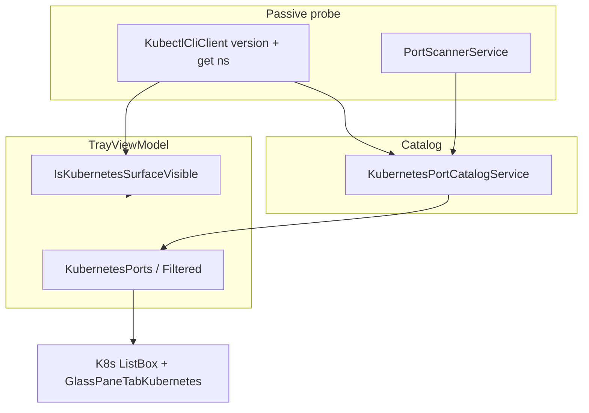
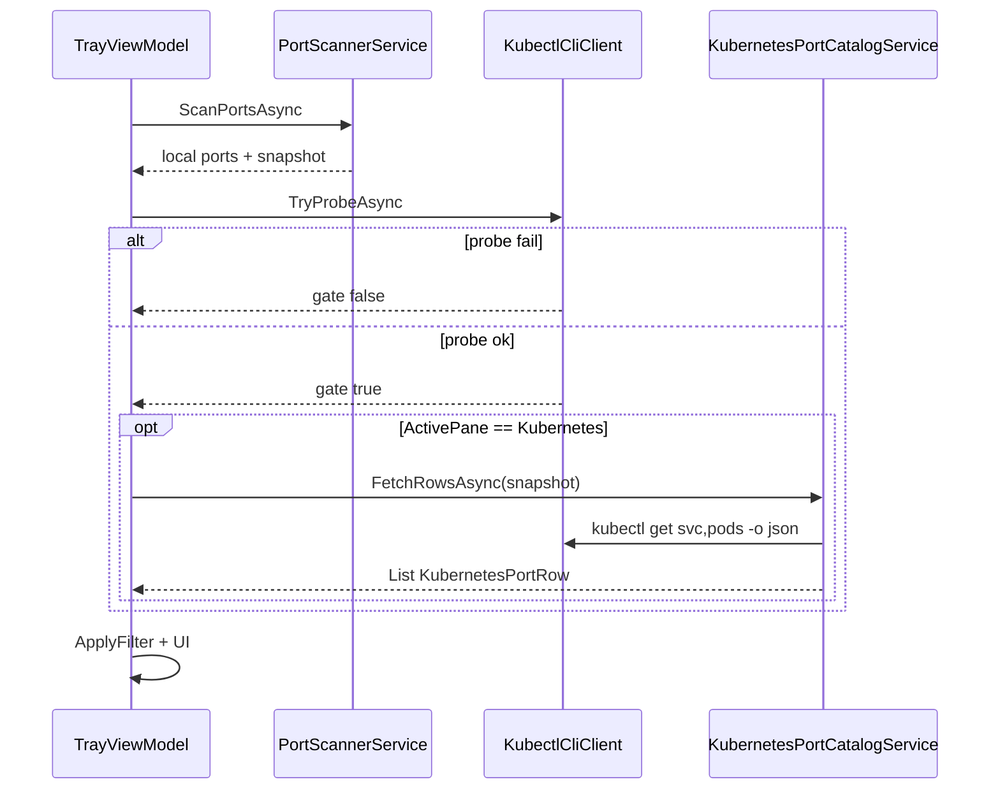

# Phase 2: Kubernetes Ports

| Field | Value |
| --- | --- |
| Initiative | [260601_portcheck-expansion-milestone.md](260601_portcheck-expansion-milestone.md) |
| Phase | 2 of 3 |
| Status | `planned` |
| Depends on | Phase 1 optional for code; **pane/tab UX patterns** should match Phase 1 + Docker |
| Governing authority | `docs/spec/portcheck.md` |
| Reference implementation | [260527_docker-dual-pane-phase2-services-vm.md](260527_docker-dual-pane-phase2-services-vm.md) |
| Estimated scale | **Large** (new pane, services, refresh orchestration) |

---

## 1. Phase PRD

### 1.1 Problem Statement

Local Kubernetes development creates TCP listeners that are **technically host ports** but **semantically cluster resources**:

| Listener example | What user thinks |
| --- | --- |
| `kubectl port-forward svc/foo 8080:80` | “Forward to `default/foo`” |
| `com.docker.backend` / `vpnkit` / WSL relay | Opaque |
| NodePort bound on desktop Docker K8s | “Service `app/nginx` NodePort 30080” |

PortCheck’s **Local Port** pane lists PIDs and process names. **Docker Port** covers published container ports via Engine API. There is no pane for **Kubernetes context** (namespace, service, pod, forward type).

Phase 2 adds a third pane using the same **passive gate + catalog + kill** pattern as Docker, without starting clusters or shells.

### 1.2 Goals

| ID | Goal | Outcome |
| --- | --- | --- |
| G1 | `PortPane.Kubernetes` + third `GlassPaneTabButton` | User switches Local / Docker / K8s |
| G2 | `IsKubernetesSurfaceVisible` gate | Silent hide when no cluster/tools (like Docker) |
| G3 | `KubernetesPortCatalogService` | Rows with host port + K8s metadata |
| G4 | Refresh gating | Full catalog only when gate true **and** active pane is K8s |
| G5 | Documented kill semantics per row kind | No ambiguous “Kill” |
| G6 | Search/filter applies to K8s collection | Same `SearchQuery` model |

### 1.3 Non-Goals

| Item | Notes |
| --- | --- |
| Install/start minikube, kind, Docker K8s | Passive only |
| Switch kube context in UI | Use current `KUBECONFIG` / default context |
| In-cluster exec / logs / apply | Not a K8s dashboard |
| Ingress / Gateway API / mesh routes | v2 |
| UDP services | TCP only (product rule) |
| Favourite by `namespace/name` | Phase 1 host port still applies |
| Helm/Kustomize file parsing | Labels from live API only |
| Remote cluster SSH tunnel | Local kubeconfig endpoints only |

### 1.4 Actors

| Actor | Capability |
| --- | --- |
| User | View K8s pane when visible; search; kill supported row types |
| `kubectl` binary | Queried read-only; optional stop via PID kill |
| `TrayViewModel` | Third collection, pane orchestration |
| `PortExclusionService` | Same host-port exclusion as Local/Docker |

### 1.5 User Stories (expanded)

| # | Story | Acceptance |
| --- | --- | --- |
| US-1 | User with working `kubectl` and cluster sees **Kubernetes Port** tab | Tab visible; switching does not break animations |
| US-2 | User sees forward `127.0.0.1:8080` tied to `default/my-svc` | Row shows namespace, service, forward indicator |
| US-3 | User kills port-forward row | PID terminated; row gone after refresh |
| US-4 | Cluster stopped | Tab hidden; no error banner |
| US-5 | User on K8s pane searches `nginx` | Filters by service/pod name |
| US-6 | User excludes port 443 in Settings | Row hidden in K8s pane |

### 1.6 Success Criteria

- [ ] `portcheck.md` updated: surfaces, gate, kill table, config keys.
- [ ] `dotnet build` Release/Debug.
- [ ] Manual QA: Docker Desktop K8s **or** kind/minikube with sample Deployment + port-forward.
- [ ] No regression Local/Docker refresh timing.
- [ ] Optional: parser unit tests with golden `kubectl` JSON fixtures.

---

## 2. System Architecture

### 2.1 Comparison to Docker Phase 2

| Concern | Docker (shipped) | Kubernetes (Phase 2) |
| --- | --- | --- |
| Client | `DockerEngineClient` (named pipe HTTP) | `KubectlCliClient` (process stdout JSON) |
| Catalog | `DockerPortCatalogService` | `KubernetesPortCatalogService` |
| Stop | `DockerContainerStopService` (`docker stop`) | `KubernetesPortStopService` (PID kill v1) |
| Gate | `IsDockerSurfaceVisible` | `IsKubernetesSurfaceVisible` |
| Inferred rows | docker-proxy listeners | `kubectl` / wslrelay PIDs |

### 2.2 Diagram



### 2.3 Refresh Sequence



---

## 3. Phase TDD

### 3.1 `KubernetesPortRow` Model

| Field | Type | Required | Description |
| --- | --- | --- | --- |
| `Id` | `Guid` | yes | Row identity (API Phase 3) |
| `HostPort` | `int` | yes | Local TCP port |
| `HostAddress` | `string` | yes | e.g. `127.0.0.1`, `0.0.0.0` |
| `Namespace` | `string` | no | `default`, etc. |
| `ResourceKind` | `enum` | yes | `PortForward`, `Service`, `Pod`, `Inferred` |
| `ResourceName` | `string` | no | Service or pod name |
| `ContainerPort` | `int?` | no | Target port in pod |
| `Protocol` | `string` | yes | `tcp` v1 |
| `Pid` | `int` | no | For forward/inferred kill |
| `ProcessName` | `string` | no | `kubectl`, etc. |
| `Context` | `string` | no | `kubectl config current-context` |
| `IsHostListening` | `bool` | yes | Correlates to scan |
| `CanKill` | `bool` | yes | Derived from row kind + policy |
| `KillKind` | `enum` | yes | `TerminatePid`, `Unsupported` |

### 3.2 `KubectlCliClient` Design

```csharp
internal sealed class KubectlCliClient
{
    Task<bool> TryProbeAsync(CancellationToken ct);
    Task<string> RunAsync(string arguments, CancellationToken ct);
    string? ResolveKubectlPath(); // PATH, optional settings override
}
```

| Call | Purpose | Timeout key |
| --- | --- | --- |
| `version --client --output=json` | Client exists | `kubernetesClientTimeoutMs` |
| `cluster-info` or `get ns -o name` | Cluster reachable | `kubernetesClusterTimeoutMs` |
| `get svc -A -o json` | Services | `kubernetesCatalogTimeoutMs` |
| `get pods -A -o json` | Pods (ports section) | same |

**Rules**

- Never pass user-controlled strings into shell; use `ProcessStartInfo` with argument list.
- Capture stdout/stderr; non-zero exit → empty catalog, gate may still be true if listeners exist (inferred path).

### 3.3 Catalog Merge Logic

1. **API rows:** Parse Services (NodePort, LoadBalancer ingress to localhost where detectable).
2. **Forward rows:** Match scan entries where `ProcessName` contains `kubectl` and command line has `port-forward` (regex) → attach metadata when parseable.
3. **Inferred rows:** Listeners matching K8s-related process allowlist without API match (like Docker inferred).
4. Deduplicate by `(HostPort, ResourceKind, Namespace, ResourceName)`.
5. Apply `PortExclusionService` before VM publishes collection.

### 3.4 Kill Semantics (canonical — must land in spec)

| Row kind | `CanKill` | Action | Confirm UI |
| --- | --- | --- | --- |
| `PortForward` + PID | true | `ProcessKillerService.KillProcessGracefullyAsync(pid)` | Same inline confirm |
| `Inferred` + PID | true | PID kill | Same |
| `Service` NodePort (no PID) | false | — | Kill hidden |
| `Pod` not forwarded | false | — | Hidden |
| Excluded host port | false | — | Row not shown |

**v2 candidate:** `kubectl delete pod` with confirm — explicit non-goal for v1 unless product approves blast radius.

### 3.5 File Plan

| Path | Action |
| --- | --- |
| `Models/PortPane.cs` | Add `Kubernetes` |
| `Models/KubernetesPortRow.cs` | **New** |
| `Services/KubectlCliClient.cs` | **New** |
| `Services/KubernetesPortCatalogService.cs` | **New** |
| `Services/KubernetesPortStopService.cs` | **New** |
| `ViewModels/TrayViewModel.cs` | Collections, gate, refresh branch |
| `Themes/GlassPaneTabButton.xaml` | `GlassPaneTabKubernetes` style |
| `TrayPopupWindow.xaml` | Third tab + `ListBox` |
| `Helpers/FluidAnimation.cs` | 3-tab width animation (extend `SetPaneTabWidths`) |
| `appsettings.json` | Keys (see below) |
| `docs/spec/portcheck.md` | Full K8s contract |

### 3.6 Configuration (`appsettings.json`)

| Key | Default | Notes |
| --- | --- | --- |
| `kubernetesCatalogEnabled` | `true` | Master switch |
| `kubernetesClientTimeoutMs` | `2000` | |
| `kubernetesClusterTimeoutMs` | `3000` | |
| `kubernetesCatalogTimeoutMs` | `5000` | |
| `kubernetesCliPath` | `""` | Empty = PATH |
| `kubernetesProcessAllowlist` | `["kubectl","wslrelay","vpnkit"]` | For inferred |

### 3.7 UI Contract

| Element | Behavior |
| --- | --- |
| Tab | Icon: K8s wheel SVG or Segoe MDL2; label `Kubernetes Port` when active |
| List row template | `GlassPortListItem` variant or shared template with extra columns for namespace/service |
| Search placeholder | `Search Kubernetes ports` when pane active |
| Empty state | **No** “start cluster” copy — if visible but empty list, show nothing or minimal “No published ports” (only when gate true and catalog empty) |
| Kill button | Visible only when `CanKill` |

**Pane tab animation:** Extend `RunTabPush` / `SetPaneTabWidths` for three buttons — document in `liquid-glass-uiux.md`.

### 3.8 Gate Truth Table

| `kubernetesCatalogEnabled` | `kubectl` probe | Cluster probe | K8s listeners | `IsKubernetesSurfaceVisible` |
| --- | --- | --- | --- | --- |
| false | * | * | * | false |
| true | fail | * | * | false |
| true | ok | fail | no | false |
| true | ok | fail | yes | **true** (inferred) |
| true | ok | ok | * | **true** |

### 3.9 Failure Modes

| Mode | Behavior |
| --- | --- |
| `kubectl` not found | Gate false; silent |
| Cluster timeout | Gate false unless inferred listeners |
| JSON parse error | Log debug; return partial/empty catalog |
| Refresh cancelled | Discard stale catalog result |
| Kill PID access denied | Same as Local — message via existing killer path |

### 3.10 Edge Cases

| Case | Handling |
| --- | --- |
| Multiple forwards same port | Show multiple rows or merge — **default: highest confidence row wins** |
| IPv6 listeners | Match spec for Local scan |
| Docker Desktop K8s + Docker pane | Both may show related ports; user uses pane context |
| User switches pane mid-fetch | Cancel token; discard if pane changed |

### 3.11 Validation Strategy

| Lane | Classify |
| --- | --- |
| API QA | no |
| Desktop UI QA | **yes** |
| Parser unit tests | recommended |
| Sanity | `dotnet build` |

### 3.12 Phase Split (optional sub-phases)

| Sub | Deliverable |
| --- | --- |
| 2a | Spec + models + `KubectlCliClient` + probe |
| 2b | Catalog + VM refresh |
| 2c | UI tab + list + kill + QA |

---

## 4. VM Public Contract (for Phase 3 agents)

| Member | Type |
| --- | --- |
| `KubernetesPorts` | `ObservableCollection<KubernetesPortRow>` |
| `FilteredKubernetesPorts` | filtered view |
| `IsKubernetesSurfaceVisible` | `bool` |
| `StopKubernetesRowAsync(row)` | kill orchestration |

---

## 5. Open Questions

| ID | Question | Default | Blocking? |
| --- | --- | --- | --- |
| P2-OQ-1 | Tab label length vs popup width | Abbreviate icon-only idle | No |
| P2-OQ-2 | Show context name in row subtitle | Yes | No |
| P2-OQ-3 | `kubectl` in WSL vs Windows PATH | Try Windows PATH first; OQ for `wsl kubectl` | **Yes** for Docker Desktop users |
| P2-OQ-4 | Merge port-forward parse from WMI command line | Yes if available | No |

---

## 6. Changelog

| Date | Change |
| --- | --- |
| 2026-06-01 | Initial short plan |
| 2026-06-02 | Full architecture, model, kill table, gate matrix |
