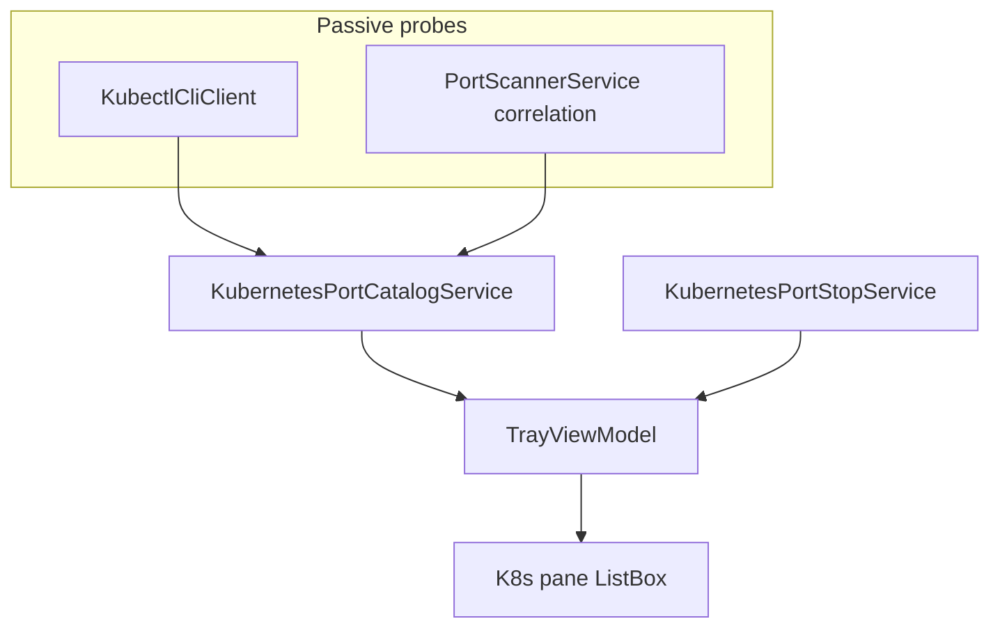

# Phase 2: Kubernetes Ports

| Field | Value |
| --- | --- |
| Initiative | [260601_portcheck-expansion-milestone.md](260601_portcheck-expansion-milestone.md) |
| Phase | 2 of 3 |
| Status | `planned` |
| Depends on | [Phase 1](260601_phase1-favourite-ports.md) spec patterns (optional for code; **required** for pane UX consistency) |
| Governing authority | `docs/spec/portcheck.md` |

---

## 1. Phase PRD

### Problem

Developers running local Kubernetes (Docker Desktop K8s, kind, minikube, k3d) see opaque listeners (`kubectl port-forward`, `wslrelay`, kube-proxy paths) in **Local Port** only. There is no pane that answers: *which Service/Pod/Namespace owns this TCP port?*

### Goals

- Add **Kubernetes Port** pane (third pane tab) when `IsKubernetesSurfaceVisible` gate is true.
- Passive discovery only: detect local `kubectl` and/or kubeconfig; **never** install or start a cluster.
- List TCP rows with host port, namespace, service/pod metadata when resolvable.
- Per-row **Kill** semantics documented (see TDD — likely `kubectl delete pod` or stop port-forward PID; **not** the same as Docker `docker stop`).

### Non-Goals

- In-cluster network policies, Ingress controllers, or cloud LB management
- Multi-cluster context switcher UI (use current `KUBECONFIG` / `kubectl config current-context` only)
- Helm release browser
- Favourite ports scoped to K8s resource IDs (Phase 1 host-port favourites still apply to listener port number)

### User Stories

1. User has `kubectl` and a reachable context; **Kubernetes Port** tab appears.
2. User sees port `localhost:8080` mapped to `default/my-svc` (when catalog resolves).
3. User kills a port-forward row → forward stops; listener disappears on refresh.
4. Cluster offline → pane hidden (same silent model as Docker gate).

### Success Criteria

- [ ] `docs/spec/portcheck.md` K8s surface, gate, kill semantics.
- [ ] `KubernetesPortCatalogService` + models (`KubernetesPortRow`).
- [ ] `GlassPaneTabKubernetes` style (or reuse base tab style).
- [ ] Refresh orchestration: catalog only when pane visible (mirror Docker).
- [ ] Desktop QA with kind/minikube or Docker Desktop K8s.

---

## 2. Phase TDD

### Technical Approach

Mirror **Docker dual-pane** architecture (see `260527_docker-dual-pane-phase2-services-vm.md`):

**Discovery v1 (recommended)**

| Source | Data |
| --- | --- |
| `kubectl get svc -A -o json` | NodePort / LoadBalancer host ports (when bound locally) |
| `kubectl get pods -A -o json` | Container ports (informational) |
| Local TCP scan | Match PIDs named `kubectl`, `wslrelay`, VPN proxies to rows |

**Surface gate `IsKubernetesSurfaceVisible`**

True when:

1. `kubectl` on PATH responds to `kubectl version --client` within timeout, **and**
2. `kubectl cluster-info` (or `kubectl get ns`) succeeds within timeout, **or**
3. At least one local listener classified as Kubernetes-related (fallback, like Docker inferred rows).

### Component Breakdown

| Layer | Artifact |
| --- | --- |
| Spec | `portcheck.md` — K8s pane, gate, kill |
| Config | `appsettings.json` — `kubernetesCatalogEnabled`, timeouts |
| Model | `KubernetesPortRow`, `PortPane.Kubernetes` enum value |
| Service | `KubectlCliClient` |
| Service | `KubernetesPortCatalogService` |
| Service | `KubernetesPortStopService` |
| ViewModel | Third collection, pane switch, refresh gating |
| View | Third `GlassPaneTabButton`, list template, search placeholder |

### Kill Semantics (must freeze in Phase 2 spec)

| Row type | Kill action |
| --- | --- |
| `kubectl port-forward` listener | Terminate owning PID (`ProcessKillerService`) |
| NodePort on local kube-proxy | Document as **unsupported kill** or pod delete behind confirm — **open question** |

### Ownership Boundaries

- All `kubectl` invocation in Services; ViewModel orchestrates only.
- Win32 PID kill stays in `ProcessKillerService`.

### Validation Strategy

| Lane | Classification |
| --- | --- |
| Sanity | `dotnet build` |
| API QA | `no` |
| Desktop UI QA | `yes` — gate on/off, tab switch, kill port-forward |
| Harness | Optional mock `kubectl` output parser tests |

### Completion Criteria

Spec merged, services + UI shipped, manual K8s QA evidence, no Docker/Local regression.

---

## 3. Spec Delta Checklist

- [ ] `PortPane` enum / pane tabs (3-way)
- [ ] `IsKubernetesSurfaceVisible` gate table
- [ ] Kill semantics table
- [ ] Configuration keys
- [ ] Non-goals (no cluster install)
- [ ] Search applies to K8s collection

---

## 4. Open Questions

| ID | Question | Default |
| --- | --- | --- |
| P2-OQ-1 | Kill for non-forward rows | PID kill only in v1 |
| P2-OQ-2 | Tab icon / label | “Kubernetes Port” + K8s glyph |
| P2-OQ-3 | `kubectl` path override in settings | Use PATH only |
