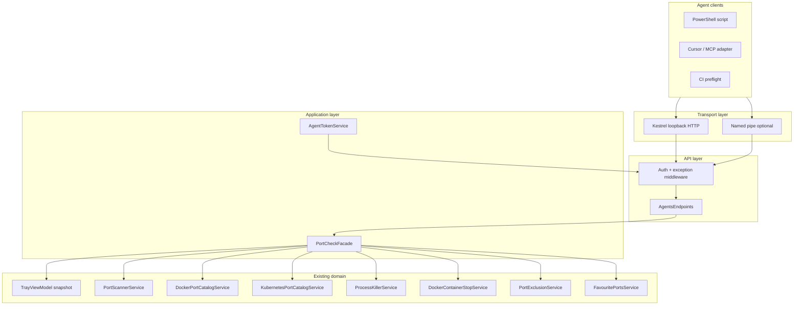
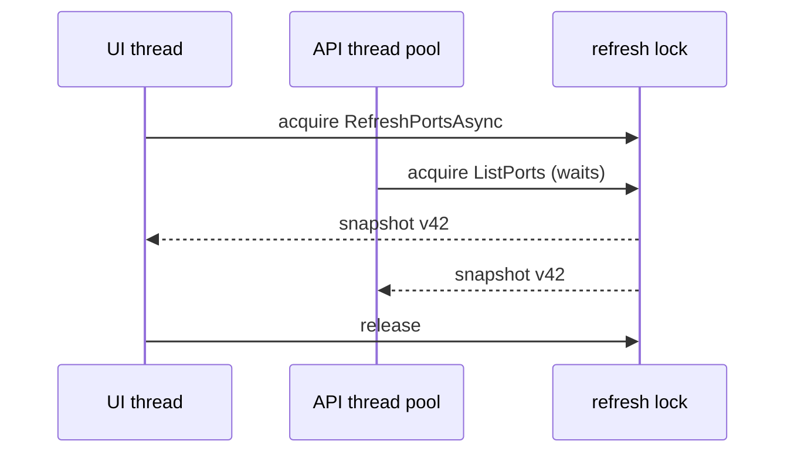
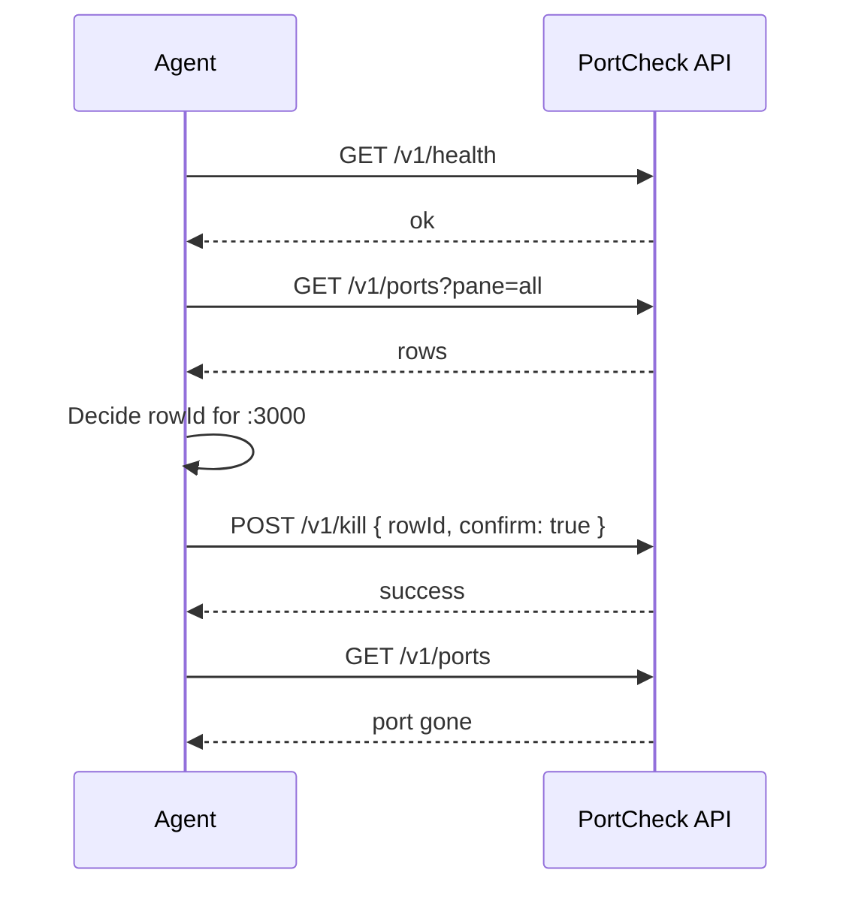

# Phase 3: Agent Control Plane (Local API)

| Field | Value |
| --- | --- |
| Initiative | [260601_portcheck-expansion-milestone.md](260601_portcheck-expansion-milestone.md) |
| Phase | 3 of 3 |
| Status | `planned` |
| Depends on | Phase 1 favourites persistence; Phase 2 K8s row model (**minimum:** Local + Docker shipped today; favourites/K8s fields nullable in API until prior phases land) |
| Governing authority | **`docs/spec/agent-control-plane.md`** (new, canonical for API) + `docs/spec/portcheck.md` (product boundary) |
| Estimated scale | **Large** — new transport, auth, facade, settings, integration tests, security review |
| Deliverable split | **3.0** list/kill/health; **3.1** watch stream + batch kill (optional) |

---

## 1. Phase PRD

### 1.1 Problem Statement

LLM agents and automation (Cursor Agent, Codex, Copilot scripts, CI preflight tools) repeatedly execute **ad-hoc shell** to discover and free ports:

```powershell
netstat -ano | findstr :3000
taskkill /PID 1234 /F
docker stop mycontainer
kubectl port-forward ...
```

Each path bypasses PortCheck’s **single policy engine**:

| Policy | Today (UI only) | Without Phase 3 |
| --- | --- | --- |
| Protected ports (135, 445, …) | Hidden + non-killable | Agent may `taskkill` system processes |
| User-excluded ports | Merged exclusion | Agent ignores Settings |
| Docker kill = `docker stop` | Not `taskkill` proxy PID | Wrong target killed |
| Elevation | Release manifest + UAC | Silent failure or partial kill |
| Favourites / pane context | User mental model | No stable row identity |

**“Centralize terminal”** in the initiative name means: **one local control plane** that agents call instead of opening their own shell for port operations — **not** embedding an xterm/PTY inside PortCheck.

### 1.2 Goals

| ID | Goal | Success signal |
| --- | --- | --- |
| G1 | **List** TCP port rows for Local, Docker, Kubernetes (when gates true), with exclusions applied | `GET /v1/ports` matches UI-filtered data |
| G2 | **Kill** by stable `rowId` or structured key with same backend services as UI | `POST /v1/kill` → same outcome as tray kill |
| G3 | **Favourites** read/write via API when Phase 1 shipped | `GET/POST /v1/favourites` |
| G4 | **Auth** — only local user with bearer token | Wrong token → `401`; LAN → unreachable |
| G5 | **Discoverability** — machine-readable OpenAPI-style doc in `docs/spec/agent-control-plane.md` | Agent authors need no source dive |
| G6 | **Operability** — enable/disable + rotate token in Settings | User control; default **off** |
| G7 | **Example clients** — PowerShell + curl in `examples/agent/` | Copy-paste works on dev machine |

### 1.3 Non-Goals (v1 / 3.0)

| Item | Rationale |
| --- | --- |
| Embedded terminal UI (PTY) | Agents keep their shell; PortCheck exposes **API** |
| Remote access (bind `0.0.0.0`, Tailscale, cloud) | Localhost threat model only |
| Arbitrary command execution | No `POST /v1/exec` |
| OAuth / API keys in cloud | File-based bearer token only |
| Bypass exclusion or protected catalog | Hard reject with `403` |
| Unix/macOS PortCheck port | Windows tray app only; spec may note future |
| Official MCP server binary in-repo | Document HTTP contract; thin MCP adapter is **3.1** optional |
| WebSocket log tail of all process output | Out of scope |
| Agent-initiated **Kill All** without explicit flag | Too destructive; separate `POST /v1/kill-all` behind `allowMassKill` default false |

### 1.4 Actors and Permissions

| Actor | Capability | Constraint |
| --- | --- | --- |
| Human user | Enable API, view/copy token, rotate, set port | Settings UI |
| LLM agent / script | List, kill, manage favourites | Bearer token; localhost only |
| `PortCheckFacade` | Orchestrates services; no UI | Runs on thread pool; marshals to UI thread when reading VM snapshot |
| `AgentTokenService` | Generate, validate, rotate token | Token file ACL: current user only |
| `TrayViewModel` | Source of truth for collections OR facade reads services directly | **Decision:** facade calls **services + shared snapshot builder**, not XAML bindings |
| Windows OS | Elevation for kill | Surfaced as `elevationRequired` in errors |

### 1.5 User Stories (expanded)

| # | Story | Acceptance |
| --- | --- | --- |
| US-1 | Agent lists all non-excluded local listeners | JSON array; each row has `rowId`, `pane`, `port`, `pid`, `processName` |
| US-2 | Agent kills Docker row by `rowId` | Container stopped via `DockerContainerStopService`; not proxy PID |
| US-3 | Agent receives `403` when killing protected port 135 | Body includes `code: "PORT_EXCLUDED"` |
| US-4 | User disables agent API in Settings | `GET /v1/health` → connection refused or `503 agent_disabled` |
| US-5 | User rotates token | Old `Authorization` header fails within 1s |
| US-6 | Agent calls API while user hovers kill in UI | No double-kill corruption; idempotent kill returns `409` or `200` with `alreadyTerminated` |
| US-7 | Developer copies example `examples/agent/list-ports.ps1` | Works against Debug build with API enabled |
| US-8 | Security reviewer confirms no command injection | All inputs validated; kill routes to existing services only |

### 1.6 Success Criteria (Phase exit)

- [ ] `docs/spec/agent-control-plane.md` merged — **every endpoint** has request/response/error schemas.
- [ ] `AgentControlHost` starts when tray starts **and** `agentApiEnabled=true`; stops on app exit.
- [ ] Integration test project or `PortCheck.Tests` covers: auth, list, kill mock, exclusion.
- [ ] Manual: Cursor-style script lists ports and kills test `python -m http.server` listener.
- [ ] Security review checklist signed (localhost, token ACL, no shell).
- [ ] `portcheck.md` links agent surface; Non-Goals updated.
- [ ] API QA lane **yes** per `docs/workflow/phases/test.md`.
- [ ] Dual code review.

---

## 2. What “Centralize Terminal” Means (disambiguation)

| Interpretation | Phase 3.0 | Phase 3.1+ |
| --- | --- | --- |
| Single **list/kill API** for agents | **Yes** | — |
| PortCheck hosts **interactive shell** | **No** | **No** (unless product pivots) |
| Agents stop using `netstat`/`taskkill` | **Documented** | Ecosystem adapters |
| **Structured audit log** of agent kills | Response body only | Optional `GET /v1/audit` |
| **SSE / WebSocket** port change events | **No** | **3.1** `GET /v1/watch` |
| **Cursor MCP** tool `portcheck_list`, `portcheck_kill` | Thin wrapper doc | Optional package |

---

## 3. System Architecture

### 3.1 Layered design



**Principle:** `PortCheckFacade` is the **only** type HTTP handlers call. Handlers never reference `TrayPopupWindow` or Win32.

### 3.2 Why not bind API directly to `TrayViewModel`?

| Approach | Pros | Cons |
| --- | --- | --- |
| VM-only | Single observable state | API on background thread; VM is UI-thread affined; tests need WPF dispatcher |
| **Facade over services + snapshot** | Testable; same rules as VM; refresh can push snapshot | Must duplicate filter logic once — extract `PortSnapshotBuilder` shared by VM and facade |
| Duplicate scan in API | “Fresh” data | Double Win32 load; race with UI refresh |

**Decision (recommended):** Extract `PortSnapshotBuilder` from `TrayViewModel.RefreshPortsAsync` into `Services/PortSnapshotBuilder.cs`. VM and `PortCheckFacade` both call it under the same `refresh` lock used today (`_scanInFlight`).

### 3.3 Concurrency model



| Rule | Detail |
| --- | --- |
| Single refresh in flight | Reuse `Interlocked` / CTS pattern from `TrayViewModel` |
| API read | Returns last committed snapshot version + `snapshotAt` ISO timestamp |
| API kill | Queues kill on thread pool; calls existing async kill methods; **does not** start full refresh until kill completes (match UI) |
| API vs UI kill same row | `KillInProgress` row flag or process existence check → idempotent response |

### 3.4 Process lifecycle

| Event | Agent host behavior |
| --- | --- |
| App startup, `agentApiEnabled=false` | No listener |
| User enables API in Settings | Generate token if missing; start Kestrel |
| User disables API | Stop host; existing connections drain 2s then abort |
| App exit | `IHostApplicationLifetime` stop |
| Second PortCheck instance | **OQ:** mutex single instance — second exe may fail bind → document `PORT_IN_USE` |

---

## 4. Transport Design

### 4.1 Loopback HTTP (primary — 3.0)

| Setting | Default | Notes |
| --- | --- | --- |
| Bind address | `127.0.0.1` | **Never** `0.0.0.0` or `[::]` |
| Port | `17845` | `appsettings.json` `agentApiPort`; user override in Settings |
| TLS | None | Localhost-only; TLS adds cert pain |
| HTTP version | HTTP/1.1 | Sufficient for JSON |
| Framework | `Microsoft.AspNetCore` minimal hosting **or** `HttpListener` | Prefer Kestrel for middleware pipeline; avoid new deps if policy forbids — `HttpListener` acceptable |

**CORS:** Not required (non-browser clients). If browser dashboard ever added, explicit opt-in.

### 4.2 Named pipe (optional — 3.0 or 3.1)

| Field | Value |
| --- | --- |
| Name | `PortCheck.Agent.v1` |
| Encoding | Length-prefixed JSON frames (4-byte LE length + UTF-8 JSON) |
| Methods | Same logical operations as HTTP (`op: "listPorts"`) |
| Auth | First frame must include `token` field |

**When to implement:** If `agentApiPort` conflicts are common on dev machines; pipe has no port clash.

### 4.3 Discovery for agents

| Mechanism | Path / value |
| --- | --- |
| Token file | `%AppData%\PortCheck\agent.token` |
| Port file | `%AppData%\PortCheck\agent.endpoint.json` → `{ "baseUrl": "http://127.0.0.1:17845" }` |
| Health | `GET /v1/health` unauthenticated **only** returns `{ "agentEnabled": true }` — **no sensitive data** |

**Open question:** Whether health is unauthenticated or requires token — **default: no auth on health**, no port list leak.

---

## 5. Authentication and Authorization

### 5.1 Bearer token

| Property | Rule |
| --- | --- |
| Format | `Authorization: Bearer <base64url-32-bytes>` |
| Generation | `RandomNumberGenerator.Fill` on first enable |
| Storage | `%AppData%/PortCheck/agent.token` single line |
| File ACL | Current user full control only (explicit `FileSecurity` on create) |
| Rotation | Settings button → new token; old invalid immediately |
| Logging | Never log token; errors say “invalid token” only |

### 5.2 Authorization matrix

| Endpoint | Auth | Extra |
| --- | --- | --- |
| `GET /v1/health` | None | No row data |
| `GET /v1/ports` | Bearer | — |
| `POST /v1/kill` | Bearer | `confirm: true` if `agentConfirmKills` |
| `GET /v1/favourites` | Bearer | — |
| `POST /v1/favourites` | Bearer | — |
| `POST /v1/refresh` | Bearer | Triggers snapshot refresh (optional 3.0) |

### 5.3 Threat model

| Threat | Mitigation | Residual |
| --- | --- | --- |
| LAN attacker | `127.0.0.1` bind | Malware on same host |
| Malware reads token file | User ACL | Same-user malware can call API — **acceptable** (equivalent to malware running `taskkill`) |
| CSRF from browser | No cookie auth; Bearer only | Malicious page cannot call localhost in some browsers — not relied on |
| Command injection via `rowId` | Validate GUID/format; no shell | — |
| Privilege escalation | No arbitrary exec | Kill uses existing elevated process |
| DoS | Rate limit optional 3.1 | — |

---

## 6. Row Identity and Snapshot Schema

### 6.1 Stable `rowId`

Agents must not rely on `(port, pid)` alone — PIDs recycle.

| Pane | `rowId` format (v1) |
| --- | --- |
| Local | `local:{PortInfo.Id}` (GUID already on `PortInfo`) |
| Docker | `docker:{DockerPortInfo.Id}` or composite `docker:{containerId}:{hostPort}` |
| Kubernetes | `k8s:{KubernetesPortRow.Id}` |

Kill request **must** accept `rowId` as primary key.

### 6.2 `PortRowDto` (list response element)

```json
{
  "rowId": "local:8f2c3e4a-...",
  "pane": "local",
  "hostPort": 3000,
  "hostAddress": "0.0.0.0",
  "pid": 4412,
  "processName": "node.exe",
  "user": "DOMAIN\\user",
  "command": "C:\\path\\node.exe ...",
  "isActive": true,
  "isDockerPublished": false,
  "isFavourite": true,
  "canKill": true,
  "killMethod": "terminatePid",
  "labels": {},
  "docker": null,
  "kubernetes": null
}
```

**Docker extension** (`docker` object when `pane=docker`):

```json
"docker": {
  "containerId": "abc123",
  "containerName": "myapp",
  "publishedPort": 8080,
  "protocol": "tcp",
  "composeProject": "mycompose"
}
```

**Kubernetes extension** (`kubernetes` object when `pane=kubernetes`):

```json
"kubernetes": {
  "namespace": "default",
  "resourceKind": "PortForward",
  "resourceName": "svc/myapp",
  "context": "docker-desktop"
}
```

### 6.3 Snapshot envelope

```json
{
  "snapshotVersion": 42,
  "snapshotAt": "2026-06-02T14:30:00.000Z",
  "elevated": true,
  "panes": {
    "local": { "visible": true, "count": 12 },
    "docker": { "visible": true, "count": 3 },
    "kubernetes": { "visible": false, "count": 0 }
  },
  "rows": [ "... PortRowDto ..." ]
}
```

---

## 7. HTTP API Contract (canonical — copy to `docs/spec/agent-control-plane.md`)

### 7.1 `GET /v1/health`

| | |
| --- | --- |
| **Auth** | None |
| **Purpose** | Liveness + feature flags |

**Response 200**

```json
{
  "status": "ok",
  "agentApiEnabled": true,
  "version": "1.0.0",
  "product": "PortCheck"
}
```

**Response 503** — API disabled in settings

```json
{
  "status": "disabled",
  "agentApiEnabled": false
}
```

---

### 7.2 `GET /v1/ports`

| | |
| --- | --- |
| **Auth** | Bearer required |
| **Query** | `pane` = `local` \| `docker` \| `kubernetes` \| `all` (default `all`) |
| | `includeExcluded` = `false` (default; if `true` **rejected** in v1) |
| | `favouritesOnly` = `false` |

**Response 200** — `PortSnapshotEnvelope` (§6.3)

**Errors**

| Status | `code` | When |
| --- | --- | --- |
| 401 | `UNAUTHORIZED` | Missing/invalid token |
| 400 | `INVALID_PANE` | Unknown pane query |

---

### 7.3 `POST /v1/kill`

| | |
| --- | --- |
| **Auth** | Bearer |
| **Idempotency** | Same `rowId` within 30s after success → `200` + `alreadyTerminated: true` |

**Request body**

```json
{
  "rowId": "local:8f2c3e4a-...",
  "confirm": true
}
```

**Alternative request** (when row not in last snapshot)

```json
{
  "pane": "local",
  "hostPort": 3000,
  "pid": 4412,
  "confirm": true
}
```

| Field | Validation |
| --- | --- |
| `rowId` | Preferred; must exist in last snapshot unless fallback keys provided |
| `confirm` | Required `true` when `agentConfirmKills=true` in settings |
| `pane`+`hostPort`+`pid` | Only for `local` pane in v1 |

**Response 200**

```json
{
  "success": true,
  "rowId": "local:8f2c3e4a-...",
  "method": "terminatePid",
  "message": "Process terminated."
}
```

**Response 200** (idempotent)

```json
{
  "success": true,
  "alreadyTerminated": true,
  "rowId": "local:..."
}
```

**Error body schema (all 4xx/5xx)**

```json
{
  "success": false,
  "code": "PORT_EXCLUDED",
  "message": "Host port 135 is excluded.",
  "details": { "hostPort": 135 }
}
```

| Status | `code` | When |
| --- | --- | --- |
| 400 | `CONFIRMATION_REQUIRED` | `confirm` not true |
| 400 | `INVALID_ROW` | Bad id / stale |
| 403 | `PORT_EXCLUDED` | Protected or user excluded |
| 403 | `KILL_NOT_SUPPORTED` | K8s NodePort unsupported kind |
| 404 | `ROW_NOT_FOUND` | No matching row |
| 409 | `KILL_IN_PROGRESS` | UI or API already killing |
| 500 | `ELEVATION_REQUIRED` | Kill failed access denied |
| 500 | `KILL_FAILED` | Generic failure |

**Side effects:** Same as UI — refresh triggered after kill completes.

---

### 7.4 `GET /v1/favourites`

| | |
| --- | --- |
| **Auth** | Bearer |
| **Depends on** | Phase 1 |

**Response 200**

```json
{
  "favouritePorts": [3000, 5432],
  "items": [
    {
      "hostPort": 3000,
      "isActive": true,
      "rowId": "local:...",
      "processName": "node.exe"
    },
    {
      "hostPort": 5432,
      "isActive": false,
      "rowId": null,
      "processName": "Not running"
    }
  ]
}
```

---

### 7.5 `POST /v1/favourites`

**Request**

```json
{
  "action": "add",
  "hostPort": 3000
}
```

`action`: `add` \| `remove`

**Response 200**

```json
{
  "success": true,
  "favouritePorts": [3000, 5432]
}
```

**Errors:** `403 PORT_EXCLUDED`, `400 INVALID_PORT`, `400 FAVOURITE_LIMIT` (max 32)

---

### 7.6 `POST /v1/refresh` (optional 3.0)

Triggers `RefreshPortsAsync` equivalent; returns new snapshot envelope.

**Use case:** Agent wants fresh data without polling.

---

### 7.7 `POST /v1/kill-all` (optional, default **disabled**)

| | |
| --- | --- |
| **Query** | `pane=local` only |
| **Body** | `{ "confirm": true, "acknowledgeMassKill": true }` |
| **Settings** | `agentAllowMassKill` default `false` |

Not required for 3.0 exit if non-goals stand.

---

## 8. Phase 3.1 — Watch Stream (deferred)

| | |
| --- | --- |
| **Endpoint** | `GET /v1/watch` |
| **Protocol** | SSE (`text/event-stream`) |
| **Events** | `snapshot`, `portAdded`, `portRemoved`, `favouriteChanged` |
| **Auth** | Bearer |

**Rationale for deferral:** Requires diffing consecutive snapshots in `PortSnapshotBuilder`; valuable for long-running agents but not required to replace shell one-shots.

---

## 9. Component Breakdown and File Plan

| Path | Action |
| --- | --- |
| `docs/spec/agent-control-plane.md` | **New** — normative API (copy §7) |
| `docs/spec/portcheck.md` | Agent surface paragraph + link |
| `Services/PortSnapshotBuilder.cs` | **New** — shared refresh snapshot |
| `Services/PortCheckFacade.cs` | **New** |
| `Services/AgentTokenService.cs` | **New** |
| `Agent/AgentControlHost.cs` | **New** — Kestrel `WebApplication` |
| `Agent/AgentAuthMiddleware.cs` | **New** |
| `Agent/AgentEndpoints.cs` | **New** |
| `Models/Agent/*.cs` | DTOs |
| `ViewModels/TrayViewModel.cs` | Refactor to use `PortSnapshotBuilder` |
| `App.xaml.cs` | Register + start/stop host |
| `appsettings.json` | `agentApiEnabled`, `agentApiPort`, `agentConfirmKills` |
| `UserSettings` | Persist agent settings |
| `TrayPopupWindow` Settings UI | Enable API, show token, rotate, port |
| `examples/agent/list-ports.ps1` | **New** |
| `examples/agent/kill-port.ps1` | **New** |
| `tests/PortCheck.AgentApi.Tests/` | **New** project |

### 9.1 `PortCheckFacade` interface (sketch)

```csharp
public interface IPortCheckFacade
{
    Task<PortSnapshotEnvelope> GetSnapshotAsync(PaneFilter filter, CancellationToken ct);
    Task<KillResult> KillAsync(KillRequest request, CancellationToken ct);
    Task<FavouritesEnvelope> GetFavouritesAsync(CancellationToken ct);
    Task<FavouritesEnvelope> MutateFavouriteAsync(FavouriteMutation mutation, CancellationToken ct);
    Task TriggerRefreshAsync(CancellationToken ct);
}
```

### 9.2 Settings persistence

**`settings.json` additions**

| Field | Type | Default |
| --- | --- | --- |
| `agentApiEnabled` | `bool` | `false` |
| `agentApiPort` | `int` | `17845` |
| `agentConfirmKills` | `bool` | `true` |
| `agentAllowMassKill` | `bool` | `false` |

**`agent.token`** — separate file, not in settings.json (avoid accidental copy-paste into chat logs with settings).

---

## 10. UI Contract (Settings)

| Control | Behavior |
| --- | --- |
| Toggle “Allow local agent API” | Off by default; enabling shows token once with Copy |
| Port number | Validated 1024–65535; restart host on change |
| Rotate token | Confirms; invalidates old |
| Confirm kills via API | Maps to `agentConfirmKills` |
| Link | “Documentation” → opens `agent-control-plane.md` path or GitHub |

**States:** Disabled (no listener); Enabled (health OK); Error (port bind failed — show “port in use”).

---

## 11. Agent Integration Guide (for LLM tool authors)

### 11.1 Recommended agent workflow



### 11.2 PowerShell example (sketch)

```powershell
$token = Get-Content "$env:APPDATA\PortCheck\agent.token" -Raw
$base = (Get-Content "$env:APPDATA\PortCheck\agent.endpoint.json" | ConvertFrom-Json).baseUrl
$headers = @{ Authorization = "Bearer $($token.Trim())" }
Invoke-RestMethod "$base/v1/ports" -Headers $headers
```

### 11.3 Cursor / MCP mapping (3.1)

| MCP tool | HTTP mapping |
| --- | --- |
| `portcheck_list_ports` | `GET /v1/ports` |
| `portcheck_kill` | `POST /v1/kill` |
| `portcheck_favourites` | `GET/POST /v1/favourites` |

MCP server is a **thin** Node/Python process — not required in PortCheck repo for 3.0.

### 11.4 Prompt guidance for coding agents

When user says “free port 3000”:

1. Call PortCheck API if `health` ok.
2. Else fall back to telling user to open PortCheck tray (do not silently use `taskkill` on excluded ports).

---

## 12. Failure Modes and Edge Cases

| Scenario | Behavior |
| --- | --- |
| API enabled, tray quit | Connection refused |
| Kill during refresh | Serialize on row; 409 or wait |
| Stale `rowId` after refresh | `404 ROW_NOT_FOUND`; agent should re-list |
| Docker gate false | Docker rows absent from `all` |
| Non-elevated Release kill | `500 ELEVATION_REQUIRED` with message to restart elevated |
| Invalid JSON body | `400 INVALID_REQUEST` |
| Port bind conflict | Settings error state; suggest change port |
| Token file deleted while running | Next request 401; host keeps running until toggle |

---

## 13. Operational Concerns

| Concern | Approach |
| --- | --- |
| **Audit** | v1: optional log to `%AppData%/PortCheck/agent-audit.log` (timestamp, op, rowId, success) — **no PII/command lines** |
| **Observability** | `GET /v1/health` + snapshot version |
| **Performance** | List returns cached snapshot — **O(n) rows**, no scan on every GET unless `POST /v1/refresh` |
| **Rate limit** | 3.1: max 30 kills/minute |
| **Retention** | Audit log rotate 1 MB |
| **Concurrency** | One refresh lock; kills serialized per PID |

---

## 14. Validation and Test Strategy

| Lane | Classify | Notes |
| --- | --- | --- |
| Sanity | yes | `dotnet build` |
| API QA | **yes** | Every endpoint + auth + errors |
| Browser UI QA | no |
| Desktop UI QA | yes | Settings toggle, token rotate |
| Security review | **mandatory** | §5.3 checklist |
| Integration tests | `WebApplicationFactory` or self-host loopback |

### 14.1 Test matrix (minimum)

| Test | Assert |
| --- | --- |
| Health when disabled | 503 |
| List without token | 401 |
| List with token | 200, exclusions applied |
| Kill excluded port | 403 `PORT_EXCLUDED` |
| Kill local row mock | `ProcessKillerService` mocked, called once |
| Kill docker row mock | `DockerContainerStopService` invoked |
| Confirm gate | 400 without `confirm: true` |
| Favourites add/remove | Phase 1 dependency |

---

## 15. Phase Entry / Exit Gates

| Gate | Requirement |
| --- | --- |
| **Enter Phase 3 spec** | Phase 1 & 2 specs merged OR API documents nullable K8s/favourites |
| **Enter Develop** | `agent-control-plane.md` approved |
| **Exit 3.0** | Tests green + manual script + security sign-off |
| **Exit 3.1** | Watch SSE + MCP doc (if scheduled) |

---

## 16. Open Questions

| ID | Question | Default | Blocking? |
| --- | --- | --- | --- |
| P3-OQ-1 | Kestrel vs `HttpListener` | Kestrel if package allowed | Yes for implementer |
| P3-OQ-2 | Health unauthenticated | Yes, minimal body | No |
| P3-OQ-3 | `POST /v1/refresh` in 3.0 | Include | No |
| P3-OQ-4 | Audit log file | On by default when API enabled | No |
| P3-OQ-5 | Named pipe in 3.0 vs 3.1 | 3.1 unless port conflicts common | No |
| P3-OQ-6 | Single-instance mutex for agent port | Document manual | No |
| P3-OQ-7 | `kill-all` endpoint | Defer | No |

---

## 17. Changelog

| Date | Change |
| --- | --- |
| 2026-06-01 | Initial ~150 line sketch |
| 2026-06-02 | Full PRD, architecture, API contract, security, tests, 3.1 deferrals |
