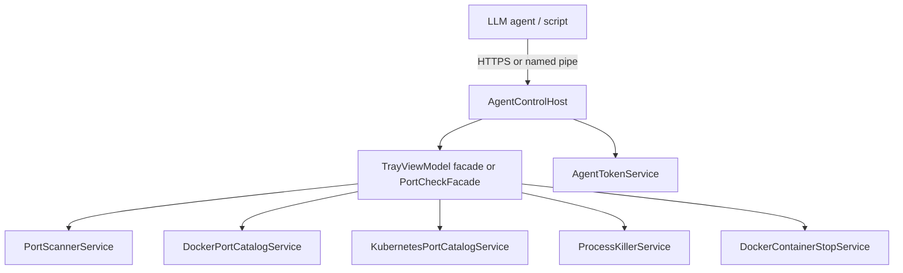

# Phase 3: Agent Control Plane (Local API)

| Field | Value |
| --- | --- |
| Initiative | [260601_portcheck-expansion-milestone.md](260601_portcheck-expansion-milestone.md) |
| Phase | 3 of 3 |
| Status | `planned` |
| Depends on | Phase 1 favourites + Phase 2 K8s contracts stable (API may ship favourites-only first if K8s delayed) |
| Governing authority | New `docs/spec/agent-control-plane.md` + updates to `portcheck.md` |

---

## 1. Phase PRD

### Problem

LLM agents (Cursor, Codex, custom scripts) repeatedly run ad-hoc `netstat`, `Get-Process`, `docker stop`, and `taskkill`. There is no **single local authority** that enforces PortCheck exclusion rules and elevation behavior.

### Goals

- PortCheck exposes a **local control API** while the tray app is running:
  - **List** listeners (Local, Docker, K8s when available, Favourites metadata).
  - **Kill** by stable row id or by `(pane, port, pid?)` with same confirmations policy as UI (configurable auto-confirm for agents).
- Document contract for agent authors (JSON schema, error codes, auth).
- Optional: emit **structured events** (port appeared / disappeared) for agent subscriptions (v1.1 if too large).

### Non-Goals (v1)

- Embedded **terminal emulator** UI inside PortCheck (“centralize terminal” = **control plane**, not xterm UI)
- Remote access off-machine
- OAuth / cloud API keys
- Arbitrary shell command execution (`curl`, `npm`, etc.)
- Bypassing protected-port exclusion

### User Stories

1. Agent calls `GET /v1/ports` → receives JSON list matching UI filters (exclusions applied).
2. Agent calls `POST /v1/kill` with row id → same outcome as UI kill (elevation errors returned as structured fault).
3. User disables agent API in Settings → connection refused.
4. User rotates agent token → old token rejected.

### Success Criteria

- [ ] `docs/spec/agent-control-plane.md` is canonical for API.
- [ ] `AgentControlHost` starts with tray app; stops on exit.
- [ ] Integration tests against loopback (no elevation in CI; mock killer).
- [ ] Security review: localhost bind, token file ACL, no command injection.
- [ ] Example script in `docs/` or `examples/agent-list-kill.ps1`.

---

## 2. Phase TDD

### Architecture

### Transport Options

| Option | Pros | Cons |
| --- | --- | --- |
| **A. Loopback HTTP** (`127.0.0.1:fixedPort`) | Easy for agents, curl-friendly | Port conflict; must secure |
| **B. Named pipe** (`\\.\pipe\PortCheck.Agent`) | Windows-native, no port clash | Harder for cross-language clients |
| **C. Both** | Best DX | More code |

**Recommendation:** **C** — HTTP for LLM tools, named pipe optional for low-latency local tools. Same handler core.

### API Sketch (v1)

| Method | Path | Description |
| --- | --- | --- |
| `GET` | `/v1/health` | `{ "status": "ok", "elevated": true }` |
| `GET` | `/v1/ports?pane=local\|docker\|kubernetes\|all` | Array of port rows |
| `GET` | `/v1/favourites` | Favourite port numbers + active flag |
| `POST` | `/v1/kill` | Body: `{ "rowId": "..." }` or `{ "pane", "port", "pid" }` |
| `POST` | `/v1/favourites` | Add/remove favourite (optional v1) |

Headers: `Authorization: Bearer <token>` read from `%AppData%/PortCheck/agent.token` (generated on first enable).

### Component Breakdown

| Layer | Artifact |
| --- | --- |
| Spec | `docs/spec/agent-control-plane.md` |
| Spec | `portcheck.md` — mention agent surface, link |
| Service | `AgentControlHost` (Kestrel minimal hosting or `HttpListener`) |
| Service | `AgentTokenService` |
| Service | `PortCheckFacade` — thin wrapper over existing services (no duplicate scan logic) |
| Settings | `agentApiEnabled`, `agentApiPort`, `agentConfirmKills` |
| Tests | `AgentControlIntegrationTests` |

### Security

| Threat | Mitigation |
| --- | --- |
| LAN attacker | Bind `127.0.0.1` only |
| Malware on machine | Bearer token + file ACL (current user only) |
| Privilege escalation via API | No shell; kill paths reuse existing services |
| Accidental kill | `agentConfirmKills` default `true`; row must exist and not be excluded |

### “Centralize terminal” interpretation

| Interpretation | In v1? |
| --- | --- |
| Single API for list/kill | **Yes** |
| PortCheck hosts PTY for agents | **No** — agents keep their own terminal; call API |
| Log stream of kill results | Optional `POST /v1/kill` response body only |

### Validation Strategy

| Lane | Classification |
| --- | --- |
| Sanity | `dotnet build` |
| API QA | **`yes`** — contract tests for all endpoints |
| Desktop UI QA | `yes` — enable/disable in Settings |
| Security review | **mandatory** |

### Completion Criteria

API spec merged, host implemented, integration tests green, example agent script works against Release build, security review recorded.

---

## 3. Spec Artifacts

- [ ] `docs/spec/agent-control-plane.md` (new)
- [ ] `portcheck.md` — Surfaces table + Non-Goals (no remote API)
- [ ] `appsettings.json` keys documented

---

## 4. Open Questions

| ID | Question | Default |
| --- | --- | --- |
| P3-OQ-1 | Default port | `17845` (ephemeral high port, configurable) |
| P3-OQ-2 | Auto-confirm kills for agents | `false` |
| P3-OQ-3 | MCP server wrapper | Out of scope; document HTTP for Cursor MCP adapter later |
| P3-OQ-4 | SSE watch stream | Phase 3.1 |
