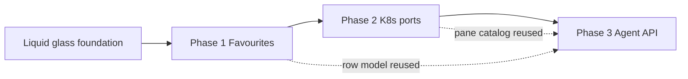

# Initiative: PortCheck Expansion (Favourites → K8s → Agent Control Plane)

| Field | Value |
| --- | --- |
| Initiative | Post–liquid-glass product expansion |
| Status | `planned` |
| Scale | **Large** |
| Governing spec (per phase) | `docs/spec/portcheck.md` (+ new contracts as noted) |
| Governing workflow | `docs/workflow/phases/*.md` |
| Created | 2026-06-01 |
| Prerequisite | Liquid-glass chrome foundation on `main` (glass round/pill/pane tab, harnesses) |
| Phase documents | [Phase 1](260601_phase1-favourite-ports.md) · [Phase 2](260601_phase2-k8s-ports.md) · [Phase 3](260601_phase3-agent-control-plane.md) |

---

## 1. Initiative Overview

### Problem Statement

PortCheck now provides a solid **Local / Docker** tray surface with liquid-glass UI, but three capabilities are still missing for daily dev and agent automation:

1. **Pinned “Favourite Ports”** — users cannot persistently watch specific host ports (including when idle).
2. **Kubernetes port visibility** — forwarded NodePort / `kubectl port-forward` / local proxy listeners are not modeled as a first-class pane.
3. **Agent control plane** — LLM agents cannot list or terminate ports through a stable, local, machine-readable API owned by PortCheck.

### Goals

| # | Goal | Phase |
| --- | --- | --- |
| G1 | User can favourite host ports; favourites survive restarts and show active or inactive rows | 1 |
| G2 | User can view K8s-related listening ports in a dedicated pane when the cluster surface is visible | 2 |
| G3 | Local agents can list ports and request kills through a documented, authenticated local control API | 3 |

### Non-Goals (initiative-wide)

- Cloud sync of favourites or multi-machine state
- Installing or starting Docker, Kubernetes, or WSL distributions
- Remote cluster admin (multi-context fleet UI)
- Replacing `kubectl`, `docker`, or IDE terminals for general shell work
- Public internet exposure of the agent API (localhost / named-pipe only)
- UDP port catalog (TCP listeners only, consistent with current product)

### Success Criteria (Initiative)

- [ ] `docs/spec/portcheck.md` updated per phase; no contradiction between phases
- [ ] Each phase has its own verification evidence (harness and/or desktop QA per `docs/workflow/phases/test.md`)
- [ ] Phases ship in order; Phase 2 does not block Phase 1 delivery
- [ ] Agent API (Phase 3) reuses kill/exclusion rules from UI — no second policy engine

---

## 2. Scale Assessment

**Classification: Large**

| Signal | Manifestation |
| --- | --- |
| Multiple surfaces | Settings, new pane/tab, optional footer, HTTP or IPC listener |
| Multiple ownership boundaries | Services, ViewModel, View, new spec sections, agent contract doc |
| Persistent state | `settings.json` schema expansion |
| Security | Elevation, exclusion, agent auth |
| Sequencing | Favourites inform row model; K8s parallels Docker gate; agents consume all panes |

---

## 3. Phase Map

| Phase | Title | Objective | Depends on | Exit criteria |
| --- | --- | --- | --- | --- |
| **1** | Favourite Ports | Spec + persistence + UI for pinned host ports | Glass foundation on `main` | Spec merged; favourites in settings; UI QA |
| **2** | Kubernetes Ports | Spec + passive K8s discovery + K8s pane | Phase 1 spec patterns (pane gate) | Build pass; K8s pane manual QA |
| **3** | Agent Control Plane | Local API for list/kill (+ favourites/K8s when present) | Phase 1–2 contracts stable | API contract doc; integration tests; security review |

---

## 4. Cross-Phase Contracts

### Shared rules (must not regress)

| Rule | Source |
| --- | --- |
| Excluded / protected ports invisible and non-killable | `portcheck.md` Exclusion Contract |
| Release kill requires elevation | `portcheck.md`, QA |
| Passive-only external systems (no start Docker/K8s) | `portcheck.md` Non-Goals |
| View → ViewModel → Service layering | `AGENTS.md` |

### Data ownership

| Concern | Owner |
| --- | --- |
| TCP enumeration | `PortScannerService` |
| Favourite list CRUD | `SettingsService` + `FavouritePortsService` (Phase 1) |
| K8s catalog | `KubernetesPortCatalogService` (Phase 2) |
| Kill local PID | `ProcessKillerService` |
| Kill Docker container | `DockerContainerStopService` |
| Agent transport | `AgentControlHost` (Phase 3) — orchestrates existing services |

### Open Questions (initiative)

| ID | Question | Default if unanswered |
| --- | --- | --- |
| OQ-1 | Max favourites count | 32 |
| OQ-2 | K8s discovery: `kubectl` only vs Kubernetes API via kubeconfig | `kubectl` + local listener correlation (passive) |
| OQ-3 | Agent API transport | Named pipe + optional loopback HTTP on fixed port |
| OQ-4 | Agent auth | OS user + single-use token file in `%AppData%/PortCheck/agent.token` |
| OQ-5 | Phase 3 “centralize terminal” scope | **Control API only** in v1; embedded terminal UI deferred |

---

## 5. Changelog

| Date | Change |
| --- | --- |
| 2026-06-01 | Initiative created after liquid-glass foundation pushed to `main` |
