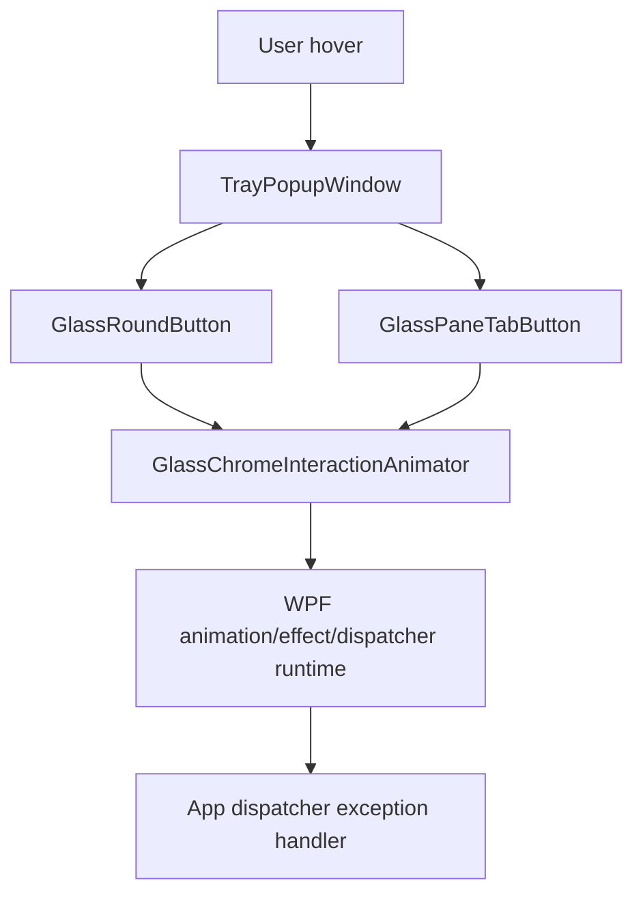

# Liquid Glass Hover Parameter Count Mismatch

## Phase Metadata

- Change scale: `Medium`
- Selected execution owner: `ralph`
- Primary changed surface: `TrayPopupWindow` liquid-glass hover interaction
- Governing spec: `docs/spec/portcheck.md`
- Governing workflow: `docs/workflow/phases/plan.md`, `docs/workflow/phases/develop.md`, `docs/workflow/phases/test.md`

## PRD

### Problem Statement

On this machine, hovering liquid-glass popup controls such as round buttons and pane tabs throws a runtime WPF exception with the visible message `Parameter count mismatch.`. The popup remains user-facing, but the current exception handler strips the stack trace, so the failure boundary is not observable from the UI.

### Goals

- reproduce the hover-triggered exception on the affected machine
- identify the exact runtime boundary that throws during liquid-glass hover interaction
- fix the smallest correct boundary so round-button and pane-tab hover no longer throw
- preserve the existing popup interaction contract in `docs/spec/portcheck.md`

### Non-Goals

- no redesign of the popup visual language
- no changes to port scanning, kill flows, Docker data flow, or settings behavior
- no broad exception-handling redesign beyond what is strictly needed to debug or verify this issue

### Actors / Permissions

| Actor | Capability |
| --- | --- |
| User | hover popup controls, switch panes, use sort/settings/back controls |
| WPF control/template layer | render liquid-glass chrome and attach hover motion |
| App exception handler | currently shows only exception message |

### User Stories

1. As a user, hovering a round liquid-glass button does not show an error dialog.
2. As a user, hovering a pane tab does not show an error dialog.
3. As a maintainer, I can identify the concrete failing hover boundary instead of only seeing the message text.

### Success Criteria

- the affected hover path is reproduced locally and tied to a concrete call site or WPF binding/runtime boundary
- hovering `GlassRoundButton` instances no longer throws
- hovering `GlassPaneTabButton` instances no longer throws
- existing popup behavior still works after the fix

### Scope Boundaries

- In scope:
  - `GlassRoundButton`
  - `GlassPaneTabButton`
  - `GlassChromeInteractionAnimator`
  - related templates/resources and minimal app diagnostics needed to localize the failure
- Out of scope:
  - non-hover popup behavior
  - service/view-model business logic
  - new product behavior or visual redesign

## TDD

### Technical Approach

- reproduce against the real desktop popup on this machine using Windows automation
- inspect the hover interaction path shared by round buttons and pane tabs
- patch the smallest shared failing boundary if the failure is in shared hover logic; otherwise patch the specific control/template boundary
- keep diagnostics minimal and local to runtime verification needs

### Component Breakdown

| Component | Responsibility |
| --- | --- |
| `TrayPopupWindow.xaml` | hosts the affected controls |
| `GlassRoundButton` | round button template wiring |
| `GlassPaneTabButton` | pane tab template wiring |
| `GlassChromeInteractionAnimator` | shared hover/press animation logic |
| `App.xaml.cs` | top-level exception surface shown to the user |

### Ownership Boundaries

| Boundary | Owner |
| --- | --- |
| popup composition | `TrayPopupWindow.xaml` |
| control/template hookup | control classes + XAML templates |
| shared hover motion | `GlassChromeInteractionAnimator` |
| exception surfacing | `App.xaml.cs` |

### Data Flow

1. User hover enters popup control.
2. WPF raises mouse events on the control.
3. Control-owned `OnApplyTemplate` attaches `GlassChromeInteractionAnimator`.
4. Animator mutates transforms, opacity, effects, or deferred dispatcher work.
5. Any thrown exception is routed to the app dispatcher handler and displayed as a message box.

### Failure Modes

- template part lookup succeeds, but one hover action uses an overload or deferred dispatcher call incorrectly on this machine
- a WPF effect/animation/property interaction throws only for certain framework/runtime combinations
- the failure occurs in shared hover logic and affects both round buttons and pane tabs
- the failure occurs only in one template path and is masked by the generic top-level error dialog

### Validation Strategy

- reproduce against the real popup UI on this machine
- run targeted sanity build checks
- run the existing glass harnesses when the touched boundary includes round-button or pane-tab chrome
- retest the same hover path that previously produced the dialog

### Test Strategy

- `dotnet build src/PortCheck/PortCheck.csproj`
- round-button harness when its shared runtime/template is touched
- pane-tab harness when its shared runtime/template is touched
- manual or automated desktop hover verification against a live popup with real port rows visible

## System Architecture

### Text Description

The hover failure lives entirely inside the desktop UI path. The popup view hosts liquid-glass controls. Each control resolves template parts and attaches a shared animator. The animator runs immediate and deferred WPF visual updates. The app-level dispatcher handler surfaces any unhandled WPF exception as a modal error dialog.

### Mermaid Diagram

### Browser -> API -> service -> DB flow

- Not applicable for this desktop UI change.

### Permission Flow

- user input -> WPF control -> shared hover animator -> app exception handler if failure occurs

### Read/Write Ownership

| Asset | Read | Write |
| --- | --- | --- |
| hover visual state | templates/animator | animator |
| popup composition | view | view |
| exception dialog text | app handler | app handler |

## API Contract

- No API surface affected.

## Database Contract

- No database surface affected.

## UI Contract

| Screen | Purpose | Visible states |
| --- | --- | --- |
| `TrayPopupWindow` | local/docker/settings popup | ready, hover, pressed, error dialog |

### Create / Edit / Delete Behavior

- none

### Save Flow

- none

### Validation Feedback

- error dialog must no longer appear when hovering affected liquid-glass controls

### Disabled States

- unchanged from current spec

### Dependency Behavior if Related API Is Unavailable

- unchanged; this bug is local to the desktop UI layer

## Operational Concerns

- Observability: current top-level dialog loses stack context, so reproduction evidence must capture the concrete failing path
- Performance: fix must not add unnecessary hover overhead
- Security/authz: unchanged
- Concurrency: deferred dispatcher work must stay valid against repeated hover enter/leave

## Edge Cases

- rapid hover enter/leave over the same control
- hover while another hover leave animation is still running
- hover over round button versus pane tab on the same popup instance
- machine-specific runtime differences that do not reproduce on another computer

## Open Questions

- none blocking; the requested scope is explicitly to debug and fix the machine-specific hover exception on liquid-glass controls

## Completion Criteria

- planning artifact exists at this path before code changes
- runtime boundary is reproduced and identified
- code change is limited to the smallest correct UI boundary
- sanity/build passes
- affected hover path is retested without the `Parameter count mismatch.` dialog
