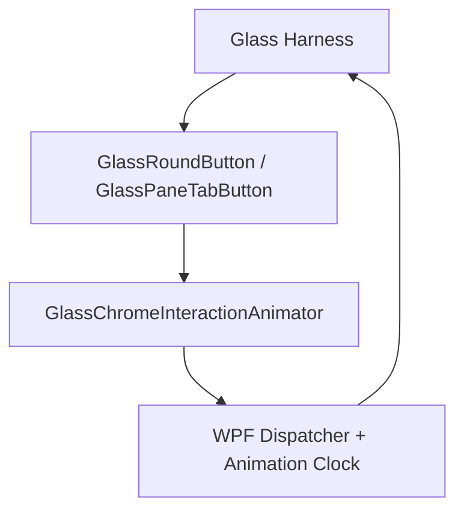

# Repo Review Critical Fixes

## Phase Metadata

- Change scale: `Medium`
- Selected execution owner: `ralph`
- Primary changed surface: liquid-glass hover runtime and its validation harnesses
- Governing spec: `docs/spec/portcheck.md`
- Governing workflow: `docs/workflow/phases/plan.md`, `docs/workflow/phases/develop.md`, `docs/workflow/phases/test.md`

## PRD

### Problem Statement

Current repo review on the liquid-glass interaction surface exposes two important defects:

1. shared hover runtime can throw `Parameter count mismatch.` on affected machines during hover leave / deferred lens cleanup
2. the shipped glass validation harnesses can falsely fail because they sample animated properties synchronously before WPF animation frames advance

If left unfixed, the repo can both break user-visible hover behavior and block valid deliveries with incorrect QA evidence.

### Goals

- remove the shared hover runtime exception
- make the round-button and pane-tab validation harnesses observe animation state correctly
- keep the fix scoped to the liquid-glass interaction boundary and its direct validation tooling
- rerun sanity and harness validation after the fixes

### Non-Goals

- no redesign of popup visuals
- no changes to port scanning, kill flows, Docker behavior, or settings product logic
- no broad refactor of unrelated validation tooling

### Actors / Permissions

| Actor | Capability |
| --- | --- |
| User | hover round buttons and pane tabs without runtime error |
| WPF control/runtime layer | run hover motion and deferred cleanup |
| Validation harnesses | verify hover motion and hover cleanup in headless mode |

### User Stories

1. As a user, hovering liquid-glass controls does not trigger a modal exception.
2. As a maintainer, the official glass harnesses pass when the hover implementation is correct.
3. As a maintainer, validation failures point to real regressions instead of harness timing bugs.

### Success Criteria

- no `Parameter count mismatch.` path remains in deferred hover cleanup
- round-button harness passes against the fixed implementation
- pane-tab harness passes against the fixed implementation
- repo build remains successful after the fixes

### Scope Boundaries

- In scope:
  - `GlassChromeInteractionAnimator`
  - `GlassRoundButtonHarness`
  - `GlassPaneTabHarness`
  - direct helper code needed for deterministic harness timing
- Out of scope:
  - unrelated services and view-model logic
  - product-level UI redesign
  - release packaging or installer changes

## TDD

### Technical Approach

- fix the incorrect deferred dispatcher invocation in the shared hover animator
- replace invalid harness assumptions that `BeginAnimation` updates values synchronously
- pump the dispatcher for a bounded interval inside harness checks so they read post-animation state instead of pre-render state

### Component Breakdown

| Component | Responsibility |
| --- | --- |
| `GlassChromeInteractionAnimator` | shared hover entry/leave behavior and deferred lens cleanup |
| `GlassRoundButtonHarness` | headless verification for round chrome |
| `GlassPaneTabHarness` | headless verification for pane-tab chrome |

### Ownership Boundaries

| Boundary | Owner |
| --- | --- |
| runtime hover behavior | `GlassChromeInteractionAnimator` |
| round-button verification | `GlassRoundButtonHarness` |
| pane-tab verification | `GlassPaneTabHarness` |

### Data Flow

1. Harness creates a measured control.
2. Harness raises hover events.
3. Shared animator starts WPF animations and optional deferred cleanup.
4. Harness pumps the dispatcher.
5. Harness reads transform and opacity state and compares against expected ranges.

### Failure Modes

- deferred cleanup still uses an invalid call shape and throws on some machines
- harness reads state before the animation clock advances and reports false failure
- dispatcher pumping is too short and leaves flaky validation
- hover leave cleanup runs while the pointer is logically re-entered and clears lens state incorrectly

### Validation Strategy

- build in a clean isolated copy when the live repo is locked by a running PortCheck instance
- run round-button harness and require `PASS`
- run pane-tab harness and require `PASS`
- keep browser/API QA classified `no` because no browser/API surface changes

### Test Strategy

- `dotnet build src/PortCheck/PortCheck.csproj`
- `dotnet exec ...\\PortCheck.dll --validate-glass-round-button`
- `dotnet exec ...\\PortCheck.dll --validate-glass-pane-tab`

## System Architecture

### Text Description

The review scope is a local WPF-only boundary. The shared animator owns hover state transitions and deferred cleanup. The harnesses create controls in-process, stimulate the same hover path, and assert against the rendered animation state after allowing the dispatcher to advance.

### Mermaid Diagram

### Browser -> API -> service -> DB flow

- Not applicable for this desktop-only change.

### Permission Flow

- harness input -> control hover events -> shared animator -> WPF dispatcher/animation runtime

### Read/Write Ownership

| Asset | Read | Write |
| --- | --- | --- |
| hover transforms/opacities | harness | animator |
| validation report files | harness | harness |

## API Contract

- No API surface affected.

## Database Contract

- No database surface affected.

## UI Contract

| Screen | Purpose | Visible states |
| --- | --- | --- |
| `TrayPopupWindow` glass chrome | hoverable round buttons and pane tabs | idle, hover, press, leave |

### Create / Edit / Delete Behavior

- none

### Save Flow

- none

### Validation Feedback

- no hover exception dialog
- harness reports `PASS`

### Disabled States

- unchanged

### Dependency Behavior if Related API Is Unavailable

- unchanged; this review scope has no API dependency

## Operational Concerns

- observability: harness output must reflect real regressions
- performance: harness pumping must stay bounded and deterministic
- security/authz: unchanged

## Edge Cases

- rapid hover enter/leave
- motion-enabled versus reduced-motion systems
- pane-tab overlay-only mode with no backdrop lens
- delayed cleanup racing with re-entry

## Open Questions

- none blocking; the current repo evidence already identifies the critical defects and their direct validation boundaries

## Completion Criteria

- shared animator no longer contains the invalid deferred invocation
- both harnesses are timing-correct and pass
- build and harness evidence are fresh for this change
